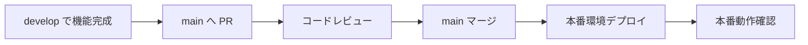

# ブランチ戦略とデプロイメント戦略提案

## 📋 概要
- **作成日**: 2025年7月20日 [[memory:3773065]]
- **更新日**: 2025年7月20日（開発環境戦略確定）
- **目的**: Shopify AI Marketing Suite の開発効率向上とリスク軽減
- **対象**: フロントエンド（Next.js）+ バックエンド（.NET 8）
- **現状**: Phase 1 実施完了（developブランチ作成済み）

---

## 🌳 **確定ブランチ戦略: 段階的導入**

### **Phase 1: 現在の構成（実施済み）**

```
main (将来の本番環境)
├── develop (開発統合環境) ✅ 作成済み
└── feature/* (機能開発ブランチ)
    ├── feature/orders-products-frontend (次回予定)
    ├── feature/shopify-api-integration
    ├── feature/batch-processing-hangfire
    └── feature/authentication-system
```

### **Phase 2: 本番環境追加（後日実施予定）**

```
main (本番環境) 
├── develop (開発統合環境)
└── feature/* (機能開発ブランチ)
```

### **現在のブランチ運用ルール**

| ブランチ | 用途 | デプロイ先 | マージ条件 |
|----------|------|------------|------------|
| **main** | 開発統合（暫定） | 現在の環境 | 直接プッシュ可（暫定） |
| **develop** | 機能統合 | 現在の環境 | feature からのPR |
| **feature/** | 機能開発 | ローカル | develop へのPR |

---

## 🏗️ **現在の環境構成**

### **開発環境 (Development) - 現在運用中**
```yaml
用途: 機能開発・統合テスト・デモ
ブランチ: develop (メイン運用)
URL: 
  Frontend: https://brave-sea-038f17a00.1.azurestaticapps.net
  Backend: https://shopifytestapi20250720173320-aed5bhc0cferg2hm.japanwest-01.azurewebsites.net
  Database API Test: https://brave-sea-038f17a00.1.azurestaticapps.net/database-test
データベース: shopify-test-db (Azure SQL Basic)
更新タイミング: develop へのマージ時自動
コスト: 約 ¥2,500/月（現在の構成）
```

### **本番環境 (Production) - 後日構築予定**
```yaml
用途: 実運用・顧客向けサービス
ブランチ: main
URL: 未定（後日決定）
データベース: 未定（本番用DB作成予定）
更新タイミング: main へのマージ時（手動承認必須）
コスト: 約 ¥10,000/月（予定）
```

---

## 🔄 **現在のワークフロー**

### **機能開発フロー（Phase 1）**


### **本番リリースフロー（Phase 2 以降）**



---

## ⚙️ **GitHub Actions 現在の構成**

### **開発環境用 (.github/workflows/ 既存ファイル)**

```yaml
# 現在のワークフローファイル:
- azure-static-web-apps-*.yml (フロントエンド)
- azure-webapps-dotnet-core.yml (バックエンド)

# 対象ブランチ: 
- main (現在)
- develop (追加予定)

# デプロイ先:
- 現在の開発環境
```

---

## 🛡️ **段階的ブランチ保護戦略**

### **Phase 1: 開発フェーズ（現在）**
- **main ブランチ**: 保護なし（開発環境として活用）
- **develop ブランチ**: CI チェック推奨
- **feature ブランチ**: PRでのマージ推奨

### **Phase 2: 本番環境構築後**
- **main ブランチ**: 厳格な保護ルール適用
- **develop ブランチ**: CI チェック必須

---

## 📊 **現在のコスト構成**

### **開発環境（現在運用中）**
```yaml
Azure App Service: 既存プラン
Azure Static Web Apps: 既存プラン  
Azure SQL Database: Basic ¥700/月
GitHub Actions: 無料枠内
合計: 約 ¥2,500/月（推定）
```

### **本番環境追加時の総コスト（予定）**
```yaml
開発環境: ¥2,500/月（現在）
本番環境: ¥10,000/月（予定）
合計: 約 ¥12,500/月
```

---

## 🚀 **実施済み・今後の計画**

### **✅ Phase 1: 完了済み（2025年7月20日）**
1. **developブランチ作成・プッシュ** ✅
2. **現在環境の開発環境位置づけ確定** ✅
3. **段階的戦略の確定** ✅

### **📋 Phase 2: 今後実施予定**
1. **GitHub Actions ワークフロー更新**
   - develop ブランチでの自動デプロイ設定
   - 現在のmainブランチデプロイ維持

2. **本番環境構築（時期未定）**
   - Azure リソース新規作成
   - 本番用データベース作成
   - main ブランチ保護ルール適用

### **📝 次回機能開発予定**
1. **feature/orders-products-frontend**
   - 注文・商品API統合画面
   - develop ブランチから派生して開発

---

## 📝 **開発者向け現在のガイド**

### **新機能開発時（現在の手順）**

```bash
# 1. 最新の develop から feature ブランチ作成
git checkout develop
git pull origin develop
git checkout -b feature/orders-products-frontend

# 2. 開発・コミット
git add .
git commit -m "feat: 注文・商品API統合画面追加"

# 3. develop への PR 作成
git push origin feature/orders-products-frontend
# GitHub で develop への PR 作成

# 4. マージ後、開発環境で動作確認
# https://brave-sea-038f17a00.1.azurestaticapps.net

# 5. デモ・検証
# Database API Test: /database-test
```

---

## 🎯 **現在の運用方針**

### **開発効率重視**
- ✅ 迅速な機能開発・検証
- ✅ feature ブランチでの並行開発
- ✅ develop での統合テスト

### **段階的品質向上**
- ✅ PR でのコードレビュー
- ✅ 機能単位での動作確認
- ⏳ 本番環境での厳格な品質管理（後日）

### **コスト効率性**
- ✅ 現在の環境を最大活用
- ✅ 必要に応じた段階的拡張
- ✅ 無駄なリソース作成回避

---

## 🔍 **次のアクション**

### **即座に実施**
1. **次回機能開発をfeatureブランチで開始**
2. **develop ブランチでの統合テスト**

### **今週中に検討**
1. **GitHub Actions ワークフローの develop ブランチ対応**
2. **本番環境構築のタイムライン検討**

---

**✅ 現実的で効率的な戦略に調整完了！この段階的アプローチで開発を進めましょう。** 