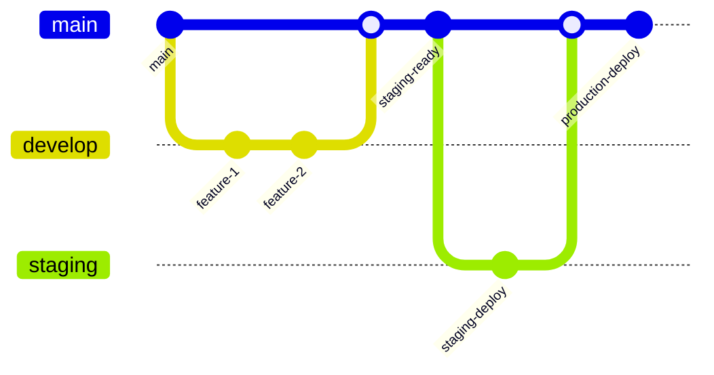

# マルチ環境デプロイメント戦略設計書

## 概要

Shopify AI Marketing SuiteのGitHubワークフローを活用したdevelop、staging、production環境への多層デプロイメント戦略を設計し、今後の改善課題も含めた包括的な運用指針を提供します。

## 現状分析

### 現在のデプロイメント構成

#### 単一環境運用（現状）
- **フロントエンド**: Azure Static Web Apps
  - URL: `https://brave-sea-038f17a00.1.azurestaticapps.net`
  - `main`ブランチからの自動デプロイ
- **バックエンド**: Azure App Service
  - URL: `https://shopifytestapi20250720173320-aed5bhc0cferg2hm.japanwest-01.azurewebsites.net`
  - .NET 8 Web API
- **データベース**: Azure SQL Database (Basic ¥700/月)

#### 現在のGitHubワークフロー
1. **フロントエンド**: `.github/workflows/azure-static-web-apps-brave-sea-038f17a00.yml`
2. **バックエンド**: `.github/workflows/azure-app-service.yml`

## マルチ環境デプロイメント設計

### 環境構成戦略

#### 1. Develop環境
```yaml
目的: 機能開発とテスト
ブランチ: develop
インフラ:
  Frontend: Azure Static Web Apps (無料枠)
  Backend: Azure App Service (Free/Shared F1)
  Database: Azure SQL Database (Basic)
  命名規則: shopify-dev-*
```

#### 2. Staging環境
```yaml
目的: 本番前のテストとデモ
ブランチ: staging または main (staging deployment)
インフラ:
  Frontend: Azure Static Web Apps (Standard)
  Backend: Azure App Service (Basic B1)
  Database: Azure SQL Database (Standard S0)
  命名規則: shopify-staging-*
```

#### 3. Production環境
```yaml
目的: 本番環境
ブランチ: main (production deployment)
インフラ:
  Frontend: Azure Static Web Apps (Standard)
  Backend: Azure App Service (Standard S1)
  Database: Azure SQL Database (Standard S2)
  命名規則: shopify-prod-*
```

### GitHubワークフロー設計

#### ブランチ戦略とデプロイメント


#### 環境別デプロイメントトリガー

##### Develop環境
```yaml
# .github/workflows/deploy-develop.yml
name: Deploy to Develop
on:
  push:
    branches: [develop]
  workflow_dispatch:
```

##### Staging環境
```yaml
# .github/workflows/deploy-staging.yml
name: Deploy to Staging
on:
  push:
    branches: [main]
    paths: [frontend/**, backend/**]
  workflow_dispatch:
    inputs:
      environment:
        description: 'Target environment'
        default: 'staging'
```

##### Production環境
```yaml
# .github/workflows/deploy-production.yml
name: Deploy to Production
on:
  release:
    types: [published]
  workflow_dispatch:
    inputs:
      confirm_production:
        description: 'Type PRODUCTION to confirm'
        required: true
```

### インフラストラクチャー管理

#### リソース命名規則
```yaml
Frontend (Static Web Apps):
  - develop: shopify-dev-frontend-{timestamp}
  - staging: shopify-staging-frontend-{timestamp}
  - production: shopify-prod-frontend-{timestamp}

Backend (App Service):
  - develop: shopify-dev-api-{timestamp}
  - staging: shopify-staging-api-{timestamp}  
  - production: shopify-prod-api-{timestamp}

Database:
  - develop: shopify-dev-db
  - staging: shopify-staging-db
  - production: shopify-prod-db
```

#### 環境変数管理
```yaml
GitHub Secrets (Environment Specific):
  AZURE_STATIC_WEB_APPS_API_TOKEN_[ENV]
  AZURE_WEBAPP_PUBLISH_PROFILE_[ENV]
  SQL_CONNECTION_STRING_[ENV]
  APP_INSIGHTS_CONNECTION_STRING_[ENV]
```

#### セキュリティ設定
```yaml
Environment Protection Rules:
  develop: 自動デプロイ
  staging: レビュー承認必須
  production: 
    - マニュアル承認必須
    - 承認者: プロジェクトオーナー
    - 待機時間: 30分
```

### デプロイメントパイプライン設計

#### 多段階デプロイメント
```yaml
Deploy Pipeline:
  1. Code Quality Check:
     - Lint (Frontend/Backend)
     - Type Check (TypeScript)
     - Security Scan
     
  2. Build & Test:
     - Unit Tests
     - Integration Tests
     - Build Artifacts
     
  3. Deploy to Environment:
     - Infrastructure Provisioning
     - Application Deployment
     - Database Migration
     
  4. Post-Deploy Verification:
     - Health Check
     - Smoke Tests
     - Performance Check
```

## 実装ロードマップ

### Phase 1: 基盤構築 (1-2週間)
- [ ] 環境別リソース作成（Azure Portal）
- [ ] GitHub Environmentsの設定
- [ ] 環境別シークレットの設定
- [ ] 基本的なワークフローの作成

### Phase 2: パイプライン拡張 (2-3週間)
- [ ] テスト自動化の追加
- [ ] デプロイメント承認プロセス
- [ ] ロールバック機能の実装
- [ ] 通知システムの設定

### Phase 3: 運用最適化 (1-2週間)
- [ ] Infrastructure as Code（ARM/Terraform）
- [ ] 監視・アラートの強化
- [ ] パフォーマンス最適化
- [ ] ドキュメント更新

## 今後の改善課題

### テスト・品質保証
#### 優先度: 高
- [ ] **自動テストの拡充**
  - Unit Tests（Jest/xUnit）の網羅率向上
  - Integration Testsの実装
  - E2E Tests（Playwright/Cypress）の導入
  
- [ ] **コード品質チェック**
  - ESLint/Prettier（Frontend）の強化
  - SonarCloud/CodeQL による静的解析
  - 依存関係の脆弱性スキャン

#### 優先度: 中
- [ ] **パフォーマンステスト**
  - Load Testing（Artillery/k6）
  - Performance Monitoring
  - Bundle Size Analysis

### セキュリティ強化
#### 優先度: 高
- [ ] **認証・認可**
  - Azure Active Directory統合
  - API Key管理の強化
  - Rate Limiting実装

- [ ] **シークレット管理**
  - Azure Key Vault統合
  - 環境変数の暗号化
  - シークレットローテーション

#### 優先度: 中
- [ ] **ネットワークセキュリティ**
  - Private Endpoints設定
  - WAF（Web Application Firewall）
  - Network Security Groups

### 監視・ログ
#### 優先度: 高
- [ ] **Application Insights拡張**
  - カスタムメトリクス追加
  - 障害アラート設定
  - パフォーマンス監視強化

- [ ] **ログ集約・分析**
  - 構造化ログの改善
  - Log Analytics Workspace統合
  - エラートラッキング（Sentry）

#### 優先度: 中
- [ ] **ビジネスメトリクス**
  - ユーザー行動分析
  - API使用状況監視
  - コスト監視ダッシュボード

### インフラストラクチャー
#### 優先度: 高
- [ ] **Infrastructure as Code**
  - ARM Templates/Terraform実装
  - 環境間の設定統一
  - 自動プロビジョニング

- [ ] **災害復旧**
  - データベースバックアップ自動化
  - 復旧手順書の作成
  - RTO/RPO目標設定

#### 優先度: 中
- [ ] **スケーラビリティ**
  - Auto Scaling設定
  - CDN導入（Azure Front Door）
  - データベースレプリケーション

### 運用・保守
#### 優先度: 高
- [ ] **デプロイメント**
  - Blue-Green Deployment
  - Feature Flags実装
  - ロールバック手順の自動化

- [ ] **ドキュメント**
  - 運用手順書の整備
  - トラブルシューティングガイド
  - API仕様書の自動生成

#### 優先度: 中
- [ ] **開発体験**
  - ローカル開発環境のDocker化
  - 開発者向けCLIツール
  - テストデータ生成ツール

### コスト最適化
#### 優先度: 中
- [ ] **リソース最適化**
  - 使用量ベースのスケーリング
  - 予約インスタンスの活用
  - 不要リソースの自動削除

- [ ] **監視・アラート**
  - コスト予算アラート
  - リソース使用率監視
  - 最適化提案の自動化

## 運用ガイドライン

### デプロイメント手順
1. **Develop環境**: `develop`ブランチへのpushで自動デプロイ
2. **Staging環境**: `main`ブランチへのpushでレビュー後デプロイ
3. **Production環境**: GitHubリリース作成でマニュアル承認後デプロイ

### ロールバック手順
1. **Immediate**: Azure Portalからのスワップスロット
2. **Code Rollback**: 前のコミットへのrevert + 再デプロイ
3. **Database**: バックアップからの復元

### 監視・アラート
- **Health Check**: 各環境で5分間隔
- **Error Rate**: 5%超過でアラート
- **Response Time**: 2秒超過でアラート
- **Cost**: 月間予算の80%でアラート

## 成功指標

### 技術指標
- **デプロイメント頻度**: 週3回以上
- **リードタイム**: 機能開発からproduction投入まで5日以内
- **MTTR**: 障害復旧時間1時間以内
- **変更失敗率**: 5%以下

### ビジネス指標
- **アップタイム**: 99.9%以上
- **ページロード時間**: 2秒以内
- **API応答時間**: 500ms以内
- **セキュリティインシデント**: ゼロ

## 参考資料

- [Azure Static Web Apps デプロイメントガイド](azure-static-web-apps-setup-guide.md)
- [Azure App Service ログ設定](azure-app-service-logging-guide.md)
- [ブランチ戦略とデプロイメント計画](branch-strategy-and-deployment-plan.md)
- [環境URL参照](environment-urls-reference.md)

---
**更新日**: 2024-07-24
**作成者**: Development Team
**レビュー**: 要レビュー