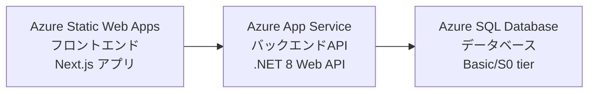
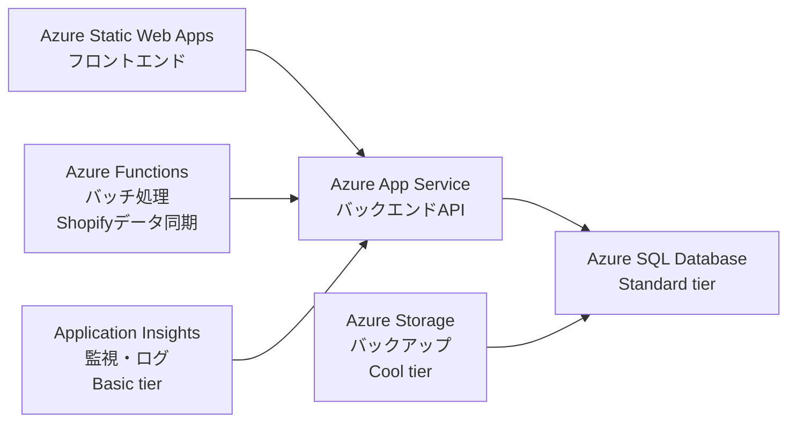

# Azureインフラ構成と費用見える化

> **📅 最終更新**: 2025年7月23日  
> **🎯 対象**: 非エンジニア向け解説  
> **💰 目的**: インフラコストの見える化と最適化

---

## 🏗️ 現状のインフラ構成

### 現在稼働中のサービス

### 現状の課題

- ❌ **バッチ処理のコスト効率が悪い**（App Service常時稼働）
- ❌ **監視・ログ収集が不十分**
- ❌ **バックアップ戦略が未確立**

---

## 🎯 将来のインフラ構成案

### 推奨構成（段階的導入）

#### Phase 1: 基本機能強化（〜3ヶ月）

#### Phase 2: スケール対応（3-6ヶ月）

- 🔄 **Azure Redis Cache** - キャッシュ（Basic C0）
- 🌐 **Azure CDN** - 静的コンテンツ配信（Standard tier）
- 🔐 **Azure Key Vault** - シークレット管理（Standard tier）

#### Phase 3: エンタープライズ対応（6ヶ月〜）

- 🚀 **Azure API Management** - API統合管理（Developer tier）
- 📨 **Azure Service Bus** - メッセージング（Basic tier）
- 📊 **Azure Monitor** - 高度な監視（Log Analytics）

---

## 💰 環境別コスト試算

### 現状構成の月額コスト（USD）

| サービス | 開発環境 | ステージング | 本番環境 | 3環境合計 |
|----------|----------|-------------|----------|-----------|
| **Azure Static Web Apps** | $0（無料枠） | $0（無料枠） | $9.00（Standard） | $9.00 |
| **Azure App Service** | $9.49（D1 Shared） | $9.49（D1 Shared） | $9.49（D1 Shared） | $28.47 |
| **Azure SQL Database** | $5.53（Basic） | $5.53（Basic） | $33.26（S1） | $44.32 |
| **月額合計** | **$15.02** | **$15.02** | **$51.75** | **$81.79** |

### 将来構成（Phase 1）の月額コスト（USD）

| サービス | 開発環境 | ステージング | 本番環境 | 3環境合計 |
|----------|----------|-------------|----------|-----------|
| **Azure Static Web Apps** | $0（無料枠） | $0（無料枠） | $9.00（Standard） | $9.00 |
| **Azure App Service** | $9.49（D1 Shared） | $9.49（D1 Shared） | $18.98（B1） | $37.96 |
| **Azure SQL Database** | $5.53（Basic） | $5.53（Basic） | $33.26（S1） | $44.32 |
| **Azure Functions** | $0（無料枠） | $0（無料枠） | $5.00（実行分） | $5.00 |
| **Application Insights** | $0（無料枠） | $1.00 | $5.00 | $6.00 |
| **Azure Storage (バックアップ)** | $1.00 | $1.00 | $2.00 | $4.00 |
| **月額合計** | **$16.02** | **$17.02** | **$73.24** | **$106.28** |

### 💡 コスト最適化の推奨事項

- ✅ **開発環境の自動停止**: 夜間・週末の自動停止で約50%削減可能（$20/月削減）
- ✅ **予約インスタンス**: 1年予約で約42%削減（本番環境で$15/月削減）
- ✅ **Functions活用**: バッチ処理をFunctions化で約$5/月削減
- ✅ **ステージング環境**: リリース前のみ起動で約$20/月削減

---

## 📊 段階的スケールアップ計画

| フェーズ | 期間 | 想定規模 | 月額コスト（3環境） | 主な追加サービス |
|----------|------|----------|-------------------|------------------|
| **現状** | 〜3ヶ月 | 100店舗 | $81.79 | 基本構成のみ |
| **Phase 1** | 3-6ヶ月 | 500店舗 | $106.28 | Functions, Application Insights, Storage |
| **Phase 2** | 6-12ヶ月 | 1,000店舗 | $250 | Redis Cache, CDN, Key Vault |
| **Phase 3** | 12ヶ月〜 | 5,000店舗 | $400〜 | API Management, Service Bus, Monitor |

---

## 📈 コスト監視・管理戦略

### 1. 即時実施項目

- 🔔 **Azure Cost Management**で月額予算アラート設定
  - 開発: $50
  - ステージング: $50
  - 本番: $100
- 🏷️ **リソースへのタグ付け**（Environment, Project, Owner）
- 📊 **日次コスト確認の自動化**

### 2. 月次レビュー項目

- 📋 **未使用リソースの棚卸し**
- 📉 **使用率の低いリソースのダウンサイジング検討**
- 💰 **予約インスタンス導入の費用対効果分析**
- 📈 **次月の使用量予測と予算調整**

### 3. 四半期レビュー項目

- 🏗️ **アーキテクチャ全体の見直し**
- 🔄 **新サービス・価格改定の影響評価**
- 📋 **長期的なコスト削減戦略の策定**

---

## 🎯 結論と推奨アクション

### 短期的アクション（1-2週間）

1. **開発環境の最適化**: 自動停止設定で即座に$20/月削減
2. **Azure Functions導入**: Shopifyデータ同期バッチをサーバーレス化
3. **Application Insights Basic**: 最小限の監視を開始

### 中期的アクション（1-3ヶ月）

1. **本番環境のスケールアップ準備**: B1プランへの移行計画
2. **バックアップ戦略確立**: Azure Storage (Cool tier)の活用
3. **予約インスタンス検討**: 3ヶ月の使用実績を基に判断

### 予算目安

- **初期（〜3ヶ月）**: 月額$100以内
- **成長期（3-6ヶ月）**: 月額$150以内
- **安定期（6ヶ月〜）**: 月額$250-400

---

## 🎨 HTMLプレビュー

📱 HTMLプレビューを表示

  <h3 style="color: white; margin-top: 0;">🎯 コスト最適化のポイント</h3>
  <ul style="color: white;">
    <li>開発環境の自動停止で約50%削減</li>
    <li>予約インスタンスで約42%削減</li>
    <li>Functions活用で約¥1,400/月削減</li>
  </ul>

  <h4 style="color: #0078d4; margin-top: 0;">💡 推奨事項</h4>
  
段階的なスケールアップにより、初期コストを抑えながら成長に対応できます。

<table style="width: 100%; border-collapse: collapse; margin: 20px 0;">
  <thead>
    <tr style="background-color: #0078d4; color: white;">
      <th style="padding: 12px; border: 1px solid #ddd;">環境</th>
      <th style="padding: 12px; border: 1px solid #ddd;">月額コスト</th>
      <th style="padding: 12px; border: 1px solid #ddd;">削減可能額</th>
    </tr>
  </thead>
  <tbody>
    <tr style="background-color: #f9f9f9;">
      <td style="padding: 12px; border: 1px solid #ddd;">開発環境</td>
      <td style="padding: 12px; border: 1px solid #ddd;">$15.02</td>
      <td style="padding: 12px; border: 1px solid #ddd;">$10</td>
    </tr>
    <tr>
      <td style="padding: 12px; border: 1px solid #ddd;">ステージング環境</td>
      <td style="padding: 12px; border: 1px solid #ddd;">$15.02</td>
      <td style="padding: 12px; border: 1px solid #ddd;">$10</td>
    </tr>
    <tr style="background-color: #f9f9f9;">
      <td style="padding: 12px; border: 1px solid #ddd;">本番環境</td>
      <td style="padding: 12px; border: 1px solid #ddd;">$51.75</td>
      <td style="padding: 12px; border: 1px solid #ddd;">$15</td>
    </tr>
  </tbody>
</table>

---

## 📋 関連ドキュメント

- [📊 Azureコスト試算チケット](../01-project-management/01-planning/azure-cost-estimation-tickets.md)
- [🗄️ SQL Server vs SQL Database説明書](./01-azure-sql/sql-server-vs-sql-database-explanation.md)
- [📈 プロジェクト状況](../01-project-management/01-planning/project-status.md)

---

*最終更新: 2025年7月23日* 