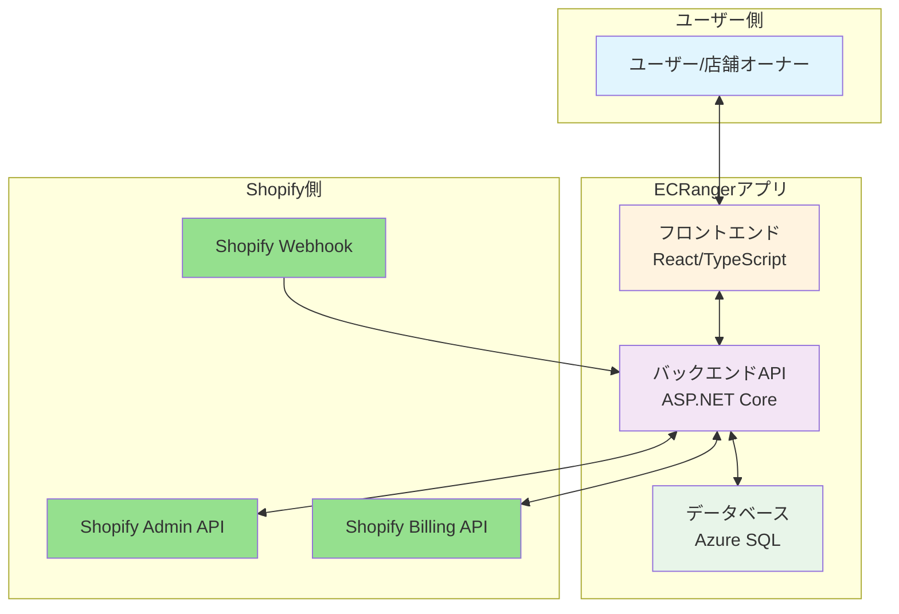
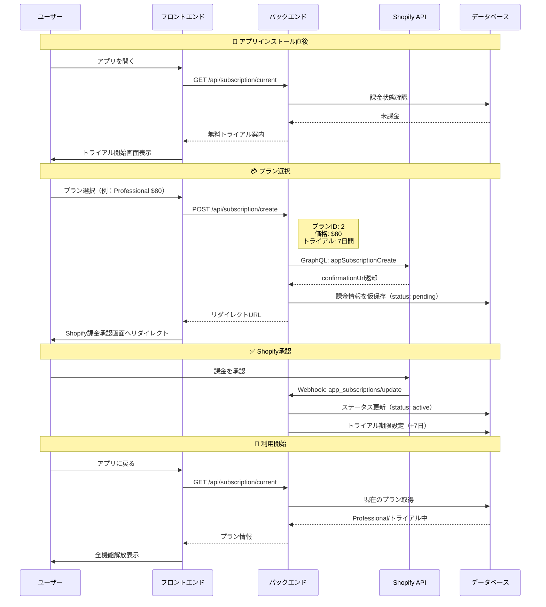
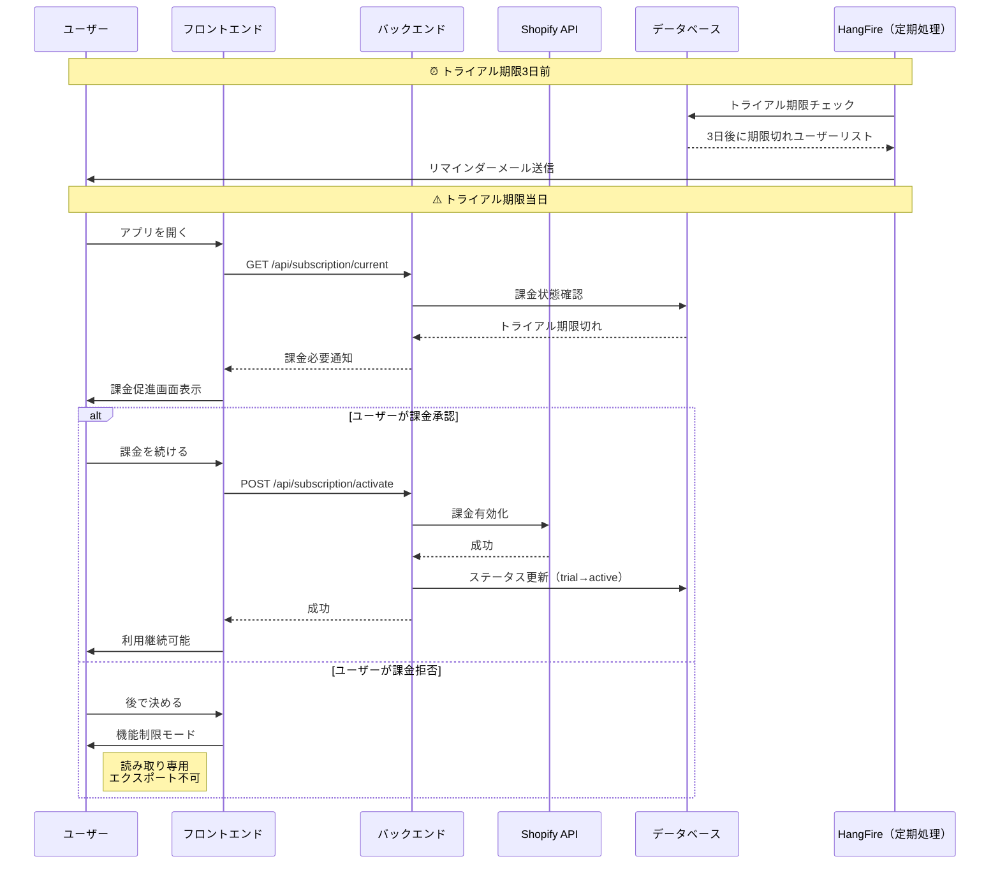
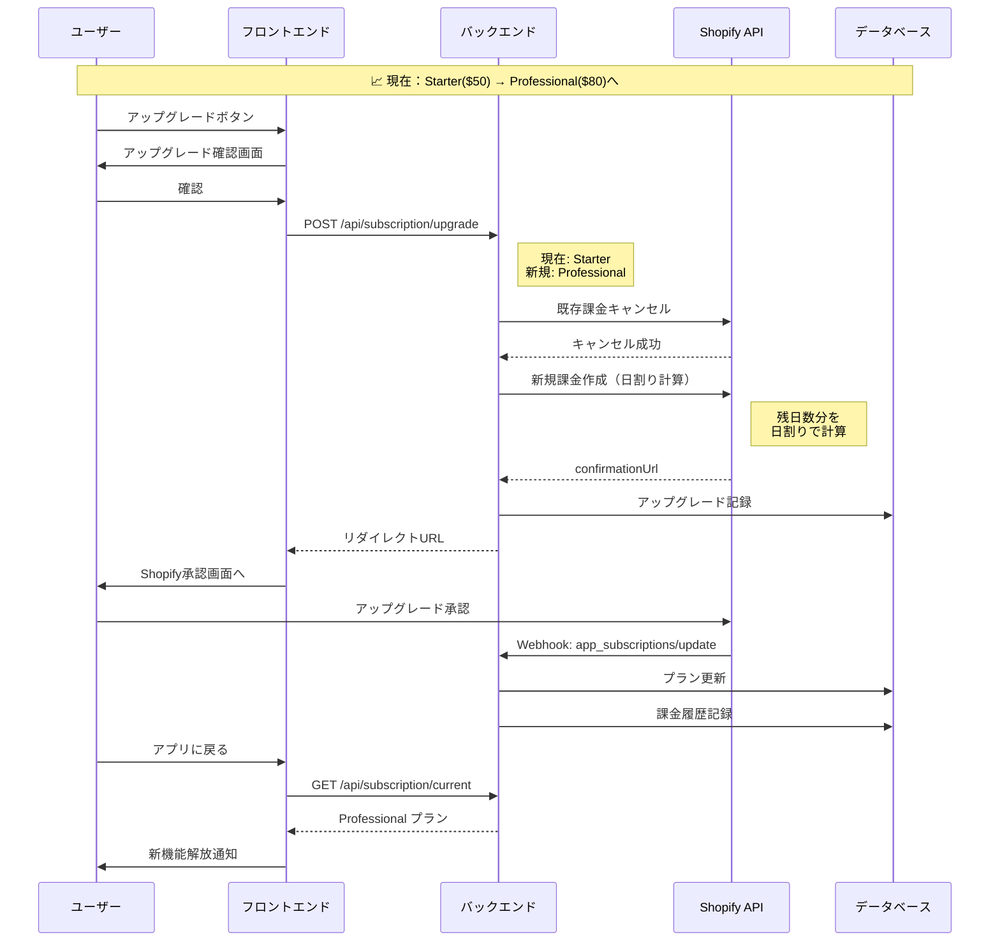
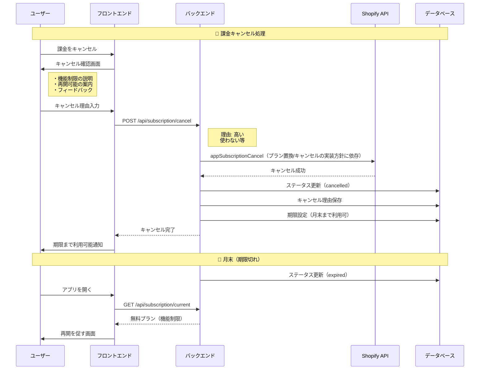
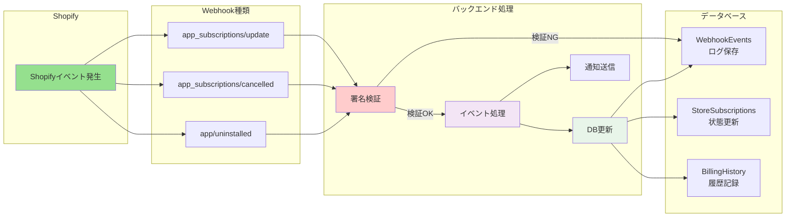
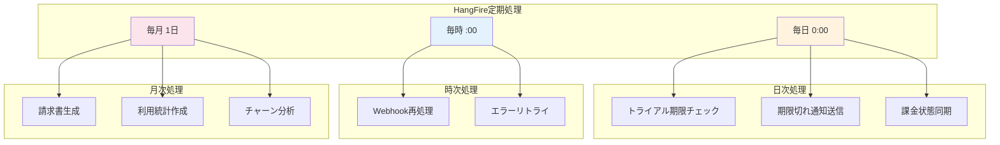
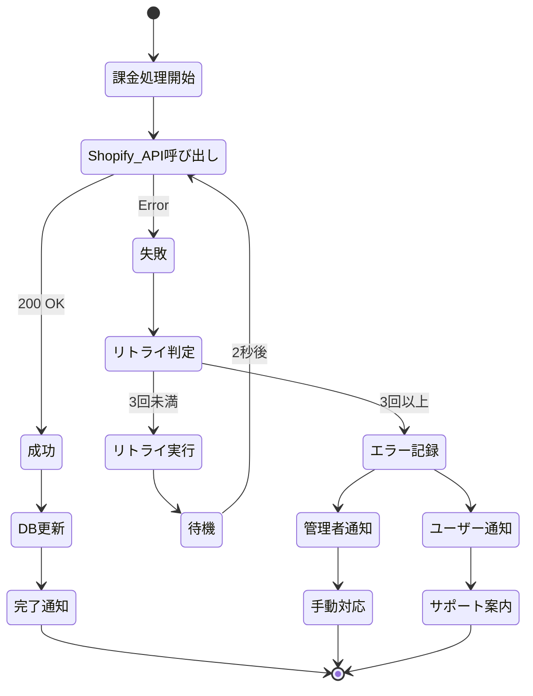
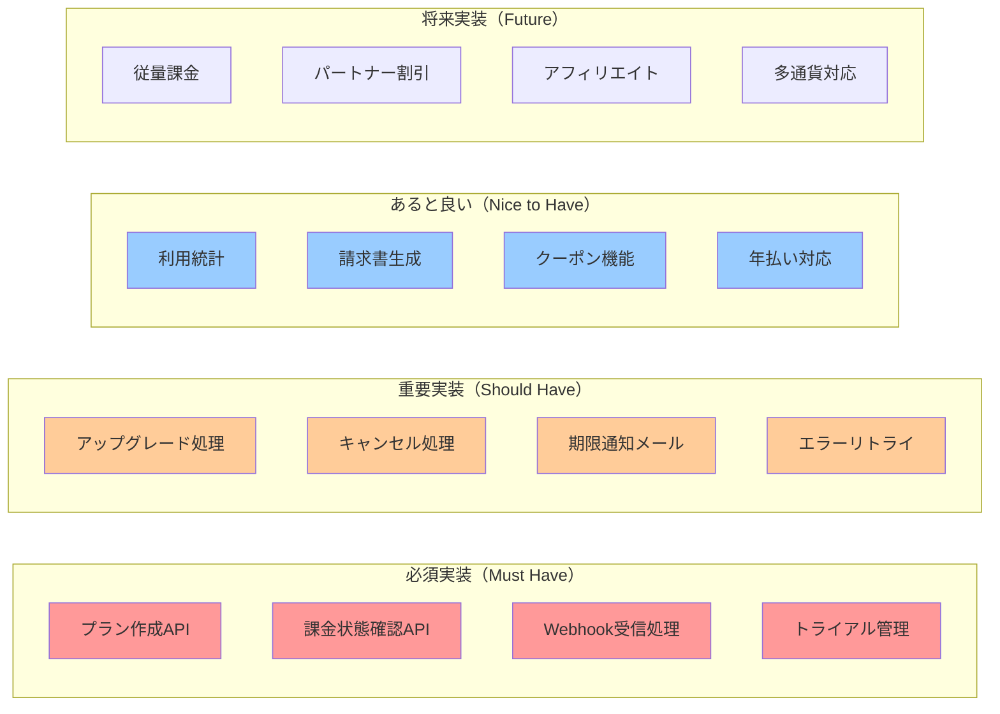
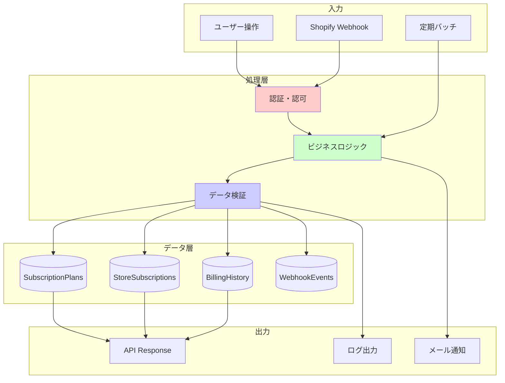

# 課金システム フロー図解説明書

## 作成日：2025年8月12日
## 作成者：Kenji（プロジェクトマネージャー）

---

## 1. 課金システム全体像

---

## 2. 初回課金フロー（新規ユーザー）

---

## 3. トライアル期限切れフロー

---

## 4. プランアップグレードフロー

---

## 5. 課金キャンセルフロー

---

## 6. Webhook処理フロー

---

## 7. 定期処理（バッチ処理）フロー

---

## 8. エラー処理とフォールバック

---

## 9. 実装必須タスクマトリックス

---

## 10. データフロー概要

---

## まとめ

### ✅ 実装必須フロー
1. **初回課金フロー** - 新規ユーザーの獲得
2. **Webhook処理** - Shopifyとの同期
3. **トライアル管理** - 期限管理と通知

### 🔧 技術的要件
- Shopify GraphQL API対応
- Webhook署名検証
- 冪等性の保証
- エラーリトライ機構

### 📊 ビジネス的要件
- 透明な料金表示
- スムーズな課金体験
- 適切な通知タイミング
- キャンセル後の再開促進

---

**本ドキュメントは実装ガイドとして活用してください**