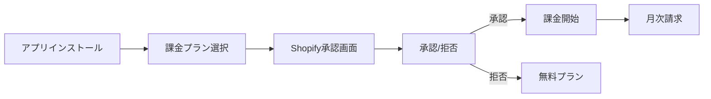

# Shopify課金システム完全ガイド
作成日: 2025-08-24
作成者: Kenji (PM)
対象: 福田さん、開発チーム全体

> 設計方針（重要）
> - プラン選択は「インストール完了（OAuth/初期設定直後）」に実施する。
> - インストール同意画面内では課金遷移を行わず、オンボーディング内でプラン選択または無料プラン（機能選択）へ誘導する。

## 📚 Shopify課金の仕組み - 完全理解

### 1. 基本概念

#### App Subscription とは
Shopifyアプリの月額課金を管理する仕組みで、GraphQL Admin APIの`appSubscriptionCreate`等を用います。

**特徴:**
- 月額固定料金の課金（従量課金との併用も可）
- 無料トライアル期間の設定可能（`trialDays`）
- Shopifyが決済を代行（開発者は決済情報を扱わない）
- 店舗の請求書に自動追加

注: RESTの`RecurringApplicationCharge`はレガシー扱いです。新規実装はGraphQLのApp Subscriptionを利用してください（公式推奨）。

#### 課金フロー


### 2. 実装パターン

#### パターン1: 新規インストール時の課金
```csharp
// 1. 課金URLを生成
var chargeUrl = await CreateSubscription(shopDomain, planId);

// 2. ユーザーをShopify承認画面へリダイレクト
return Redirect(chargeUrl);

// 3. 承認後、コールバックで状態確認
var isApproved = await CheckSubscriptionStatus(chargeId);
```

#### パターン2: プランアップグレード
```csharp
// 既存課金をキャンセル
await CancelCurrentSubscription(shopDomain);

// 新プランで課金作成
var newChargeUrl = await CreateSubscription(shopDomain, newPlanId);
```

#### パターン3: トライアル期間の扱い
```csharp
// トライアル期間付きプラン作成
var charge = new {
    name = "Professional Plan",
    price = 80.00,
    trial_days = 7,  // 7日間無料
    test = false
};
```

### 3. テストモードでの検証

#### テストモードの設定
```json
// appsettings.Development.json
{
  "Shopify": {
    "TestMode": true  // これで課金が0円になる
  }
}
```

#### テストモードの特徴
- 実際の請求は発生しない（0円）
- 承認フローは本番と同じ
- Webhookも正常に動作
- 「TEST」ラベルが表示される

### 4. よくあるシナリオと対応

#### Q1: ユーザーが課金を承認しなかった場合
**A:** 無料プランとして扱い、機能を制限する
```typescript
if (!subscription || subscription.status !== 'ACTIVE') {
  return { plan: 'free', features: limitedFeatures };
}
```

#### Q2: トライアル期間中のキャンセル
**A:** 即座に無料プランに移行、請求なし
```csharp
// トライアル期間中のキャンセルは請求が発生しない
if (subscription.IsInTrialPeriod) {
  await CancelWithoutCharge(subscriptionId);
}
```

#### Q3: プランダウングレード時の日割り計算
**A:** Shopifyが自動計算、クレジットとして次回請求に反映
```
例: $100プランから$50プランへ
- 残り15日分のクレジット: $50
- 新プラン請求: $50
- 実質請求: $0（クレジット相殺）
```

#### Q4: アプリアンインストール時の処理
**A:** Webhookで自動検知、課金自動停止
```csharp
[HttpPost("webhook/uninstalled")]
public async Task HandleUninstall(string shopDomain) {
  // 課金は自動的にキャンセルされる
  // DBのクリーンアップのみ実施
  await CleanupStoreData(shopDomain);
}
```

### 5. 課金状態の確認方法

#### GraphQL Query
```graphql
query {
  currentAppInstallation {
    activeSubscriptions {
      id
      name
      status
      trialDays
      currentPeriodEnd
      test
    }
  }
}
```

#### REST API（レガシー）
新規実装ではGraphQL Admin APIのApp Subscriptionを使用してください。以下のRESTエンドポイントはレガシー互換用途向けの参考です。
```bash
GET /admin/api/2024-01/recurring_application_charges/{charge_id}.json
```

### 6. Webhook イベント

#### 重要なWebhookトピック
| トピック | 発火タイミング | 処理内容 |
|---------|--------------|----------|
| app_subscriptions/update | 課金状態変更時 | DB更新、機能解放 |
| app_subscriptions/cancelled | キャンセル時 | 機能制限、通知 |
| app_subscriptions/approaching_capped_amount | 上限額の90%到達 | アラート、利用制限・案内 |
| app/uninstalled | アンインストール時 | データクリーンアップ |

### 7. トラブルシューティング

#### 課金が反映されない
1. Webhook受信を確認
2. HMAC署名検証が正しいか確認
3. IdempotencyKeyで重複処理を確認

#### 承認URLが無効
- 有効期限（24時間）を確認
- 一度使用したURLは無効になる

#### テストモードが動作しない
- 環境変数`Shopify:TestMode`を確認
- GraphQL mutationに`test: true`が渡されているか確認

### 8. 本番環境チェックリスト

#### デプロイ前確認
- [ ] TestModeがfalseに設定
- [ ] Webhook URLがHTTPS
- [ ] WebhookSecretが設定済み
- [ ] Rate Limit対策実装
- [ ] エラーログ監視設定

#### 申請時の注意点
- [ ] 課金説明が明確
- [ ] キャンセルポリシー記載
- [ ] サポート連絡先明記
- [ ] 無料プランの提供

### 9. 課金テスト手順

#### 完全なE2Eテスト
1. **準備**
   ```bash
   # 環境変数設定
   Shopify:TestMode=true
   ```

2. **新規インストールテスト**
   - テストストアでアプリインストール
   - プラン選択画面表示確認
   - Shopify承認画面遷移確認
   - 承認後の課金状態確認

3. **プラン変更テスト**
   - アップグレード操作
   - 承認画面での金額確認
   - 変更後の機能解放確認

4. **キャンセルテスト**
   - キャンセル操作実行
   - Webhook受信確認
   - 機能制限適用確認

5. **再インストールテスト**
   - アプリアンインストール
   - 再インストール
   - 課金状態リセット確認

### 10. よくある質問（FAQ）

**Q: 複数プランの同時課金は可能？**
A: いいえ、1つのアプリにつき1つの課金のみ

**Q: 年間プランは実装可能？**
A: はい、`interval: ANNUAL`で設定可能

**Q: 従量課金は可能？**
A: UsageChargeを併用することで可能

**Q: 返金処理は？**
A: Shopifyサポート経由で対応（アプリ側では不可）

### 11. 開発用コマンド集

```bash
# マイグレーション適用
sqlcmd -S (localdb)\MSSQLLocalDB -d ShopifyAnalytics -i "2025-08-24-AddWebhookEventsTable.sql"

# Webhook登録（ngrok使用時）
ngrok http 7140

# ログ確認
tail -f logs/shopify-billing.log

# テストモード切り替え
dotnet user-secrets set "Shopify:TestMode" "true"
```

### 12. 監視項目

#### Application Insights クエリ
```kusto
// 課金成功率
requests
| where name contains "subscription"
| summarize Success = countif(success == true), 
            Total = count() 
| extend SuccessRate = Success * 100.0 / Total

// Webhookエラー率
exceptions
| where operation_Name contains "webhook"
| summarize ErrorCount = count() by bin(timestamp, 1h)
```

---

### 13. 価格モデルと運用ポリシー（公式要点）

- 価格モデル（Subscription/One-time/Usage/組み合わせ）
  - 月次/年次の定額、従量課金（capped fee）や併用が可能
  - 設定に必要な主パラメータ: `amount`, `currencyCode`, `interval`
  - 参考: Shopify Billing – Pricing models（公式）
    - `https://shopify.dev/docs/apps/launch/billing#pricing-models`

- 無料トライアル（Free trials）
  - 新規サブスクリプションにのみ付与可能。既存には追加不可
  - トライアル日数後に自動課金へ移行
  - 参考: Free trials（公式）
    - `https://shopify.dev/docs/apps/launch/billing/offer-free-trials`

- 通貨（Supported currencies）
  - `shopBillingPreferences`でマーチャントの請求通貨を取得し一致させる
  - 参考: Supported currencies（公式）
    - `https://shopify.dev/docs/apps/launch/billing#supported-currencies`

- ゲーティング（Gate requests）
  - アクティブな支払いを検査し、未購入なら課金フローへ誘導
  - 参考: Gate requests（公式）
    - `https://shopify.dev/docs/apps/launch/billing#billing-process`

- Webhookトピック（Billing関連）
  - `APP_SUBSCRIPTIONS_UPDATE` / `APP_SUBSCRIPTIONS_APPROACHING_CAPPED_AMOUNT` など
  - 参考: Webhook topics（公式）
    - `https://shopify.dev/docs/apps/launch/billing#webhook-topics`

---

## 📝 まとめ

Shopify課金システムは、以下の3つのポイントを押さえれば完全に理解できます：

1. **課金フロー**: 作成→承認→アクティベート→Webhook
2. **テストモード**: 開発時は必ずtrue、本番はfalse
3. **エラー処理**: Rate Limit、Webhook遅延、重複処理対策

このガイドを参照しながら、安心してテストと運用を進めてください。

---
最終更新: 2025-08-24
次回更新: 必要に応じて