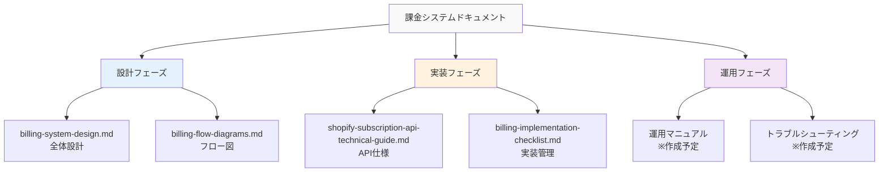

# 課金システムドキュメント

## 📁 ドキュメント構成

このフォルダには、Shopifyアプリの課金システムに関するすべての技術ドキュメントが含まれています。

---

## 📚 ドキュメント一覧

### 1. 設計・アーキテクチャ
- **[billing-system-design.md](./billing-system-design.md)**
  - 課金システム全体設計書
  - データベース設計、API設計、実装計画

- **[billing-flow-diagrams.md](./billing-flow-diagrams.md)** 🆕
  - Mermaidによるフロー図解
  - 各種シーケンス図、状態遷移図

### 2. 技術仕様
- **[shopify-subscription-api-technical-guide.md](./shopify-subscription-api-technical-guide.md)**
  - Shopify Billing API技術調査
  - GraphQLクエリサンプル、実装例

### 3. 実装管理
- **[billing-implementation-checklist.md](./billing-implementation-checklist.md)** 🆕
  - 実装チェックリスト
  - 優先順位、完了基準

---

## 🗺️ ドキュメントマップ



---

## 📖 読む順番（推奨）

### 開発者向け
1. **billing-flow-diagrams.md** - まず全体フローを理解
2. **billing-system-design.md** - 詳細設計を確認
3. **shopify-subscription-api-technical-guide.md** - API仕様を学習
4. **billing-implementation-checklist.md** - 実装タスクを確認

### ビジネス向け
1. **../06-business/billing-executive-summary.md** - エグゼクティブサマリー
2. **../06-business/billing-implementation-report-business.md** - ビジネスレポート

---

## 🔄 更新履歴

| 日付 | ドキュメント | 更新内容 |
|------|-------------|----------|
| 2025-08-12 | billing-flow-diagrams.md | 新規作成（Mermaid図解） |
| 2025-08-12 | billing-implementation-checklist.md | 新規作成（実装管理） |
| 2025-08-12 | billing-system-design.md | 初版作成 |
| 2025-08-13 | shopify-subscription-api-technical-guide.md | Takashi作成 |

---

## 🎯 クイックリファレンス

### プラン情報
| プラン | 月額 | 無料期間 |
|--------|------|----------|
| Starter | $50 | 7日間 |
| Professional | $80 | 7日間 |
| Enterprise | $100 | 14日間 |

### API エンドポイント
```
GET  /api/subscription/plans      # プラン一覧
GET  /api/subscription/current    # 現在の課金状態
POST /api/subscription/create     # 新規課金
POST /api/subscription/upgrade    # アップグレード
POST /api/subscription/cancel     # キャンセル
GET  /api/subscription/history    # 履歴取得
POST /api/webhook/subscription    # Webhook受信
```

### 重要なGraphQLクエリ
```graphql
# 課金作成
mutation recurringApplicationChargeCreate($charge: RecurringApplicationChargeInput!) {
  recurringApplicationChargeCreate(recurringApplicationCharge: $charge) {
    recurringApplicationCharge {
      id
      confirmationUrl
      status
    }
  }
}
```

---

## 👥 担当者

- **設計**: Kenji（PM）
- **バックエンド実装**: Takashi
- **フロントエンド実装**: Yuki
- **レビュー**: 福田様

---

## 📞 質問・サポート

課金システムに関する質問は、Slackチャンネル `#billing-implementation` までお願いします。

---

**最終更新**: 2025年8月12日 17:00