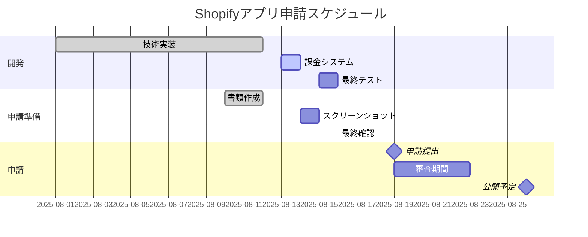

# 🛍️ Shopifyアプリ関連ドキュメント

## 概要
このフォルダには、Shopifyアプリの申請、課金、法的要件、GDPR対応に関するすべてのドキュメントが含まれています。

---

## 📁 フォルダ構成

```
06-shopify/
├── 01-申請関連/        # アプリストア申請に必要な文書
├── 02-課金システム/    # Billing API、サブスクリプション設計
├── 03-法的文書/        # プライバシーポリシー、利用規約
├── 04-GDPR対応/       # GDPR Webhook、データ保護
├── draft/             # 下書き・作業中文書
└── organized/         # アーカイブ済み文書
```

---

## 📚 主要ドキュメント

### 📝 01-申請関連
| ドキュメント | 説明 | ステータス |
|------------|------|-----------|
| [アプリストア申請ガイド.md](./01-申請関連/アプリストア申請ガイド.md) | 申請手順、必要書類 | ✅ 完成 |
| [申請チェックリスト.md](./01-申請関連/申請チェックリスト.md) | 申請前の確認項目 | ✅ 完成 |
| [申請準備状況レポート.md](./01-申請関連/申請準備状況レポート.md) | 現在の準備状況 | 🔄 更新中 |

### 💳 02-課金システム
| ドキュメント | 説明 | ステータス |
|------------|------|-----------|
| [システム設計書.md](./02-課金システム/02-技術仕様/システム設計書.md) | 詳細設計書 | ✅ 完成 |
| [フロー図解.md](./02-課金システム/02-技術仕様/フロー図解.md) | Mermaid図解 | ✅ 完成 |
| [GraphQL_API最新仕様.md](./02-課金システム/02-技術仕様/GraphQL_API最新仕様.md) | API仕様 | ✅ 完成 |
| [Shopifyサブスクリプション技術ガイド.md](./02-課金システム/02-技術仕様/Shopifyサブスクリプション技術ガイド.md) | 実装ガイド | ✅ 完成 |

### 📜 03-法的文書
| ドキュメント | 説明 | ステータス |
|------------|------|-----------|
| [プライバシーポリシー案.md](./03-法的文書/プライバシーポリシー案.md) | 個人情報保護方針 | 📝 レビュー待ち |
| [利用規約案.md](./03-法的文書/利用規約案.md) | サービス利用規約 | 📝 レビュー待ち |

### 🔒 04-GDPR対応
| ドキュメント | 説明 | ステータス |
|------------|------|-----------|
| [GDPR_Webhook仕様.md](./04-GDPR対応/GDPR_Webhook仕様.md) | 必須Webhook実装 | ✅ 実装済み |

---

## 🎯 申請スケジュール



---

## ✅ 申請要件チェックリスト

### 必須要件（Shopify公式）
- [x] OAuth認証実装
- [x] GDPR Webhook対応
- [ ] 課金システム実装（8/14完了予定）
- [x] アンインストール処理
- [x] セキュリティ要件

### 申請書類
- [ ] アプリ説明文（日英）
- [ ] スクリーンショット（5枚以上）
- [ ] プライバシーポリシーURL
- [ ] 利用規約URL
- [x] サポート連絡先

---

## 💰 課金プラン概要

| プラン | 月額 | 無料期間 | 対象 |
|--------|------|---------|------|
| **Starter** | $50 | 7日間 | 小規模店舗（商品1,000点まで） |
| **Professional** | $80 | 7日間 | 中規模店舗（商品10,000点まで） |
| **Enterprise** | $100 | 14日間 | 大規模店舗（無制限） |

### 主な機能差
```
Starter        : 基本分析、月次レポート
Professional   : + 高度な分析、週次レポート、API連携
Enterprise     : + カスタマイズ、専任サポート、無制限API
```

---

## 🔐 GDPR対応状況

### 実装済みWebhook
1. ✅ `customers/redact` - 顧客データ削除要求
2. ✅ `shop/redact` - ショップデータ削除要求
3. ✅ `customers/data_request` - 顧客データ開示要求

### データ保護方針
- 個人情報の暗号化保存
- 最小限のデータ収集
- 明示的な同意取得
- データポータビリティ対応

---

## 📋 申請前の最終確認

### 技術要件
- [ ] TypeScriptエラー: 0件
- [ ] ビルドエラー: 0件
- [ ] テストカバレッジ: 70%以上
- [ ] API応答時間: 2秒以内

### ビジネス要件
- [ ] 価格設定の妥当性確認
- [ ] 競合分析完了
- [ ] マーケティング素材準備
- [ ] プレスリリース準備

---

## 📊 競合分析

| 項目 | 当アプリ | 競合A | 競合B |
|------|---------|-------|-------|
| 最低価格 | **$50** | $79 | $99 |
| 無料期間 | **7-14日** | 7日 | なし |
| 日本語対応 | **◎** | △ | × |
| AI機能 | **◎** | ○ | △ |

---

## 🚀 今後の展開

### Phase 1（初回リリース）
- 基本的な分析機能
- 3つの料金プラン
- 日英対応

### Phase 2（3ヶ月後）
- AI予測機能強化
- 年払いプラン追加（20%割引）
- 多言語対応拡充

### Phase 3（6ヶ月後）
- カスタムレポート機能
- APIプラットフォーム
- パートナープログラム

---

## 📞 問い合わせ

- **申請関連**: Kenji（PM）
- **技術的質問**: Takashi（Backend）、Yuki（Frontend）
- **ビジネス**: 福田様

Slackチャンネル: `#shopify-app-submission`

---

## 🔄 更新履歴

| 日付 | 更新内容 | 担当者 |
|------|---------|--------|
| 2025-08-12 | フォルダ再構成、日本語化 | Kenji |
| 2025-08-12 | 課金システム設計完成 | Kenji/Takashi |
| 2025-08-13 | GDPR実装完了 | Takashi |

---

**最終更新**: 2025年8月12日 18:00