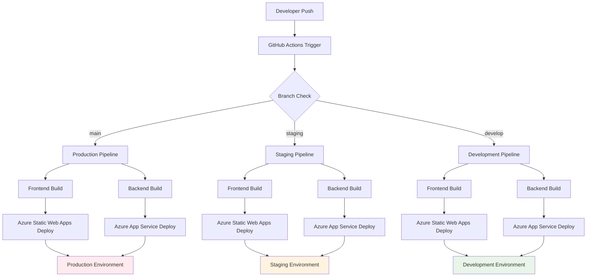

# CI/CD・トラブルシューティング統合ガイド

> **📅 作成日**: 2025年7月26日  
> **🎯 目的**: GitHub Actions・CI/CD・デプロイ問題の統一対処ガイド  
> **💻 対象**: GitHub Actions + Azure Static Web Apps + Azure App Service  
> **🔧 技術**: YAML + PowerShell + Azure CLI

---

## 📋 目次

1. [CI/CD概要](#cicd概要)
2. [GitHub Actions設定](#github-actions設定)
3. [よくある問題と解決法](#よくある問題と解決法)
4. [Azure Static Web Apps問題](#azure-static-web-apps問題)
5. [Azure App Service問題](#azure-app-service問題)
6. [環境変数・認証問題](#環境変数認証問題)
7. [デバッグ・診断方法](#デバッグ診断方法)
8. [予防策・ベストプラクティス](#予防策ベストプラクティス)

---

## 🌍 CI/CD概要

### パイプライン構成



### 対象ワークフロー

| ワークフロー | トリガー | 対象ブランチ | デプロイ先 |
|-------------|---------|-------------|-----------|
| **Frontend Deploy** | `frontend/**` 変更 | `main`, `staging`, `develop` | Azure Static Web Apps |
| **Backend Deploy** | `backend/**` 変更 | `main`, `staging`, `develop` | Azure App Service |
| **Manual Deploy** | 手動実行 | 任意 | 選択可能 |

---

## ⚙️ GitHub Actions設定

### ワークフロー構成

#### 1. Frontend デプロイワークフロー
```yaml
# .github/workflows/frontend-deploy.yml
name: Frontend Deploy - Azure Static Web Apps

on:
  push:
    branches: [ main, staging, develop ]
    paths:
      - 'frontend/**'
      - '.github/workflows/frontend-deploy.yml'
  pull_request:
    types: [opened, synchronize, reopened, closed]
    branches: [ main ]
    paths:
      - 'frontend/**'
  workflow_dispatch:
    inputs:
      environment:
        description: 'Deploy to environment'
        required: true
        default: 'development'
        type: choice
        options:
          - main
          - staging
          - development

jobs:
  build_and_deploy:
    if: github.event_name == 'push' || github.event_name == 'workflow_dispatch' || (github.event_name == 'pull_request' && github.event.action != 'closed')
    runs-on: ubuntu-latest
    name: Build and Deploy Frontend
    
    steps:
    - uses: actions/checkout@v4
      with:
        submodules: true
        lfs: false
        
    - name: Determine environment
      id: env
      run: |
        if [ "${{ github.event_name }}" = "workflow_dispatch" ]; then
          ENV="${{ github.event.inputs.environment }}"
        elif [ "${{ github.ref }}" = "refs/heads/main" ]; then
          ENV="main"
        elif [ "${{ github.ref }}" = "refs/heads/staging" ]; then
          ENV="staging"
        else
          ENV="development"
        fi
        
        echo "Environment: $ENV"
        
        case $ENV in
          "main")
            echo "deployment_environment=" >> $GITHUB_OUTPUT
            echo "environment_name=Production" >> $GITHUB_OUTPUT
            echo "node_env=production" >> $GITHUB_OUTPUT
            echo "build_environment=production" >> $GITHUB_OUTPUT
            echo "deploy_environment=production" >> $GITHUB_OUTPUT
            echo "app_environment=production" >> $GITHUB_OUTPUT
            ;;
          "staging")
            echo "deployment_environment=staging" >> $GITHUB_OUTPUT
            echo "environment_name=staging" >> $GITHUB_OUTPUT
            echo "node_env=production" >> $GITHUB_OUTPUT
            echo "build_environment=staging" >> $GITHUB_OUTPUT
            echo "deploy_environment=staging" >> $GITHUB_OUTPUT
            echo "app_environment=staging" >> $GITHUB_OUTPUT
            ;;
          *)
            echo "deployment_environment=development" >> $GITHUB_OUTPUT
            echo "environment_name=development" >> $GITHUB_OUTPUT
            echo "node_env=development" >> $GITHUB_OUTPUT
            echo "build_environment=development" >> $GITHUB_OUTPUT
            echo "deploy_environment=development" >> $GITHUB_OUTPUT
            echo "app_environment=development" >> $GITHUB_OUTPUT
            ;;
        esac
        
    - name: Deploy Status
      run: |
        echo "🚀 Deploying to: ${{ steps.env.outputs.environment_name }}"
        echo "🔧 デプロイ先環境: ${{ steps.env.outputs.deployment_environment == '' && 'Production (本番環境)' || format('Preview ({0})', steps.env.outputs.deployment_environment) }}"
        echo "🏗️ Build Environment: ${{ steps.env.outputs.build_environment }}"
        echo "📦 Node Environment: ${{ steps.env.outputs.node_env }}"
        
    - name: Build And Deploy
      uses: Azure/static-web-apps-deploy@v1
      with:
        azure_static_web_apps_api_token: ${{ secrets.AZURE_STATIC_WEB_APPS_API_TOKEN }}
        repo_token: ${{ secrets.GITHUB_TOKEN }}
        action: "upload"
        app_location: "/frontend"
        output_location: "out"
        deployment_environment: ${{ steps.env.outputs.deployment_environment }}
        app_settings: |
          NODE_ENV=${{ steps.env.outputs.node_env }}
          NEXT_PUBLIC_BUILD_ENVIRONMENT=${{ steps.env.outputs.build_environment }}
          NEXT_PUBLIC_DEPLOY_ENVIRONMENT=${{ steps.env.outputs.deploy_environment }}
          NEXT_PUBLIC_APP_ENVIRONMENT=${{ steps.env.outputs.app_environment }}

  close_pull_request:
    if: github.event_name == 'pull_request' && github.event.action == 'closed'
    runs-on: ubuntu-latest
    name: Close Pull Request
    steps:
    - name: Close Pull Request
      uses: Azure/static-web-apps-deploy@v1
      with:
        azure_static_web_apps_api_token: ${{ secrets.AZURE_STATIC_WEB_APPS_API_TOKEN }}
        action: "close"
```

#### 2. Backend デプロイワークフロー
```yaml
# .github/workflows/backend-deploy.yml
name: Backend Deploy - Azure App Service

on:
  push:
    branches: [ main, staging, develop ]
    paths:
      - 'backend/**'
      - '.github/workflows/backend-deploy.yml'
  workflow_dispatch:
    inputs:
      environment:
        description: 'Deploy to environment'
        required: true
        default: 'staging'
        type: choice
        options:
        - main
        - staging
        - develop

jobs:
  build:
    runs-on: windows-latest
    permissions:
      contents: read
      actions: read
      deployments: write
      id-token: write

    steps:
      - uses: actions/checkout@v4

      - name: Set up .NET Core
        uses: actions/setup-dotnet@v4
        with:
          dotnet-version: '8.x'

      - name: Build with dotnet
        run: |
          cd backend/ShopifyTestApi
          dotnet restore
          dotnet build --configuration Release

      - name: dotnet publish
        run: |
          cd backend/ShopifyTestApi
          dotnet publish -c Release -o ./publish

      - name: Upload artifact for deployment job
        uses: actions/upload-artifact@v4
        with:
          name: dotnet-app
          path: backend/ShopifyTestApi/publish

  deploy-main:
    runs-on: windows-latest
    needs: build
    if: github.ref == 'refs/heads/main' || (github.event_name == 'workflow_dispatch' && github.event.inputs.environment == 'main')
    environment: main
    
    steps:
      - name: Download artifact from build job
        uses: actions/download-artifact@v4
        with:
          name: dotnet-app

      - name: Deploy to Azure Web App (main)
        uses: azure/webapps-deploy@v3
        with:
          app-name: 'shopifyapp-backend-production'
          publish-profile: ${{ secrets.AZUREAPPSERVICE_PUBLISHPROFILE_MAIN }}
          package: .

  deploy-staging:
    runs-on: windows-latest
    needs: build
    if: github.ref == 'refs/heads/staging' || (github.event_name == 'workflow_dispatch' && github.event.inputs.environment == 'staging')
    environment: staging
    
    steps:
      - name: Download artifact from build job
        uses: actions/download-artifact@v4
        with:
          name: dotnet-app

      - name: Deploy to Azure Web App (staging)
        uses: azure/webapps-deploy@v3
        with:
          app-name: 'shopifyapp-backend-staging'
          publish-profile: ${{ secrets.AZUREAPPSERVICE_PUBLISHPROFILE_STAGING }}
          package: .

  deploy-develop:
    runs-on: windows-latest
    needs: build
    if: github.ref == 'refs/heads/develop' || (github.event_name == 'workflow_dispatch' && github.event.inputs.environment == 'develop')
    environment: development
    
    steps:
      - name: Download artifact from build job
        uses: actions/download-artifact@v4
        with:
          name: dotnet-app

      - name: Deploy to Azure Web App (develop)
        uses: azure/webapps-deploy@v3
        with:
          app-name: 'shopifyapp-backend-develop'
          publish-profile: ${{ secrets.AZUREAPPSERVICE_PUBLISHPROFILE_DEVELOP }}
          package: .
```

---

## 🚨 よくある問題と解決法

### 1. ワークフローが実行されない

#### 症状
```
Push to repository but GitHub Actions workflow doesn't trigger
```

#### 原因と解決法

**A. パストリガーの問題**
```yaml
# ❌ 問題のある設定
on:
  push:
    paths:
      - 'frontend/*'  # 浅い階層のみ

# ✅ 正しい設定
on:
  push:
    paths:
      - 'frontend/**'  # すべてのサブディレクトリ
```

**B. ブランチ名の不一致**
```yaml
# ❌ 問題
branches: [ master, staging ]  # mainブランチが含まれていない

# ✅ 正解
branches: [ main, staging, develop ]
```

**C. ワークフローファイルの構文エラー**
```bash
# YAML構文チェック
yamllint .github/workflows/frontend-deploy.yml

# または GitHub Actions tab でエラー確認
```

#### デバッグ方法
```yaml
- name: Debug Workflow Trigger
  run: |
    echo "Event: ${{ github.event_name }}"
    echo "Ref: ${{ github.ref }}"
    echo "Changed files: ${{ toJson(github.event.commits[0].modified) }}"
```

### 2. ビルド失敗

#### 症状
```
Error: The process '/opt/hostedtoolcache/node/18.17.1/x64/bin/npm' failed with exit code 1
```

#### よくある原因と解決法

**A. 依存関係の問題**
```yaml
# package-lock.json の不整合
- name: Clean install
  run: |
    rm -rf node_modules package-lock.json
    npm install
    npm run build
```

**B. Node.jsバージョンの問題**
```yaml
- name: Setup Node.js
  uses: actions/setup-node@v4
  with:
    node-version: '18'  # ローカル開発環境と合わせる
    cache: 'npm'
    cache-dependency-path: frontend/package-lock.json
```

**C. 環境変数の問題**
```yaml
- name: Debug Environment Variables
  run: |
    echo "NODE_ENV: $NODE_ENV"
    echo "Build Environment: $NEXT_PUBLIC_BUILD_ENVIRONMENT"
    # 機密情報は表示しない
```

**D. メモリ不足**
```yaml
- name: Build with increased memory
  run: |
    cd frontend
    NODE_OPTIONS="--max-old-space-size=4096" npm run build
```

### 3. デプロイ失敗

#### 症状
```
Error: Failed to deploy web app. Error: Package deployment using ZIP Deploy failed.
```

#### 診断・解決手順

**A. アーティファクトの確認**
```yaml
- name: List artifact contents
  run: |
    ls -la
    find . -name "*.dll" | head -10
    du -sh .
```

**B. Publish Profileの確認**
```yaml
- name: Validate Publish Profile
  run: |
    if [ -z "${{ secrets.AZUREAPPSERVICE_PUBLISHPROFILE_MAIN }}" ]; then
      echo "❌ Publish profile secret is empty"
      exit 1
    else
      echo "✅ Publish profile is set"
    fi
```

**C. App Serviceの状態確認**
```bash
# Azure CLI での確認
az webapp show \
  --name shopifyapp-backend-production \
  --resource-group shopify-marketing-rg \
  --query "state"
```

---

## 🎨 Azure Static Web Apps問題

### 1. プレビュー環境が作成される問題

#### 症状
```
mainブランチにデプロイしたのに、プレビュー環境が作成される
URL: https://app-name-production.1.azurestaticapps.net/ (プレビュー)
期待: https://app-name.1.azurestaticapps.net/ (本番)
```

#### 原因
`deployment_environment`パラメータの設定ミス

#### 解決法
```yaml
# ❌ 間違った設定
deployment_environment: Production  # → プレビュー環境が作成される

# ✅ 正しい設定
deployment_environment: ${{ github.ref == 'refs/heads/main' && '' || 'development' }}
```

### 2. "No matching Static Web App environment was found"

#### 症状
```
Error: No matching Static Web App environment was found for the deployment environment: 'Production'
```

#### 原因
Azure Portal の環境名と GitHub Actions の環境名の不一致

#### 解決法
```yaml
# Azure Portal の環境名を確認
# Production → production (小文字)
# Staging → staging

- name: Determine environment
  id: env
  run: |
    if [ "${{ github.ref }}" = "refs/heads/main" ]; then
      echo "deployment_environment=" >> $GITHUB_OUTPUT  # 本番は空
    else
      echo "deployment_environment=development" >> $GITHUB_OUTPUT
    fi
```

### 3. ビルド設定が反映されない

#### 症状
環境変数が正しく設定されない、またはビルドが期待通りに動作しない

#### 解決法

**A. app_settings の正しい形式**
```yaml
app_settings: |
  NODE_ENV=${{ steps.env.outputs.node_env }}
  NEXT_PUBLIC_BUILD_ENVIRONMENT=${{ steps.env.outputs.build_environment }}
  NEXT_PUBLIC_DEPLOY_ENVIRONMENT=${{ steps.env.outputs.deploy_environment }}
```

**B. staticwebapp.config.json の設定**
```json
{
  "navigationFallback": {
    "rewrite": "/index.html",
    "exclude": ["/api/*", "/_next/*", "/images/*"]
  },
  "routes": [
    {
      "route": "/api/*",
      "allowedRoles": ["authenticated"]
    }
  ],
  "responseOverrides": {
    "404": {
      "rewrite": "/index.html",
      "statusCode": 200
    }
  }
}
```

### 4. デプロイ内容が反映されない

#### 症状
GitHub Actions は成功するが、実際のサイトに変更が反映されない

#### 診断方法
```yaml
- name: Debug Deployment
  run: |
    echo "🔍 Deployment Info:"
    echo "Branch: ${{ github.ref }}"
    echo "Environment: ${{ steps.env.outputs.deployment_environment }}"
    echo "Commit: ${{ github.sha }}"
    echo "Actor: ${{ github.actor }}"
```

#### 解決法

**A. キャッシュクリア**
```bash
# ブラウザのハードリフレッシュ
Ctrl+F5 (Windows) / Cmd+Shift+R (Mac)
```

**B. デプロイ先環境の確認**
```yaml
- name: Verify Deployment Target
  run: |
    if [ -z "${{ steps.env.outputs.deployment_environment }}" ]; then
      echo "✅ Deploying to Production environment"
    else
      echo "🔧 Deploying to Preview environment: ${{ steps.env.outputs.deployment_environment }}"
    fi
```

---

## ⚙️ Azure App Service問題

### 1. Publish Profile認証失敗

#### 症状
```
Error: Failed to authenticate using publish profile
```

#### 解決手順

**A. Publish Profileの再取得**
```bash
# Azure Portal → App Service → 発行プロファイルの取得
# 新しいファイルをダウンロードして GitHub Secrets を更新
```

**B. Secret名の確認**
```yaml
# GitHub Repository → Settings → Secrets and variables → Actions
# Secret名がワークフローと一致しているか確認
AZUREAPPSERVICE_PUBLISHPROFILE_MAIN
AZUREAPPSERVICE_PUBLISHPROFILE_STAGING
AZUREAPPSERVICE_PUBLISHPROFILE_DEVELOP
```

**C. XML形式の確認**
```xml
<!-- Publish Profile の内容例 -->
<publishData>
  <publishProfile 
    profileName="xxx - Web Deploy"
    publishMethod="MSDeploy"
    publishUrl="xxx.scm.azurewebsites.net:443"
    msdeploysite="xxx"
    userName="$xxx"
    userPWD="xxx"
    ...
  />
</publishData>
```

### 2. .NET ビルド失敗

#### 症状
```
Error: The command "dotnet build" failed with exit code 1
```

#### 診断・解決方法

**A. 依存関係の確認**
```yaml
- name: Restore dependencies
  run: |
    cd backend/ShopifyTestApi
    dotnet restore --verbosity detailed
    dotnet list package --vulnerable
```

**B. .NET バージョンの確認**
```yaml
- name: Setup .NET Core
  uses: actions/setup-dotnet@v4
  with:
    dotnet-version: '8.x'  # プロジェクトのターゲットフレームワークと一致

- name: Verify .NET version
  run: |
    dotnet --version
    dotnet --info
```

**C. プロジェクトファイルの確認**
```xml
<!-- ShopifyTestApi.csproj -->
<Project Sdk="Microsoft.NET.Sdk.Web">
  <PropertyGroup>
    <TargetFramework>net8.0</TargetFramework>
    <RuntimeIdentifier>win-x64</RuntimeIdentifier>  <!-- App Service 用 -->
  </PropertyGroup>
</Project>
```

### 3. App Service起動失敗

#### 症状
デプロイは成功するが、App Service が起動しない

#### 診断方法
```bash
# Azure Portal → App Service → ログストリーム
# または Kudu Console → LogFiles/Application/

# Azure CLI でのログ確認
az webapp log tail \
  --name shopifyapp-backend-production \
  --resource-group shopify-marketing-rg
```

#### よくある原因と解決法

**A. 設定ファイルの問題**
```csharp
// Program.cs にトライキャッチ追加
try
{
    var app = builder.Build();
    app.Logger.LogInformation("🚀 Application starting...");
    
    // 設定値の確認
    var env = app.Environment.EnvironmentName;
    app.Logger.LogInformation($"Environment: {env}");
    
    app.Run();
}
catch (Exception ex)
{
    Console.WriteLine($"❌ Application startup failed: {ex}");
    throw;
}
```

**B. 接続文字列の問題**
```csharp
// appsettings.json で接続文字列をテスト
var connectionString = builder.Configuration.GetConnectionString("DefaultConnection");
if (string.IsNullOrEmpty(connectionString))
{
    throw new InvalidOperationException("Database connection string is not configured");
}
```

---

## 🔐 環境変数・認証問題

### 1. GitHub Secrets 設定問題

#### 症状
環境変数が期待した値にならない、またはnullになる

#### 確認・解決手順

**A. Secret名の確認**
```yaml
# GitHub Repository → Settings → Secrets and variables → Actions

# Repository Secrets (全環境共通)
AZURE_STATIC_WEB_APPS_API_TOKEN
AZUREAPPSERVICE_PUBLISHPROFILE_MAIN
AZUREAPPSERVICE_PUBLISHPROFILE_STAGING
AZUREAPPSERVICE_PUBLISHPROFILE_DEVELOP

# Environment Secrets (環境別)
# production environment
API_URL: https://shopifyapp-backend-production.japanwest-01.azurewebsites.net
DEBUG_API: false

# staging environment  
API_URL: https://shopifytestapi20250720173320-aed5bhc0cferg2hm.japanwest-01.azurewebsites.net
DEBUG_API: true
```

**B. 環境変数のデバッグ**
```yaml
- name: Debug Secrets (Safe)
  run: |
    echo "🔍 Secret Availability Check:"
    echo "AZURE_STATIC_WEB_APPS_API_TOKEN: ${{ secrets.AZURE_STATIC_WEB_APPS_API_TOKEN != '' && '✅ Available' || '❌ Missing' }}"
    echo "PUBLISH_PROFILE_MAIN: ${{ secrets.AZUREAPPSERVICE_PUBLISHPROFILE_MAIN != '' && '✅ Available' || '❌ Missing' }}"
    echo "API_URL: ${{ secrets.API_URL != '' && '✅ Available' || '❌ Missing' }}"
    # 実際の値は表示しない（セキュリティのため）
```

### 2. Environment Protection Rules

#### 症状
デプロイジョブが「waiting for approval」状態で止まる

#### 設定確認・調整

**A. Protection Rules の確認**
```
GitHub Repository → Settings → Environments → [環境名]

# Production Environment
Required reviewers: 1-2名を設定
Wait timer: 5 minutes
Restrict pushes to protected branches: ☑️ enabled

# Staging Environment
Wait timer: 1 minute (短縮可能)

# Development Environment  
Protection rules: なし (即座にデプロイ)
```

**B. 緊急時のバイパス**
```yaml
# 緊急時用のワークフロー (main ブランチのみ)
on:
  workflow_dispatch:
    inputs:
      bypass_approval:
        description: 'Bypass approval for emergency'
        required: false
        type: boolean
        default: false

jobs:
  emergency_deploy:
    if: github.event.inputs.bypass_approval == 'true' && github.ref == 'refs/heads/main'
    # environment指定なし = Protection Rulesをバイパス
```

### 3. Azure認証問題

#### 症状
Azure Static Web Apps API Token が無効

#### 解決手順

**A. API Token の再取得**
```bash
# Azure Portal → Static Web Apps → 管理 → API キー
# 新しいトークンを生成してGitHub Secretsに設定
```

**B. トークンの検証**
```bash
# Azure CLI でのトークン確認
az staticwebapp show \
  --name shopify-marketing-suite-frontend \
  --resource-group shopify-marketing-rg \
  --query "repositoryToken"
```

---

## 🔍 デバッグ・診断方法

### 1. GitHub Actions ログ分析

#### ログレベル別確認

**A. ワークフロー実行ログ**
```
GitHub Repository → Actions → [ワークフロー名] → [実行] → [ジョブ名]
```

**B. 詳細ログの有効化**
```yaml
# Repository Settings → Secrets and variables → Actions
ACTIONS_RUNNER_DEBUG: true
ACTIONS_STEP_DEBUG: true
```

#### 重要なログポイント
```yaml
- name: Comprehensive Debug
  run: |
    echo "🔍 System Information:"
    echo "Runner OS: ${{ runner.os }}"
    echo "GitHub Event: ${{ github.event_name }}"
    echo "Branch: ${{ github.ref }}"
    echo "Commit: ${{ github.sha }}"
    echo "Actor: ${{ github.actor }}"
    
    echo "🔧 Environment Variables:"
    echo "NODE_ENV: $NODE_ENV"
    echo "Working Directory: $(pwd)"
    echo "Disk Space: $(df -h . | tail -1)"
    
    echo "📁 Directory Structure:"
    ls -la
    
    if [ -d "frontend" ]; then
      echo "Frontend directory exists"
      ls -la frontend/
    fi
    
    if [ -d "backend" ]; then
      echo "Backend directory exists"
      ls -la backend/
    fi
```

### 2. Azure リソース診断

#### App Service 診断
```bash
# Azure CLI での基本確認
az webapp show \
  --name shopifyapp-backend-production \
  --resource-group shopify-marketing-rg \
  --query "{name:name, state:state, hostNames:hostNames, lastModifiedTimeUtc:lastModifiedTimeUtc}"

# ヘルスチェック
az webapp list-runtimes --linux
```

#### Static Web Apps 診断
```bash
# リソース情報確認
az staticwebapp show \
  --name shopify-marketing-suite-frontend \
  --resource-group shopify-marketing-rg \
  --query "{name:name, defaultHostname:defaultHostname, repositoryUrl:repositoryUrl, branch:branch}"

# デプロイ履歴確認
az staticwebapp environment list \
  --name shopify-marketing-suite-frontend \
  --resource-group shopify-marketing-rg
```

### 3. ネットワーク・API診断

#### エンドポイント疎通確認
```bash
# ヘルスチェックエンドポイント
curl -I https://shopifyapp-backend-production.azurewebsites.net/health

# CORS確認
curl -H "Origin: https://shopify-marketing-suite.azurestaticapps.net" \
     -H "Access-Control-Request-Method: GET" \
     -X OPTIONS \
     https://shopifyapp-backend-production.azurewebsites.net/api/test

# SSL証明書確認
openssl s_client -connect shopifyapp-backend-production.azurewebsites.net:443 -servername shopifyapp-backend-production.azurewebsites.net
```

---

## 🛡️ 予防策・ベストプラクティス

### 1. 事前検証・テスト

#### Pre-deployment チェック
```yaml
name: Pre-deployment Validation

on:
  pull_request:
    branches: [ main, staging ]

jobs:
  validate:
    runs-on: ubuntu-latest
    steps:
    - uses: actions/checkout@v4
    
    - name: Validate YAML syntax
      run: |
        yamllint .github/workflows/
    
    - name: Security scan
      run: |
        npm audit --audit-level moderate
        
    - name: Build test
      run: |
        cd frontend
        npm ci
        npm run build
        
    - name: Unit tests
      run: |
        cd frontend
        npm test
```

#### ステージング環境でのテスト
```yaml
- name: Staging smoke test
  if: github.ref == 'refs/heads/staging'
  run: |
    # デプロイ後の基本機能テスト
    curl -f https://app-staging.azurestaticapps.net/health || exit 1
    curl -f https://shopifytestapi20250720173320-aed5bhc0cferg2hm.japanwest-01.azurewebsites.net/health || exit 1
```

### 2. 監視・アラート設定

#### GitHub Actions 監視
```yaml
# Slack/Teams 通知設定
- name: Notify on failure
  if: failure()
  uses: 8398a7/action-slack@v3
  with:
    status: failure
    channel: '#deployments'
    webhook_url: ${{ secrets.SLACK_WEBHOOK }}
    message: |
      🚨 Deployment failed!
      Branch: ${{ github.ref }}
      Commit: ${{ github.sha }}
      Actor: ${{ github.actor }}
```

#### Azure Monitor 統合
```bash
# Azure CLI でアラート設定
az monitor action-group create \
  --name "deployment-alerts" \
  --resource-group shopify-marketing-rg \
  --short-name "DeployAlert"

az monitor metrics alert create \
  --name "high-error-rate" \
  --resource-group shopify-marketing-rg \
  --scopes /subscriptions/{sub-id}/resourceGroups/shopify-marketing-rg/providers/Microsoft.Web/sites/shopifyapp-backend-production \
  --condition "avg Http5xx > 10" \
  --window-size 5m \
  --evaluation-frequency 1m \
  --action /subscriptions/{sub-id}/resourceGroups/shopify-marketing-rg/providers/microsoft.insights/actionGroups/deployment-alerts
```

### 3. ロールバック戦略

#### 自動ロールバック
```yaml
- name: Health check after deployment
  id: health_check
  run: |
    sleep 30  # デプロイ完了待ち
    
    for i in {1..5}; do
      if curl -f ${{ secrets.API_URL }}/health; then
        echo "✅ Health check passed"
        echo "healthy=true" >> $GITHUB_OUTPUT
        break
      else
        echo "❌ Health check failed (attempt $i/5)"
        sleep 10
      fi
    done
    
    if [ "$i" -eq 5 ]; then
      echo "healthy=false" >> $GITHUB_OUTPUT
    fi

- name: Rollback on health check failure
  if: steps.health_check.outputs.healthy == 'false'
  run: |
    echo "🔄 Rolling back due to health check failure"
    # 前回の成功したデプロイメントにロールバック
    az webapp deployment slot swap \
      --name shopifyapp-backend-production \
      --resource-group shopify-marketing-rg \
      --slot staging \
      --target-slot production \
      --action swap
```

### 4. 定期メンテナンス

#### 月次セキュリティチェック
```yaml
name: Monthly Security Audit

on:
  schedule:
    - cron: '0 2 1 * *'  # 毎月1日 AM 2:00

jobs:
  security_audit:
    runs-on: ubuntu-latest
    steps:
    - uses: actions/checkout@v4
    
    - name: Dependencies security scan
      run: |
        cd frontend
        npm audit --audit-level high
        
    - name: Code quality check
      run: |
        cd frontend
        npm run lint
        npm run type-check
        
    - name: Report results
      # Slack/Teams等への通知
```

---

## 📋 トラブルシューティングチェックリスト

### GitHub Actions 問題

#### ワークフロー実行前
- [ ] YAML構文が正しい
- [ ] トリガー条件（ブランチ、パス）が正しい
- [ ] 必要なSecretsが設定済み
- [ ] Environment Protection Rulesが適切

#### ビルド問題
- [ ] Node.js/.NETバージョンが一致
- [ ] 依存関係が最新かつ脆弱性なし
- [ ] 環境変数が正しく設定
- [ ] メモリ使用量が適切

#### デプロイ問題
- [ ] Publish Profile/API Tokenが有効
- [ ] Azureリソースが正常状態
- [ ] ネットワーク接続に問題なし
- [ ] デプロイパッケージが正しい

### Azure リソース問題

#### App Service
- [ ] サービスプランが適切
- [ ] アプリケーション設定が正しい
- [ ] ログ設定が有効
- [ ] ヘルスチェックが成功

#### Static Web Apps
- [ ] 環境設定が正しい
- [ ] ビルド設定が適切
- [ ] ルーティング設定が正しい
- [ ] CORS設定が適切

### 環境・設定問題

#### 環境変数
- [ ] Secret名が正しい
- [ ] 環境別設定が分離済み
- [ ] ビルド時変数が設定済み
- [ ] 機密情報が適切に管理済み

#### 認証・セキュリティ
- [ ] Basic認証が正常動作
- [ ] HTTPS証明書が有効
- [ ] CORSが適切に設定
- [ ] IP制限が必要に応じて設定

---

*最終更新: 2025年7月26日*