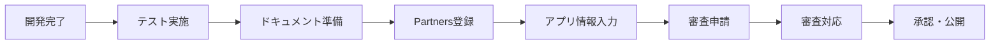

# Shopify App Store 申請ガイド

**作成日**: 2025年7月29日  
**作成者**: YUKI(Claude)  
**更新日**: 2025年7月29日  
**申請予定日**: 2025年8月8日

## 📌 概要

このガイドは、Shopify AIマーケティング分析スイートをShopify App Storeに申請するための詳細な手順書です。初回申請で承認を得るために必要な全ての情報を網羅しています。

## 🎯 申請の全体フロー



## 📝 Step 1: 事前準備（7/29-8/5）

### 1.1 技術要件の確認

#### 必須要件チェック
- [x] OAuth 2.0認証の実装
- [ ] GDPR必須Webhookの実装（4種類全て）
- [x] HTTPS通信の強制
- [ ] CSPヘッダーの適切な設定
- [ ] レート制限対策

#### パフォーマンス要件
- [ ] 初回読み込み: 3秒以内
- [ ] APIレスポンス: 2秒以内
- [ ] Webhook応答: 5秒以内

### 1.2 アプリ情報の準備

#### 基本情報
```yaml
アプリ名:
  日本語: Shopify AIマーケティング分析スイート
  英語: Shopify AI Marketing Analytics Suite

カテゴリー: Store management > Analytics and reports

簡潔な説明（〜80文字）:
  日本語: AIを活用してShopifyストアの売上を最大化する高度な分析ツール
  英語: Advanced analytics tool that maximizes Shopify store sales with AI

詳細な説明（400文字以上）:
  以下のセクション参照
```

#### 詳細な説明文テンプレート

**日本語版：**
```
Shopify AIマーケティング分析スイートは、あなたのストアデータを深く分析し、
売上向上のための実用的なインサイトを提供します。

【主な機能】
✅ リアルタイム売上分析
- 日別・月別・年別の売上推移を可視化
- 商品別・カテゴリー別の売上分析
- 前年同期比較で成長率を把握

✅ 顧客行動分析
- 顧客セグメント自動分類
- 購買パターンの可視化
- 休眠顧客の早期発見と対策提案

✅ 商品パフォーマンス分析
- 売れ筋商品の自動検出
- 在庫回転率の最適化提案
- クロスセル機会の発見

✅ AI予測機能
- 翌月の売上予測
- 需要予測による在庫最適化
- 顧客離脱リスクの事前察知

【導入メリット】
• データドリブンな意思決定が可能に
• 売上向上の具体的なアクションが明確に
• 日々の運営効率が大幅に改善

【こんな方におすすめ】
• 売上を伸ばしたいが何から始めればいいか分からない
• データは溜まっているが活用できていない
• 効率的にストア運営を改善したい

今すぐインストールして、あなたのストアの潜在能力を最大限に引き出しましょう！
```

**英語版：**
```
Shopify AI Marketing Analytics Suite deeply analyzes your store data 
and provides actionable insights to boost your sales.

【Key Features】
✅ Real-time Sales Analytics
- Visualize daily, monthly, and yearly sales trends
- Product and category-based sales analysis
- Year-over-year comparison for growth tracking

✅ Customer Behavior Analysis
- Automatic customer segmentation
- Purchase pattern visualization
- Early detection of dormant customers

✅ Product Performance Analysis
- Automatic detection of best-sellers
- Inventory turnover optimization
- Cross-sell opportunity discovery

✅ AI Prediction Features
- Next month sales forecast
- Demand prediction for inventory optimization
- Customer churn risk detection

【Benefits】
• Enable data-driven decision making
• Clear actionable steps for sales growth
• Significantly improve daily operations

【Perfect for】
• Store owners wanting to grow sales but unsure where to start
• Those with data but struggling to utilize it
• Anyone seeking efficient store management

Install now and unlock your store's full potential!
```

### 1.3 ビジュアル素材の準備

#### アプリアイコン
- **サイズ**: 512x512px
- **形式**: PNG（背景透過）
- **内容**: AIとグラフを組み合わせたモダンなデザイン

#### スクリーンショット（最低5枚）
1. **ダッシュボード画面**
   - 全体的な売上サマリー
   - 重要KPIの表示
   
2. **売上分析画面**
   - グラフとチャート
   - 前年比較

3. **顧客分析画面**
   - セグメント表示
   - 顧客リスト

4. **商品分析画面**
   - パフォーマンス指標
   - ランキング表示

5. **AI予測画面**
   - 予測グラフ
   - 推奨アクション

#### プロモーションビデオ（推奨）
- **長さ**: 30-60秒
- **内容**: 主要機能のデモンストレーション
- **字幕**: 日本語・英語

## 🏪 Step 2: Shopify Partners設定（8/1-8/2）

### 2.1 アカウント作成

1. [Shopify Partners](https://partners.shopify.com)にアクセス
2. アカウント作成（既存の場合はスキップ）
3. 組織情報の入力

### 2.2 アプリ作成

#### 基本設定
```
App name: Shopify AI Marketing Analytics Suite
App URL: https://[your-domain].com
Redirect URLs:
  - https://[your-domain].com/auth/callback
  - https://[your-domain].com/auth/success
```

#### 必要な権限（Scopes）
```
read_products
read_customers  
read_orders
read_analytics
read_reports
```

#### Webhook設定
```
app/uninstalled: https://[your-domain].com/api/webhooks/app/uninstalled
customers/redact: https://[your-domain].com/api/webhooks/customers/redact
shop/redact: https://[your-domain].com/api/webhooks/shop/redact
customers/data_request: https://[your-domain].com/api/webhooks/customers/data_request
```

### 2.3 開発ストアでのテスト

1. 開発ストアの作成
2. アプリのインストール
3. 全機能の動作確認
4. アンインストール・再インストールテスト

## 📤 Step 3: 申請フォーム記入（8/6-8/7）

### 3.1 App listing情報

#### Pricing（料金設定）
```
プラン名: スタンダードプラン
月額: $29 USD
無料体験: 14日間
```

#### App listing言語
- Primary: English
- Secondary: Japanese

### 3.2 App configuration

#### Embedded app設定
- [x] This app can be embedded in the Shopify admin

#### API version
- 2024-01（最新安定版）

### 3.3 App review情報

#### Testing instructions
```
1. Install the app using the provided test credentials
2. Navigate to Analytics > AI Marketing Suite
3. View the dashboard with pre-populated demo data
4. Test each analysis feature:
   - Sales Analytics
   - Customer Analytics  
   - Product Performance
   - AI Predictions
5. Test data refresh functionality
6. Verify all UI elements are responsive
```

#### Test credentials
```
Store URL: dev-test-store.myshopify.com
Email: test@example.com
Password: [Will be provided separately]
```

## ✅ Step 4: 最終チェック（8/7）

### 4.1 技術チェックリスト

- [ ] 全てのエンドポイントがHTTPS
- [ ] Webhookが5秒以内に応答
- [ ] エラーハンドリングが適切
- [ ] ローディング状態の表示
- [ ] レスポンシブデザイン

### 4.2 コンテンツチェックリスト

- [ ] 誤字脱字がない
- [ ] 画像が適切に表示される
- [ ] リンクが正しく機能する
- [ ] 多言語対応が正しい

### 4.3 法的チェックリスト

- [ ] 利用規約へのリンク
- [ ] プライバシーポリシーへのリンク
- [ ] データ使用に関する明確な説明
- [ ] 料金の明確な表示

## 🚀 Step 5: 申請実行（8/8）

### 5.1 申請手順

1. Shopify Partnersダッシュボードにログイン
2. Apps > [Your App] > Distributionを選択
3. "Submit for review"をクリック
4. 全ての必須項目が✓であることを確認
5. 追加コメント欄に以下を記載：

```
This app is designed specifically for Japanese Shopify merchants 
but fully supports English for international use. We have implemented 
all required security features and GDPR webhooks. The app has been 
thoroughly tested on multiple development stores.
```

6. Submitをクリック

### 5.2 申請後の対応

#### 審査期間
- 通常: 3-5営業日
- 繁忙期: 最大10営業日

#### レビュアーからのフィードバック対応
1. メールで通知が届く
2. Partners管理画面で詳細確認
3. 24時間以内に初回返信
4. 修正実施
5. 再申請

## 📊 審査基準と対策

### よくある却下理由と対策

| 却下理由 | 対策 |
|---------|------|
| セキュリティ不備 | HTTPS強制、HMAC検証、CSPヘッダー設定 |
| パフォーマンス問題 | レスポンス時間短縮、キャッシュ実装 |
| UX問題 | エラーメッセージ改善、ローディング表示 |
| 説明不足 | 詳細な使用方法、スクリーンショット追加 |
| GDPR非準拠 | 4つの必須Webhook実装、データポリシー明記 |

## 🎯 成功のためのベストプラクティス

### 1. レビュアーの視点で確認
- 初見でも使い方が分かるか
- エラー時の対応が明確か
- 価値提案が明確か

### 2. デモデータの準備
- リアルなサンプルデータ
- 各機能が魅力的に見える
- エッジケースも考慮

### 3. コミュニケーション
- レビュアーへの返信は迅速に
- 技術的な説明は簡潔に
- 追加資料は積極的に提供

## 📞 サポート情報

### Shopify Partner Support
- Email: partners@shopify.com
- Documentation: https://shopify.dev
- Community: https://community.shopify.com/c/shopify-apps

### 内部連絡先
- 技術的な問題: TAKASHI
- UI/UX関連: YUKI  
- 全体管理: KENJI

## 🔄 更新履歴

| 日付 | 更新内容 | 更新者 |
|------|---------|--------|
| 2025/07/29 | 初版作成 | YUKI(Claude) |

---

**最終確認**: 申請前に、このガイドの全項目を再度チェックしてください。初回申請での承認を目指しましょう！

Co-Authored-By: YUKI(Claude) <claude@anthropic.com>