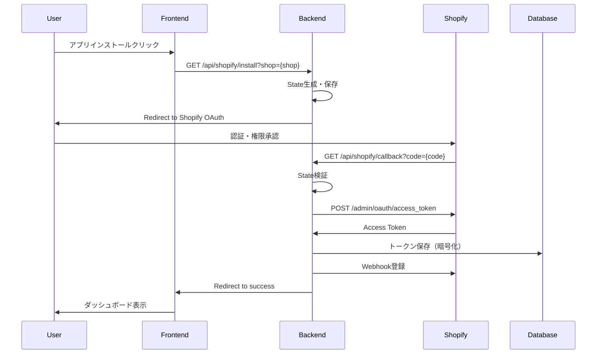

# Shopify OAuth 2.0 実装設計書

**作成日**: 2025年7月29日  
**作成者**: ケンジ  
**対象期限**: 2025年8月8日（残り7日）

## 1. 実装概要

### 1.1 目的
Shopify AI Marketing SuiteがShopifyストアのデータにアクセスするための認証フローを実装する。

### 1.2 スコープ
- OAuth 2.0認証フロー
- アクセストークン管理
- GDPR必須Webhook
- セキュリティ要件の実装

## 2. システム構成

### 2.1 認証フロー図


### 2.2 データベース設計
```sql
-- 既存のStoresテーブルに追加
ALTER TABLE Stores ADD COLUMN ShopifyAccessToken NVARCHAR(MAX);
ALTER TABLE Stores ADD COLUMN ShopifyScope NVARCHAR(500);
ALTER TABLE Stores ADD COLUMN InstalledAt DATETIME2;
ALTER TABLE Stores ADD COLUMN UninstalledAt DATETIME2;

-- Webhook履歴テーブル
CREATE TABLE WebhookEvents (
    Id INT IDENTITY(1,1) PRIMARY KEY,
    StoreId INT FOREIGN KEY REFERENCES Stores(Id),
    Topic NVARCHAR(100) NOT NULL,
    ShopDomain NVARCHAR(255) NOT NULL,
    Payload NVARCHAR(MAX),
    ProcessedAt DATETIME2,
    Status NVARCHAR(50), -- 'pending', 'processed', 'failed'
    CreatedAt DATETIME2 DEFAULT GETUTCDATE()
);
```

## 3. API設計

### 3.1 認証エンドポイント

#### インストール開始
```
GET /api/shopify/install
Query Parameters:
  - shop: string (required) - Shopifyストアドメイン
  
Response:
  - 302 Redirect to Shopify OAuth URL
```

#### コールバック処理
```
GET /api/shopify/callback
Query Parameters:
  - code: string - 認証コード
  - shop: string - ストアドメイン
  - state: string - CSRF対策トークン
  
Response:
  - 302 Redirect to フロントエンド成功ページ
```

### 3.2 GDPR Webhookエンドポイント

#### アプリアンインストール
```
POST /api/webhooks/app/uninstalled
Headers:
  - X-Shopify-Topic: app/uninstalled
  - X-Shopify-Hmac-Sha256: {hmac}
  - X-Shopify-Shop-Domain: {shop}

Response: 200 OK (48時間以内にデータ削除)
```

#### 顧客データ削除要求
```
POST /api/webhooks/customers/redact
Headers: 同上

Response: 200 OK (30日以内に削除)
```

#### ショップデータ削除要求
```
POST /api/webhooks/shop/redact
Headers: 同上

Response: 200 OK (90日以内に削除)
```

#### 顧客データ開示要求
```
POST /api/webhooks/customers/data_request
Headers: 同上

Response: 200 OK (10日以内に提供)
```

## 4. 実装詳細

### 4.1 バックエンド実装タスク

#### Day 1 (7/29) - 基本構造
1. **ShopifyAuthController作成**
   - [ ] install/callbackエンドポイント実装
   - [ ] State管理（Redis or InMemory）
   - [ ] HMAC検証ユーティリティ

2. **TokenService実装**
   - [ ] アクセストークン暗号化・復号化
   - [ ] Azure Key Vault統合（本番環境）
   - [ ] トークンリフレッシュ機構

#### Day 2 (7/30) - Webhook実装
1. **WebhookController作成**
   - [ ] GDPR 4種類のWebhook実装
   - [ ] HMAC署名検証ミドルウェア
   - [ ] 非同期処理（Azure Queue）

2. **データ削除サービス**
   - [ ] 顧客データ削除ロジック
   - [ ] ショップデータ削除ロジック
   - [ ] 削除スケジューラー

### 4.2 フロントエンド実装タスク

#### Day 1 (7/29)
1. **インストールページ作成**
   - [ ] /install ルート追加
   - [ ] ストアドメイン入力フォーム
   - [ ] インストールボタン

2. **認証成功ページ**
   - [ ] /auth/success ルート
   - [ ] ストア情報取得・表示
   - [ ] ダッシュボードリダイレクト

### 4.3 セキュリティ実装

#### 必須セキュリティ対策
1. **HTTPS強制**
   ```csharp
   app.UseHttpsRedirection();
   app.Use(async (context, next) =>
   {
       context.Response.Headers.Add("Strict-Transport-Security", "max-age=31536000");
       await next();
   });
   ```

2. **CSPヘッダー設定**
   ```csharp
   app.Use(async (context, next) =>
   {
       context.Response.Headers.Add("Content-Security-Policy", 
           "frame-ancestors https://*.myshopify.com https://admin.shopify.com");
       await next();
   });
   ```

3. **レート制限**
   ```csharp
   services.AddRateLimiter(options =>
   {
       options.AddFixedWindowLimiter("shopify-api", options =>
       {
           options.Window = TimeSpan.FromSeconds(1);
           options.PermitLimit = 2;
       });
   });
   ```

## 5. テスト計画

### 5.1 開発環境テスト（Day 3）
1. **ngrokセットアップ**
   ```bash
   # バックエンド
   ngrok http 5137
   
   # フロントエンド  
   ngrok http 3000
   ```

2. **開発ストア作成**
   - Shopify Partnersで開発ストア作成
   - テストデータ投入

3. **E2Eテスト**
   - インストールフロー
   - Webhook受信
   - データ同期

### 5.2 本番環境テスト（Day 4）
1. **Azure環境デプロイ**
2. **SSL証明書確認**
3. **Webhook疎通確認**

## 6. 実装優先順位

### 最優先（7/29-30）
1. OAuth認証フロー
2. アクセストークン管理
3. 基本的なWebhook受信

### 高優先（7/31-8/1）
1. GDPR Webhook完全実装
2. データ削除機能
3. セキュリティ強化

### 中優先（8/2-3）
1. エラーハンドリング
2. ログ・監視
3. パフォーマンス最適化

## 7. リスクと対策

| リスク | 影響 | 対策 |
|--------|------|------|
| HTTPS証明書問題 | 高 | Let's Encrypt自動更新設定 |
| Webhook 5秒タイムアウト | 高 | 即座に200返却、非同期処理 |
| レート制限超過 | 中 | リトライ機構、キューイング |
| トークン漏洩 | 高 | 暗号化保存、Key Vault使用 |

## 8. 成功基準

### 技術要件
- [ ] OAuth認証が正常動作
- [ ] 全Webhookが5秒以内に応答
- [ ] HMAC検証が全リクエストで実施
- [ ] トークンが暗号化保存

### ビジネス要件
- [ ] インストールが3クリック以内
- [ ] エラー時の適切なメッセージ表示
- [ ] 日本語・英語対応

## 9. 次のアクション

### 本日（7/29）実施
1. **09:00-10:00**: ShopifyAuthController基本実装
2. **10:00-11:00**: State管理機構実装
3. **11:00-12:00**: フロントエンドインストールページ作成
4. **13:00-14:00**: コールバック処理実装
5. **14:00-15:00**: トークン暗号化実装
6. **15:00-16:00**: 基本テスト実施

### 明日（7/30）実施
1. Webhook Controller実装
2. HMAC検証実装
3. GDPR対応実装開始

---

**注意**: Shopify審査では特にセキュリティ要件が厳しく審査されます。HTTPS、HMAC検証、適切なエラーハンドリングは必須です。