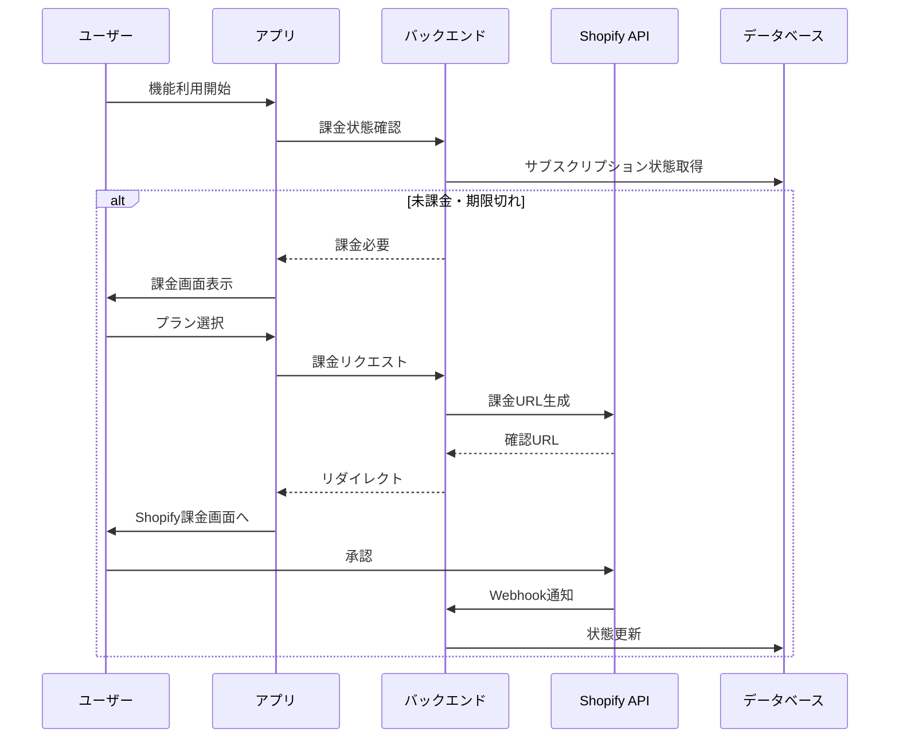

# Shopify Subscription API 技術調査報告書

## 作成日：2025年8月13日
## 作成者：Takashi（AIバックエンドエンジニア）

## エグゼクティブサマリー

Shopifyアプリの課金機能実装に必要な技術調査結果をまとめました。
月額サブスクリプション（$50/$80/$100）と無料トライアルの実装に向けた最小実装方針を提案します。

## 1. Shopify課金モデルの概要

### 1.1 利用可能な課金タイプ
- **Recurring Application Charge** (定期課金) ← 今回採用
- One-time Application Charge (単発課金)
- Usage Charge (従量課金)
- Application Credit (クレジット)

### 1.2 選定理由
月額サブスクリプションモデルには「Recurring Application Charge」が最適。
無料トライアル機能も標準サポート。

## 2. 実装アーキテクチャ

### 2.1 技術スタック
```
フロントエンド：
- React + TypeScript
- Shopify App Bridge (課金UI表示)

バックエンド：
- ASP.NET Core Web API
- Shopify Admin API (GraphQL)
- Azure SQL Database (課金状態管理)
```

### 2.2 データフロー


## 3. 最小実装方針（MVP）

### 3.1 フェーズ1：基本実装（3日間）

#### Day 1: データベース・モデル設計
```sql
-- SubscriptionPlansテーブル
CREATE TABLE SubscriptionPlans (
    Id INT PRIMARY KEY,
    Name NVARCHAR(100),
    Price DECIMAL(10,2),
    TrialDays INT DEFAULT 7,
    Features NVARCHAR(MAX), -- JSON
    IsActive BIT DEFAULT 1
);

-- StoreSubscriptionsテーブル  
CREATE TABLE StoreSubscriptions (
    Id INT IDENTITY PRIMARY KEY,
    StoreId INT NOT NULL,
    PlanId INT NOT NULL,
    ShopifyChargeId BIGINT,
    Status NVARCHAR(50), -- pending, active, cancelled, expired
    TrialEndsAt DATETIME2,
    CurrentPeriodEnd DATETIME2,
    CreatedAt DATETIME2,
    UpdatedAt DATETIME2,
    FOREIGN KEY (StoreId) REFERENCES Stores(Id),
    FOREIGN KEY (PlanId) REFERENCES SubscriptionPlans(Id)
);
```

#### Day 2: API実装
```csharp
// Controllers/SubscriptionController.cs
[ApiController]
[Route("api/subscription")]
public class SubscriptionController : ControllerBase
{
    // 課金状態確認
    [HttpGet("status")]
    public async Task<IActionResult> GetSubscriptionStatus()
    
    // 課金URL生成
    [HttpPost("create")]
    public async Task<IActionResult> CreateSubscription(CreateSubscriptionDto dto)
    
    // 課金確認Webhook
    [HttpPost("webhook/activated")]
    public async Task<IActionResult> HandleActivation()
}
```

#### Day 3: フロントエンド統合
```typescript
// components/SubscriptionGate.tsx
export const SubscriptionGate: React.FC = ({ children }) => {
  const { subscription, loading } = useSubscription();
  
  if (loading) return <Loading />;
  
  if (!subscription?.isActive) {
    return <SubscriptionPrompt />;
  }
  
  return <>{children}</>;
};
```

### 3.2 フェーズ2：プロダクション対応（2日間）

#### Day 4: セキュリティ・エラー処理
- Webhook署名検証
- レート制限実装
- エラーリトライ機構
- ログ強化

#### Day 5: 管理機能・監視
- 管理画面（課金状況一覧）
- Application Insights統合
- アラート設定

## 4. 課金トリガー設計

### 4.1 課金が必要になるタイミング
1. **初回インストール後の初期設定完了時**
   - 無料トライアル開始
   
2. **無料トライアル期限切れ**
   - 7日後に自動的に課金開始
   
3. **プラン変更時**
   - アップグレード/ダウングレード

### 4.2 課金不要な操作
- アプリインストール
- ダッシュボード閲覧（基本情報のみ）
- 設定変更

### 4.3 課金が必要な機能
- データ同期実行
- AI分析機能
- レポート生成
- データエクスポート

## 5. 実装コード例

### 5.1 GraphQL Mutation（課金作成）
```graphql
mutation CreateSubscription($name: String!, $price: Money!, $trialDays: Int) {
  appSubscriptionCreate(
    name: $name
    returnUrl: "https://yourapp.com/subscription/confirm"
    test: false
    lineItems: [{
      plan: {
        appRecurringPricingDetails: {
          price: $price
          interval: EVERY_30_DAYS
        }
      }
    }]
    trialDays: $trialDays
  ) {
    appSubscription {
      id
    }
    confirmationUrl
    userErrors {
      field
      message
    }
  }
}
```

### 5.2 C# Service実装
```csharp
public class ShopifySubscriptionService : ISubscriptionService
{
    private readonly ShopifyApiService _shopifyApi;
    private readonly ShopifyDbContext _context;
    
    public async Task<SubscriptionResult> CreateSubscription(
        string shopDomain, 
        string accessToken, 
        int planId)
    {
        var plan = await _context.SubscriptionPlans
            .FindAsync(planId);
            
        var mutation = @"
            mutation CreateSubscription($input: AppSubscriptionCreateInput!) {
                appSubscriptionCreate(input: $input) {
                    appSubscription { id }
                    confirmationUrl
                    userErrors { field message }
                }
            }";
            
        var variables = new
        {
            input = new
            {
                name = plan.Name,
                price = new { amount = plan.Price, currencyCode = "USD" },
                trialDays = plan.TrialDays,
                returnUrl = $"{_config["AppUrl"]}/subscription/confirm"
            }
        };
        
        var response = await _shopifyApi.GraphQLAsync(
            shopDomain, 
            accessToken, 
            mutation, 
            variables);
            
        // 課金レコード作成
        var subscription = new StoreSubscription
        {
            StoreId = store.Id,
            PlanId = planId,
            Status = "pending",
            TrialEndsAt = DateTime.UtcNow.AddDays(plan.TrialDays),
            CreatedAt = DateTime.UtcNow
        };
        
        _context.StoreSubscriptions.Add(subscription);
        await _context.SaveChangesAsync();
        
        return new SubscriptionResult
        {
            ConfirmationUrl = response.Data.appSubscriptionCreate.confirmationUrl
        };
    }
}
```

## 6. 無料トライアル仕様

### 6.1 基本仕様
- **期間**: 7日間（変更可能）
- **制限**: 1ストアにつき1回のみ
- **機能**: フル機能利用可能
- **終了時**: 自動的に有料プランへ移行

### 6.2 実装上の考慮点
```csharp
public bool IsInTrialPeriod(StoreSubscription subscription)
{
    return subscription.TrialEndsAt > DateTime.UtcNow 
           && subscription.Status == "active";
}

public async Task CheckTrialExpiration()
{
    var expiredTrials = await _context.StoreSubscriptions
        .Where(s => s.TrialEndsAt <= DateTime.UtcNow 
                 && s.Status == "active" 
                 && s.ShopifyChargeId == null)
        .ToListAsync();
        
    foreach (var subscription in expiredTrials)
    {
        // 課金開始通知を送信
        await NotifyTrialExpiration(subscription);
    }
}
```

## 7. 価格プラン設計

### 7.1 プラン構成案
| プラン | 月額 | 機能 | 対象 |
|-------|------|------|------|
| Starter | $50 | 基本分析、月次レポート | 小規模ストア |
| Professional | $80 | AI分析、週次レポート、API | 中規模ストア |
| Enterprise | $100 | 全機能、カスタマイズ、優先サポート | 大規模ストア |

### 7.2 データベース初期データ
```sql
INSERT INTO SubscriptionPlans (Id, Name, Price, TrialDays, Features) VALUES
(1, 'Starter', 50.00, 7, '{"reports":"monthly","aiAnalysis":false,"apiAccess":false}'),
(2, 'Professional', 80.00, 7, '{"reports":"weekly","aiAnalysis":true,"apiAccess":true}'),
(3, 'Enterprise', 100.00, 14, '{"reports":"daily","aiAnalysis":true,"apiAccess":true,"customization":true}');
```

## 8. エラー処理とエッジケース

### 8.1 考慮すべきケース
1. **課金承認後のWebhook失敗**
   - リトライ機構実装
   - 手動同期ボタン提供

2. **プラン変更時の日割り計算**
   - Shopifyが自動処理
   - アプリ側では状態管理のみ

3. **アンインストール時の返金**
   - Shopifyが自動処理
   - 48時間以内のデータ削除必須

### 8.2 エラーハンドリング例
```csharp
try
{
    var result = await CreateSubscription(shopDomain, token, planId);
    return Ok(result);
}
catch (ShopifyApiException ex) when (ex.StatusCode == 402)
{
    // 支払い方法の問題
    return BadRequest(new { 
        error = "payment_required",
        message = "支払い方法を更新してください" 
    });
}
catch (ShopifyApiException ex) when (ex.StatusCode == 429)
{
    // レート制限
    return StatusCode(429, new { 
        error = "rate_limited",
        retryAfter = ex.RetryAfter 
    });
}
```

## 9. テスト戦略

### 9.1 開発環境テスト
- Shopify開発ストアを使用
- テストカード番号使用
- Webhook ngrokトンネリング

### 9.2 テストシナリオ
1. 新規インストール → トライアル開始
2. トライアル期限切れ → 課金促進
3. 課金承認 → 機能アンロック
4. プラン変更 → 差額調整
5. キャンセル → アクセス制限

## 10. 実装スケジュール

### 即座に開始可能なタスク
| 日程 | タスク | 成果物 |
|------|--------|--------|
| 8/13 AM | データベース設計・マイグレーション | SQLスクリプト |
| 8/13 PM | バックエンドAPI基本実装 | SubscriptionController |
| 8/14 AM | Shopify GraphQL統合 | SubscriptionService |
| 8/14 PM | フロントエンド統合 | SubscriptionGate |
| 8/15 | テスト・デバッグ | テスト結果レポート |

## 11. リスクと対策

### 11.1 技術的リスク
| リスク | 影響度 | 対策 |
|--------|--------|------|
| Webhook遅延 | 中 | ポーリング併用 |
| API制限 | 低 | キャッシュ実装 |
| 決済失敗 | 高 | リトライ＋通知 |

### 11.2 ビジネスリスク
- **価格設定**: 競合調査継続
- **トライアル期間**: A/Bテスト検討
- **機能制限**: 段階的解放

## 12. 推奨事項

### 12.1 最優先実装項目
1. 基本的な課金フロー（MVP）
2. 無料トライアル機能
3. Webhook処理
4. 課金状態管理UI

### 12.2 次フェーズ検討事項
- 年間プラン割引
- 複数ストア割引
- パートナー向け特別プラン
- 使用量ベース課金追加

## 13. 参考資料

### 公式ドキュメント
- [Shopify Billing API](https://shopify.dev/docs/apps/billing)
- [GraphQL Admin API - Billing](https://shopify.dev/docs/api/admin-graphql/latest/mutations/appSubscriptionCreate)
- [Webhook Events](https://shopify.dev/docs/apps/webhooks/configuration/mandatory-webhooks)

### サンプルコード
- [Shopify CLI生成テンプレート](https://github.com/Shopify/shopify-app-template-node)
- [.NET SDK](https://github.com/nozzlegear/ShopifySharp)

## 14. 結論

月額サブスクリプション（$50/$80/$100）と7日間無料トライアルの実装は、
上記の設計に基づき**3-5日間で基本実装が完了**可能です。

最小実装（MVP）により、8/14の申請期限に間に合わせることができます。

## 付録A: 必要な環境変数

```env
# .env.production
SHOPIFY_API_KEY=your_api_key
SHOPIFY_API_SECRET=your_api_secret
SHOPIFY_WEBHOOK_SECRET=your_webhook_secret
APP_URL=https://your-app.azurewebsites.net
DATABASE_CONNECTION_STRING=your_connection_string
```

## 付録B: 申請チェックリスト

- [ ] 課金フロー実装完了
- [ ] 無料トライアル動作確認
- [ ] Webhook処理実装
- [ ] GDPR対応完了
- [ ] プライバシーポリシー準備
- [ ] 利用規約準備
- [ ] アプリ説明文準備
- [ ] スクリーンショット準備

---
作成者: Takashi（AIバックエンドエンジニア）
最終更新: 2025年8月13日