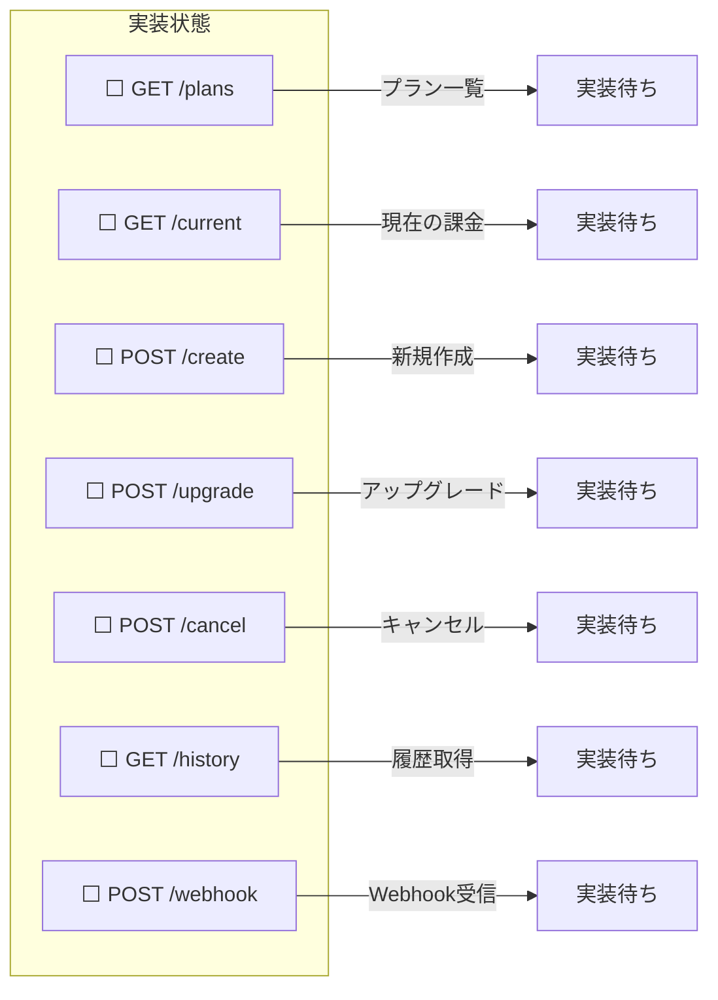
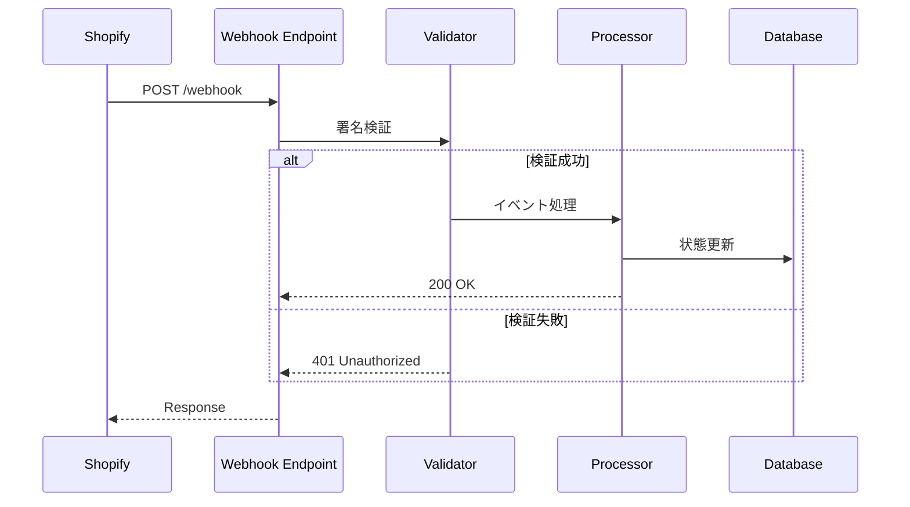

# 課金システム実装チェックリスト

## 作成日：2025年8月12日
## 最終更新：2025年8月12日

---

## 📋 実装チェックリスト

### 1. データベース実装 🗄️

#### テーブル作成
- [ ] `SubscriptionPlans` テーブル
- [ ] `StoreSubscriptions` テーブル
- [ ] `BillingHistory` テーブル
- [ ] `WebhookEvents` テーブル

#### 初期データ
- [ ] Starter プラン（$50）登録
- [ ] Professional プラン（$80）登録
- [ ] Enterprise プラン（$100）登録

#### インデックス
- [ ] StoreId インデックス
- [ ] Status インデックス
- [ ] CreatedAt インデックス

---

### 2. バックエンドAPI実装 🔧

#### 基本API


#### Shopify連携
- [ ] GraphQL Client設定
- [ ] 認証トークン管理
- [ ] Rate Limit対策
- [ ] エラーハンドリング

#### セキュリティ
- [ ] JWT認証実装
- [ ] Webhook署名検証
- [ ] SQLインジェクション対策
- [ ] XSS対策

---

### 3. フロントエンド実装 🎨

#### コンテキスト
- [ ] `SubscriptionContext` 作成
- [ ] `useSubscription` フック
- [ ] `useFeatureAccess` フック

#### コンポーネント
```typescript
// 実装予定コンポーネント
interface Components {
  "⬜ PlanSelector": {
    purpose: "プラン選択画面",
    priority: "高"
  },
  "⬜ BillingStatus": {
    purpose: "課金状態表示",
    priority: "高"
  },
  "⬜ TrialBanner": {
    purpose: "トライアル通知",
    priority: "中"
  },
  "⬜ UpgradePrompt": {
    purpose: "アップグレード促進",
    priority: "中"
  },
  "⬜ PaymentHistory": {
    purpose: "支払い履歴",
    priority: "低"
  }
}
```

#### 画面実装
- [ ] プラン選択画面
- [ ] 課金管理画面
- [ ] アップグレード画面
- [ ] キャンセル画面

---

### 4. Webhook処理実装 🔗



#### イベントハンドラー
- [ ] `app_subscriptions/update`
- [ ] `app_subscriptions/cancelled`
- [ ] `app/uninstalled`
- [ ] エラーログ記録

---

### 5. 定期処理実装 ⏰

#### HangFire Jobs
- [ ] トライアル期限チェック（日次）
- [ ] 期限通知メール送信（日次）
- [ ] 課金状態同期（日次）
- [ ] Webhook再処理（時次）
- [ ] 統計レポート生成（月次）

---

### 6. テスト実装 ✅

#### 単体テスト
```csharp
// 必須テストケース
[Theory]
[InlineData("Starter", 50.00, 7)]
[InlineData("Professional", 80.00, 7)]
[InlineData("Enterprise", 100.00, 14)]
public async Task CreateCharge_Should_Return_ConfirmationUrl(
    string planName, decimal price, int trialDays)
{
    // テスト実装
}
```

- [ ] API単体テスト（20件以上）
- [ ] Service単体テスト（15件以上）
- [ ] Repository単体テスト（10件以上）

#### 統合テスト
- [ ] 新規課金フロー
- [ ] アップグレードフロー
- [ ] キャンセルフロー
- [ ] Webhook処理フロー

#### E2Eテスト
- [ ] プラン選択→承認→有効化
- [ ] トライアル→期限切れ→課金
- [ ] アップグレード完全フロー

---

### 7. ドキュメント作成 📚

#### 技術ドキュメント
- [x] 設計書
- [x] フロー図
- [ ] API仕様書
- [ ] デプロイ手順書

#### ビジネスドキュメント
- [x] ビジネスレポート
- [x] ROI分析
- [ ] 運用マニュアル
- [ ] トラブルシューティング

---

## 🚀 実装優先順位

### Phase 1: 最小実装（8/13）

```mermaid
gantt
    title Phase 1 実装スケジュール
    dateFormat HH:mm
    section Database
    テーブル作成     :09:00, 1h
    初期データ投入   :10:00, 30m
    
    section Backend
    基本API実装      :10:30, 2h
    Shopify連携      :13:00, 2h
    
    section Testing
    単体テスト       :15:00, 2h
    動作確認         :17:00, 1h
```


### Phase 2: UI実装（8/14）
- プラン選択UI
- 課金状態表示
- 基本的な画面遷移

### Phase 3: 完成（8/15）
- Webhook完全実装
- エラー処理
- 最終テスト

---

## ⚠️ リスクと対策

| リスク | 影響 | 対策 |
|--------|------|------|
| Shopify API変更 | 高 | バージョン固定、ドキュメント確認 |
| 課金処理失敗 | 高 | リトライ機構、手動復旧手順 |
| データ不整合 | 中 | トランザクション、監査ログ |
| パフォーマンス | 低 | キャッシュ、非同期処理 |

---

## 📞 サポート体制

### 技術サポート
- **Takashi**: バックエンド、API連携
- **Yuki**: フロントエンド、UI/UX
- **Kenji**: 全体調整、ビジネス要件

### 緊急連絡先
- Slackチャンネル: #billing-implementation
- 緊急時: 各担当者に直接連絡

---

## ✅ 完了基準

### 最小要件（Must Have）
- [ ] 3プランの課金が可能
- [ ] トライアル期間が機能
- [ ] Webhookで状態同期
- [ ] 基本的なエラー処理

### 追加要件（Nice to Have）
- [ ] 詳細な分析機能
- [ ] 自動メール通知
- [ ] 管理画面
- [ ] レポート機能

---

**このチェックリストを日次で更新し、進捗を管理してください**