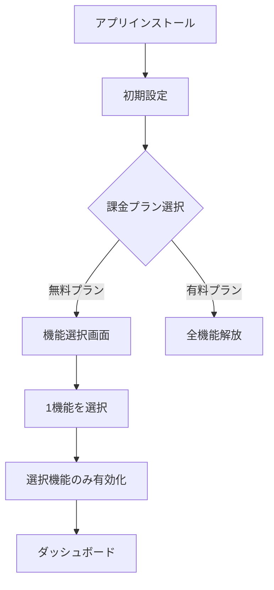

# 無料プラン機能制限 - 要件定義と設計書

> 設計方針（重要）
> - プラン選択は「インストール完了（OAuth/初期設定直後）」に実施する。
> - インストール同意画面内では課金遷移を行わず、オンボーディングの中でプラン選択または無料プランの機能選択へ誘導する。
> - 無料プラン選択時は機能選択画面（3機能のうち1機能）へ遷移し、選択結果に基づいてゲーティングを適用する。
作成日: 2025-08-24
作成者: Kenji (PM)
バージョン: 1.0

## 📋 要件定義

### ビジネス要件
無料プランユーザーに対して、3つの主要機能のうち1つのみを選択して利用できる仕組みを提供する。
これにより、ユーザーは実際に価値を体験しつつ、有料プランへのアップグレード動機を持つ。

### 3つの主要機能（分析3機能に統一）
1. **休眠顧客分析**
   - 休眠顧客の自動検出
   - 復活可能性スコアリング
   - 最適な復活施策の提案

2. **前年同月比分析**
   - 売上の前年同月比較
   - カテゴリ別成長率分析
   - 顧客セグメント推移

3. **購入回数詳細分析**
   - 購入回数別の顧客分布
   - リピート率の推移分析
   - 次回購入予測

### 機能制限ルール
- **無料プラン**: 3機能のうち1つのみ選択可能
- **Starter ($50)**: 3機能すべて利用可能（制限付き）
- **Professional ($80)**: 3機能すべて利用可能（制限緩和）
- **Enterprise ($100)**: 3機能すべて利用可能（無制限）

## 🎨 ユーザー体験設計

### 初回セットアップフロー


### 機能選択画面UI
```
┌─────────────────────────────────────┐
│     無料プランの機能を選択          │
│                                     │
│  以下から1つの機能を選んでください  │
│                                     │
│  ┌─────────────────────────┐      │
│  │ 🤖 AIマーケティング分析  │      │
│  │ ・売上予測              │      │
│  │ ・顧客分析              │      │
│  │      [選択]             │      │
│  └─────────────────────────┘      │
│                                     │
│  ┌─────────────────────────┐      │
│  │ 📧 メールキャンペーン    │      │
│  │ ・自動配信              │      │
│  │ ・A/Bテスト             │      │
│  │      [選択]             │      │
│  └─────────────────────────┘      │
│                                     │
│  ┌─────────────────────────┐      │
│  │ 📦 在庫管理最適化        │      │
│  │ ・在庫予測              │      │
│  │ ・自動発注              │      │
│  │      [選択]             │      │
│  └─────────────────────────┘      │
│                                     │
│  💡 後から変更可能（月1回まで）     │
└─────────────────────────────────────┘
```

## 💾 データベース設計

### 新規テーブル: FreeplanFeatureSelection
```sql
CREATE TABLE FreeplanFeatureSelection (
    Id INT PRIMARY KEY IDENTITY(1,1),
    StoreId INT NOT NULL FOREIGN KEY REFERENCES Stores(Id),
    SelectedFeature NVARCHAR(50) NOT NULL, -- 'ai_marketing', 'email_campaign', 'inventory'
    SelectionDate DATETIME2 NOT NULL DEFAULT GETUTCDATE(),
    LastChangeDate DATETIME2,
    ChangeCount INT DEFAULT 0,
    IsActive BIT DEFAULT 1,
    CONSTRAINT UQ_Store_Feature UNIQUE (StoreId, IsActive)
);

-- インデックス
CREATE INDEX IX_FreeplanFeatureSelection_StoreId ON FreeplanFeatureSelection(StoreId);
CREATE INDEX IX_FreeplanFeatureSelection_SelectionDate ON FreeplanFeatureSelection(SelectionDate);
```

### 既存テーブルの拡張
```sql
-- StoreSubscriptionsテーブルに追加
ALTER TABLE StoreSubscriptions
ADD SelectedFreeFeature NVARCHAR(50) NULL,
    FeatureChangeCount INT DEFAULT 0,
    LastFeatureChangeDate DATETIME2 NULL;
```

## 🔧 技術設計

### バックエンドAPI（/api/feature-selection 配下に統一）

#### 1. 機能選択API
```csharp
[HttpPost("api/feature-selection/select")]
public async Task<IActionResult> SelectFreeFeature(SelectFeatureRequest request)
{
    // バリデーション
    // - ユーザーが無料プランか確認
    // - 月1回の変更制限チェック
    // - 有効な機能IDか確認
    
    // DB更新
    // - FreeplanFeatureSelectionに記録
    // - StoreSubscriptionsを更新
    
    // キャッシュクリア
    // 機能アクセス権限を再計算
    
    return Ok(new { success = true, selectedFeature = request.FeatureId });
}
```

#### 2. 変更可能状態確認API
```csharp
[HttpGet("api/subscription/free-feature/can-change")]
public async Task<IActionResult> CanChangeFeature()
{
    // 最後の変更から30日経過しているか確認
    var lastChange = await GetLastFeatureChange(storeId);
    var canChange = DateTime.UtcNow.Subtract(lastChange).TotalDays >= 30;
    
    return Ok(new { 
        canChange,
        nextChangeDate = lastChange.AddDays(30),
        currentFeature = GetCurrentFeature(storeId)
    });
}
```

### フロントエンド実装（App Router, Shadcn/ui）

#### 1. FeatureSelector コンポーネント
```typescript
// frontend/src/components/billing/FeatureSelector.tsx（パス例）
interface FeatureSelectorProps {
  onSelect: (featureId: string) => void;
  currentFeature?: string;
  canChange: boolean;
}

export const FeatureSelector: React.FC<FeatureSelectorProps> = ({
  onSelect,
  currentFeature,
  canChange
}) => {
  const features = [
    {
      id: 'ai_marketing',
      name: 'AIマーケティング分析',
      icon: '🤖',
      description: '売上予測と顧客分析',
      benefits: ['売上予測', '顧客セグメント分析', '商品レコメンデーション']
    },
    {
      id: 'email_campaign',
      name: 'メールキャンペーン',
      icon: '📧',
      description: '自動メール配信',
      benefits: ['自動配信', 'A/Bテスト', 'パーソナライゼーション']
    },
    {
      id: 'inventory',
      name: '在庫管理最適化',
      icon: '📦',
      description: '在庫予測と自動発注',
      benefits: ['在庫予測', '自動発注提案', '在庫アラート']
    }
  ];

  return (
    <div className="feature-selector">
      {features.map(feature => (
        <FeatureCard
          key={feature.id}
          {...feature}
          isSelected={currentFeature === feature.id}
          onSelect={() => onSelect(feature.id)}
          disabled={!canChange && currentFeature !== feature.id}
        />
      ))}
    </div>
  );
};
```

#### 2. アクセス制御Hook拡張
```typescript
// frontend/src/hooks/useFeatureAccess.ts に追加
export const useFreePlanFeature = () => {
  const { subscription } = useSubscription();
  
  const selectedFeature = subscription?.selectedFreeFeature;
  const canChangeFeature = subscription?.canChangeFeature ?? false;
  const nextChangeDate = subscription?.nextFeatureChangeDate;
  
  const hasAccess = (featureId: string) => {
    if (subscription?.plan !== 'free') {
      return true; // 有料プランは全機能利用可能
    }
    return selectedFeature === featureId;
  };
  
  const selectFeature = async (featureId: string) => {
    const response = await fetch('/api/subscription/free-feature/select', {
      method: 'POST',
      body: JSON.stringify({ featureId })
    });
    return response.json();
  };
  
  return {
    selectedFeature,
    canChangeFeature,
    nextChangeDate,
    hasAccess,
    selectFeature
  };
};
```

## 📊 機能制限マトリックス

| 機能 | 無料 | Starter | Professional | Enterprise |
|------|------|---------|--------------|------------|
| AIマーケティング | 選択時のみ | ✅ 基本 | ✅ 高度 | ✅ 完全 |
| メールキャンペーン | 選択時のみ | ✅ 1000通/月 | ✅ 10000通/月 | ✅ 無制限 |
| 在庫管理 | 選択時のみ | ✅ 100SKU | ✅ 1000SKU | ✅ 無制限 |
| 機能切替 | 月1回 | - | - | - |
| API利用 | ❌ | 1000回/日 | 10000回/日 | 無制限 |
| データ保持 | 30日 | 90日 | 1年 | 無制限 |

## 🚀 実装ロードマップ

### Phase 1: 基盤実装（2日）
- [ ] DBスキーマ作成・マイグレーション
- [ ] バックエンドAPI実装
- [ ] 基本的な権限制御

### Phase 2: UI実装（2日）
- [ ] 機能選択画面
- [ ] ダッシュボード統合
- [ ] 制限通知UI

### Phase 3: テスト・調整（1日）
- [ ] E2Eテスト
- [ ] UXブラッシュアップ
- [ ] ドキュメント作成

## 🎯 アップグレード誘導戦略

### 1. 制限到達時の誘導
```typescript
// 機能が制限されている場合の表示
if (!hasAccess('ai_marketing')) {
  return (
    <UpgradePrompt
      title="この機能は選択されていません"
      message="AIマーケティング分析を利用するには、有料プランにアップグレードするか、月次の機能変更で選択してください。"
      showComparisonTable={true}
    />
  );
}
```

### 2. 使用量制限の可視化
```typescript
// 無料プランの使用量表示
<UsageIndicator
  current={currentUsage}
  limit={freeLimit}
  message="無料プランの制限に達しました"
  upgradeUrl="/billing/upgrade"
/>
```

### 3. 定期的なリマインダー
- 機能変更可能日の通知
- 他の機能の価値訴求
- 期間限定オファー

## 📝 実装チェックリスト

### バックエンド
- [ ] FreeplanFeatureSelectionテーブル作成
- [ ] 機能選択API実装
- [ ] 変更制限ロジック実装
- [ ] 権限チェックミドルウェア更新
- [ ] Webhook連携（プラン変更時の処理）

### フロントエンド
- [ ] FeatureSelectorコンポーネント
- [ ] 機能選択ページ（/billing/free-plan-setup）
- [ ] useFreePlanFeature Hook
- [ ] アクセス制限UI
- [ ] 変更可能日カウントダウン

### テスト
- [ ] 機能選択フロー
- [ ] 月1回制限の確認
- [ ] プランアップグレード時の解放
- [ ] ダウングレード時の再選択

## 🔍 考慮事項

### セキュリティ
- 機能選択の改ざん防止
- APIレート制限
- 不正なアクセス試行の検知

### パフォーマンス
- 機能アクセス権限のキャッシュ
- 選択状態の高速取得
- リアルタイム更新

### ユーザビリティ
- 選択理由の説明
- 比較表の提供
- 切り替えタイミングの明確化

---

この設計に基づいて実装を進めることで、無料プランユーザーに価値を提供しながら、有料プランへの自然な誘導が可能になります。