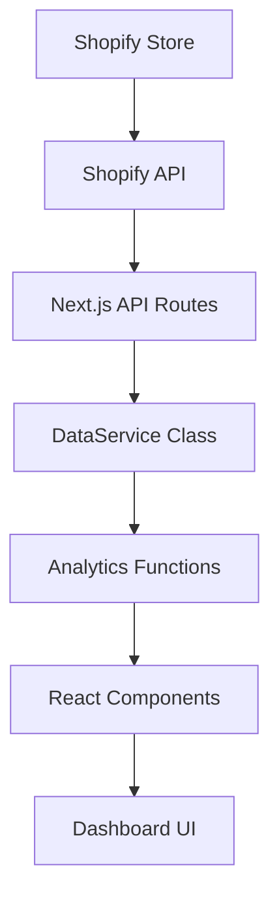

# Shopify ECマーケティング分析アプリ - プロジェクト設計ドキュメント

## 📋 目次

1. [プロジェクト概要](#プロジェクト概要)
2. [プロジェクト構造](#プロジェクト構造)
3. [技術スタック](#技術スタック)
4. [機能別ファイル配置](#機能別ファイル配置)
5. [アーキテクチャ詳細](#アーキテクチャ詳細)
6. [技術的負債と改善点](#技術的負債と改善点)
7. [今後のリファクタリング計画](#今後のリファクタリング計画)

---

## 🎯 プロジェクト概要

### 目的
Shopifyストア運営者向けの**AIを活用した購買データ分析とDM作成・郵送自動化**を実現するアプリケーション

### 主要機能
- **売上分析ダッシュボード**: 売上推移、商品別売上、前年比較などを可視化
- **顧客分析ダッシュボード**: 顧客セグメント、購入頻度、リピート率などを分析
- **AI分析インサイト**: トレンド予測、異常検知、推奨施策を自動生成
- **DM作成・郵送機能**: ターゲット顧客の抽出とDM作成・郵送の自動化（開発中）

---

## 🏗️ プロジェクト構造

```plaintext
shopify-ai-marketing-suite/
├── 📁 src/                         # メインソースコード
│   ├── 📁 app/                     # Next.js App Router
│   │   ├── 📁 api/                 # APIエンドポイント
│   │   │   └── 📁 shopify/         # Shopify API統合
│   │   │       ├── 📁 products/    # 商品API
│   │   │       ├── 📁 orders/      # 注文API
│   │   │       └── 📁 customers/   # 顧客API
│   │   ├── layout.tsx              # ルートレイアウト
│   │   ├── page.tsx                # ホームページ
│   │   └── globals.css             # グローバルスタイル
│   ├── 📁 components/              # Reactコンポーネント
│   │   ├── 📁 dashboards/          # ダッシュボードコンポーネント
│   │   ├── 📁 layout/              # レイアウトコンポーネント
│   │   └── 📁 ui/                  # UIコンポーネント（部分的）
│   ├── 📁 contexts/                # Reactコンテキスト
│   └── 📁 lib/                     # ユーティリティライブラリ
├── 📁 components/                   # UIコンポーネント（メイン）
│   ├── 📁 ui/                      # shadcn/ui コンポーネント
│   └── theme-provider.tsx          # テーマプロバイダー
├── 📁 hooks/                       # カスタムReactフック
├── 📁 docs/                        # プロジェクトドキュメント
├── 📁 worklog/                     # 作業ログ・タスク管理
│   ├── 📁 tasks/                   # タスクファイル
│   │   ├── main-todo.md            # メインタスク管理
│   │   └── task-*.md               # 個別タスクファイル
│   └── 📁 daily/                   # 日次ログ
├── 📁 public/                      # 静的アセット
└── 📁 styles/                      # スタイルファイル
```

---

## 🛠️ 技術スタック

### フロントエンド
- **Next.js**: 15.2.4 (App Router)
- **React**: 19
- **TypeScript**: 5
- **Tailwind CSS**: 3.4.17
- **shadcn/ui**: UIコンポーネントライブラリ
- **Radix UI**: ヘッドレスUIコンポーネント
- **Lucide React**: アイコンライブラリ
- **Recharts**: チャートライブラリ

### データ処理・分析
- **React Hook Form**: フォーム管理
- **Zod**: スキーマバリデーション
- **date-fns**: 日付処理

### Shopify統合
- **Shopify API**: 2023-10バージョン
- **カスタムAPIクライアント**: TypeScript実装

### 状態管理
- **React Context API**: グローバル状態管理
- **useReducer**: 複雑な状態ロジック

---

## 📂 機能別ファイル配置

### 売上分析機能
| 機能 | ファイルパス | 責任 |
|------|-------------|------|
| **メインダッシュボード** | `src/components/dashboards/SalesDashboard.tsx` | KPI表示、期間選択、タブ管理 |
| **年次商品分析** | `src/components/dashboards/YearOverYearProductAnalysis.tsx` | 前年同月比商品分析 |
| **購入頻度分析** | `src/components/dashboards/ProductPurchaseFrequencyAnalysis.tsx` | 商品別購入頻度 |
| **詳細分析** | `src/components/dashboards/PurchaseFrequencyDetailAnalysis.tsx` | 購入回数詳細分析 |
| **統合分析ページ** | `src/components/dashboards/IntegratedPurchaseAnalysisPage.tsx` | 統合購入分析 |

### 顧客分析機能
| 機能 | ファイルパス | 責任 |
|------|-------------|------|
| **顧客ダッシュボード** | `src/components/dashboards/CustomerDashboard.tsx` | 顧客セグメント、RFM分析 |
| **セグメント分析** | `src/components/dashboards/CustomerSegmentAnalysis.tsx` | 顧客セグメント詳細分析 |

### AI分析機能
| 機能 | ファイルパス | 責任 |
|------|-------------|------|
| **AIインサイト** | `src/components/dashboards/AIInsightsDashboard.tsx` | AI分析結果表示 |

### データ層
| 機能 | ファイルパス | 責任 |
|------|-------------|------|
| **Shopify API** | `src/lib/shopify.ts` | Shopify APIクライアント |
| **データサービス** | `src/lib/data-service.ts` | データ処理・集計 |
| **ユーティリティ** | `src/lib/utils.ts` | 共通ユーティリティ |

### APIエンドポイント
| エンドポイント | ファイルパス | 責任 |
|---------------|-------------|------|
| **商品API** | `src/app/api/shopify/products/route.ts` | 商品データ取得 |
| **注文API** | `src/app/api/shopify/orders/route.ts` | 注文データ取得 |
| **顧客API** | `src/app/api/shopify/customers/route.ts` | 顧客データ取得 |

### レイアウト・UI
| 機能 | ファイルパス | 責任 |
|------|-------------|------|
| **メインレイアウト** | `src/components/layout/MainLayout.tsx` | アプリ全体レイアウト |
| **アプリコンテキスト** | `src/contexts/AppContext.tsx` | グローバル状態管理 |
| **UIコンポーネント** | `components/ui/` | shadcn/ui基盤コンポーネント |

---

## 🏛️ アーキテクチャ詳細

### データフロー


### 状態管理パターン
```typescript
// AppContext による集中管理
interface AppContextType {
  activeTab: "sales" | "customers" | "ai"
  selectedPeriod: "thisMonth" | "lastMonth" | "thisQuarter" | "custom"
  isLoading: boolean
  isExporting: boolean
  refreshData: () => void
  exportData: () => void
}
```

### API統合パターン
```typescript
// ShopifyAPI クラス
export class ShopifyAPI {
  async getProducts(limit = 50): Promise<{ products: ShopifyProduct[] }>
  async getOrders(limit = 250): Promise<{ orders: ShopifyOrder[] }>
  async getCustomers(limit = 250): Promise<{ customers: ShopifyCustomer[] }>
}

// DataService ラッパー
export class DataService {
  async getAnalyticsData(period: string): Promise<AnalyticsData>
  async getPurchaseFrequencyAnalysis(): Promise<FrequencyAnalysis[]>
}
```

---

## ⚠️ 技術的負債と改善点

### 🔴 重複ファイル問題（高優先度）
#### 問題
UIコンポーネントとフックが重複配置されている：
- `components/ui/button.tsx` ⚠️ `src/components/ui/button.tsx`
- `hooks/use-toast.ts` ⚠️ `components/ui/use-toast.ts`
- その他多数のshadcn/uiコンポーネント

#### 影響
- コードの不整合性
- メンテナンス困難
- バンドルサイズ増大
- 開発者の混乱

#### 推奨解決策
1. **単一ソース原則**の採用：`components/ui/`を唯一の場所とする
2. `src/components/ui/`ディレクトリの削除
3. インポートパスの統一（`@/components/ui/`）

### 🟡 大規模コンポーネント問題（中優先度）
#### 問題
一部のコンポーネントが巨大化：
- `CustomerDashboard.tsx`: 1,075行
- `YearOverYearProductAnalysis.tsx`: 975行
- `AIInsightsDashboard.tsx`: 616行

#### 影響
- 可読性の低下
- テストの困難さ
- 再利用性の欠如

#### 推奨解決策
1. **コンポーネント分割**：機能単位で細分化
2. **カスタムフック**の抽出：ロジック分離
3. **デザインパターン**の適用：Composite/Strategyパターン

### 🟡 ハードコードデータ問題（中優先度）
#### 問題
サンプルデータが多数ハードコード：
```typescript
const kpiData = {
  totalSales: { current: 2450000, previous: 2180000, change: 12.4 },
  // ...
}
```

#### 影響
- 実データとの乖離
- テスト環境での混乱

#### 推奨解決策
1. **モックデータ管理**：専用ディレクトリで管理
2. **環境変数制御**：本番/開発でデータソース切替
3. **型安全なモック**：実データと同じ型保証

### 🟢 パフォーマンス最適化（低優先度）
#### 改善点
- 動的インポートをより積極的に活用
- Reachtコンポーネントのメモ化
- 大規模データセットの仮想化

---

## 🔄 今後のリファクタリング計画

### フェーズ1: 基盤整理（2-3週間）
1. **重複ファイル解消**
   - [ ] UIコンポーネントの統一
   - [ ] インポートパス修正
   - [ ] 未使用ファイル削除

2. **プロジェクト構造最適化**
   - [ ] ディレクトリ構造の統一
   - [ ] ファイル命名規則の確立

### フェーズ2: コンポーネント分割（3-4週間）
1. **大規模コンポーネントの分割**
   - [ ] CustomerDashboardの分割
   - [ ] YearOverYearProductAnalysisの分割
   - [ ] AIInsightsDashboardの分割

2. **共通コンポーネントの抽出**
   - [ ] KPICard コンポーネント
   - [ ] ChartWrapper コンポーネント
   - [ ] DataTable コンポーネント

### フェーズ3: データ層強化（2-3週間）
1. **データ管理の改善**
   - [ ] モックデータの分離
   - [ ] キャッシュ機能の追加
   - [ ] エラーハンドリング強化

2. **型安全性の向上**
   - [ ] Zodスキーマの拡充
   - [ ] APIレスポンス型の厳密化

### フェーズ4: パフォーマンス最適化（1-2週間）
1. **レンダリング最適化**
   - [ ] React.memoの適用
   - [ ] useMemo/useCallbackの活用
   - [ ] 大規模リストの仮想化

2. **バンドル最適化**
   - [ ] Tree-shakingの改善
   - [ ] コード分割の最適化

---

## 🎯 開発者向けガイドライン

### 新機能開発時の確認ポイント
1. **既存コンポーネントの再利用**を優先検討
2. **components/ui/**の基盤コンポーネントを活用
3. **大規模コンポーネント**（300行超）は分割を検討
4. **TypeScript**型定義を必ず作成
5. **モックデータ**は専用ファイルで管理

### コードレビュー時のチェック項目
- [ ] 重複コンポーネントの使用がないか
- [ ] ハードコードデータの使用がないか
- [ ] 適切な型定義がされているか
- [ ] コンポーネントサイズが適切か
- [ ] パフォーマンスに配慮されているか

### 推奨開発パターン
```typescript
// ✅ 良い例：小さく、型安全、再利用可能
interface KPICardProps {
  title: string
  value: number
  change: number
  icon: IconType
}

export const KPICard: React.FC<KPICardProps> = ({ title, value, change, icon }) => {
  // 実装
}

// ❌ 悪い例：巨大、型なし、再利用困難
export const HugeDashboard = () => {
  // 1000行の実装...
}
```

---

## 📈 メトリクス・KPI

### コード品質指標
- **コンポーネント平均行数**: 目標 < 200行
- **型カバレッジ**: 目標 > 95%
- **重複コード率**: 目標 < 5%
- **テストカバレッジ**: 目標 > 80%

### パフォーマンス指標
- **初期ロード時間**: 目標 < 3秒
- **ページ遷移時間**: 目標 < 1秒
- **バンドルサイズ**: 目標 < 1MB

---

## 🔗 関連ドキュメント

- [README.md](../README.md) - プロジェクト概要・セットアップ
- [SETUP.md](./SETUP.md) - 詳細セットアップガイド
- [DEPLOYMENT.md](./DEPLOYMENT.md) - デプロイメントガイド
- [タスク管理ファイル](../worklog/tasks/main-todo.md) - プロジェクトタスク管理
- [技術スタック文書](../.cursor/rules/dev-rules/techstack.mdc) - 使用技術詳細
- [コーディング規約](../.cursor/rules/dev-rules/coding-rules.mdc) - 開発ルール

---

*最終更新: 2025年5月25日*
*作成者: AI Assistant*
*バージョン: 1.0.0* 