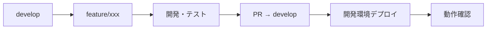

# 🚀 Shopify AIマーケティングスイート - クイックリファレンス

## 📅 最終更新: 2025年7月20日 [[memory:3773065]]

---

## 📍 **主要URL - ワンクリックアクセス** 

### **🌐 開発環境 (現在のメイン環境)**
- **フロントエンド**: `https://brave-sea-038f17a00.1.azurestaticapps.net` ⭐
- **バックエンドAPI**: `https://shopifytestapi20250720173320-aed5bhc0cferg2hm.japanwest-01.azurewebsites.net` ✅
- **API接続テスト**: `https://brave-sea-038f17a00.1.azurestaticapps.net/api-test` ✅
- **Database APIテスト**: `https://brave-sea-038f17a00.1.azurestaticapps.net/database-test` 🗄️ **新機能**

### **🖥️ ローカル開発環境**
- **フロントエンド**: `http://localhost:3000`
- **バックエンドAPI**: `https://localhost:7177`
- **Swagger**: `https://localhost:7177/swagger`
- **Database APIテスト**: `http://localhost:3000/database-test`

### **🏭 本番環境**
```yaml
状況: 未構築（Phase 2 で構築予定）
方針: 現在は開発環境をメイン使用
```

---

## ⚡ **クイックスタート**

### **🖥️ ローカル開発**
```bash
# フロントエンド起動
cd frontend && npm install && npm run dev

# バックエンド起動  
cd backend/ShopifyTestApi && dotnet restore && dotnet run
```

### **🌳 ブランチ戦略**
```bash
# 新機能開発
git checkout develop
git pull origin develop
git checkout -b feature/new-feature

# 開発後
git push origin feature/new-feature
# GitHub でdevelopへのPR作成
```

---

## 🔌 **主要APIエンドポイント**

### **✅ 実装済み - Database API**
```yaml
接続テスト: /api/database/test
顧客データ: /api/database/customers  
注文データ: /api/database/orders
商品データ: /api/database/products
DB初期化: /api/database/initialize (POST)
```

### **✅ 実装済み - Shopify API**
```yaml
Health Check: /api/health
Customer Test: /api/customer/test
Customer Segments: /api/customer/segments
Dashboard Data: /api/customer/dashboard
```

### **🔄 開発予定**
```yaml
Shopify Products: /api/shopify/products
Shopify Orders: /api/shopify/orders
Batch Processing: /api/batch/*
Authentication: /api/auth/*
```

---

## 🗄️ **Database API クイックテスト**

### **開発環境でのテスト**
```bash
# 接続確認
curl https://shopifytestapi20250720173320-aed5bhc0cferg2hm.japanwest-01.azurewebsites.net/api/database/test

# 顧客データ取得
curl https://shopifytestapi20250720173320-aed5bhc0cferg2hm.japanwest-01.azurewebsites.net/api/database/customers

# フロントエンド統合テスト
https://brave-sea-038f17a00.1.azurestaticapps.net/database-test
```

---

## 🛠️ **管理・監視**

### **☁️ Azure管理**
- **Portal**: `https://portal.azure.com`
- **App Service**: バックエンドAPI管理
- **Static Web Apps**: フロントエンド管理
- **SQL Database**: Azure SQL管理

### **🔄 GitHub管理**
- **Repository**: `https://github.com/sideworks-fuk/shopify-ai-marketing-suite`
- **Actions**: CI/CDパイプライン監視
- **Branches**: ブランチ管理
- **develop**: 開発統合ブランチ ✅ **新規**

---

## 🎯 **開発フロー**

### **機能開発の標準手順**


### **コマンド例**
```bash
# 1. feature ブランチ作成
git checkout develop && git pull origin develop
git checkout -b feature/orders-products-frontend

# 2. 開発・コミット
# 開発作業...
git add . && git commit -m "feat: 注文・商品API統合"

# 3. プッシュ・PR作成
git push origin feature/orders-products-frontend
# GitHub でPR作成

# 4. マージ後、開発環境で確認
# https://brave-sea-038f17a00.1.azurestaticapps.net
```

---

## 📊 **現在の実装状況**

### **✅ Phase 1 完了**
- ✅ Azure SQL Database統合
- ✅ Database API (接続、CRUD)
- ✅ フロントエンド統合画面
- ✅ develop ブランチ戦略

### **🔄 Phase 2 開発中**
- 🎯 注文・商品APIフロントエンド統合
- 🎯 Shopify API連携
- 🎯 バッチ処理 (Hangfire)

### **⏳ Phase 3 計画**
- 🎯 本番環境構築
- 🎯 認証システム
- 🎯 監視・ログ

---

## 🆘 **トラブルシューティング**

### **よくある問題**
```yaml
CORS エラー: 
  - フロントエンド → バックエンド接続問題
  - 解決: バックエンドのCORS設定確認

Database 接続エラー:
  - Azure SQL接続文字列確認
  - ファイアウォール設定確認

ビルドエラー:
  - npm install で依存関係更新
  - dotnet restore でNuGet復元
```

### **ログ確認先**
- **Azure App Service**: Portal > App Service > Log stream
- **GitHub Actions**: Repository > Actions > 該当ワークフロー
- **ブラウザ**: F12 > Console / Network タブ

---

## 📚 **詳細ドキュメント**

### **開発者向け**
- [📊 **ブックマーク集**](./BOOKMARKS.md) - 全URLワンクリック
- [🌳 **ブランチ戦略**](./05-operations/branch-strategy-and-deployment-plan.md) - 開発フロー
- [🏗️ **システム設計**](./02-architecture/system-architecture.md) - アーキテクチャ

### **運用・管理**
- [🗄️ **Azure SQL統合ログ**](../worklog/2025/07/2025-07-21-051500-azure-sql-database-integration-success.md) - 統合成功記録
- [📈 **プロジェクト状況**](./01-project-management/01-planning/project-status.md) - 進捗管理
- [💰 **コスト管理**](./06-infrastructure/02-cost-management/) - 運用コスト

---

## 🚀 **次のアクション**

### **今すぐできること**
1. **開発環境確認**: [Database APIテスト](https://brave-sea-038f17a00.1.azurestaticapps.net/database-test)
2. **API動作確認**: [Health Check](https://shopifytestapi20250720173320-aed5bhc0cferg2hm.japanwest-01.azurewebsites.net/api/health)
3. **ブランチ確認**: `git status` で現在のブランチ確認

### **次回開発予定**
- **feature/orders-products-frontend**: 注文・商品API統合画面
- **Shopify API連携**: リアルデータ取得機能
- **バッチ処理**: 自動データ更新機能

---

**💡 このリファレンスをブックマークして、効率的な開発を！** 🎯 