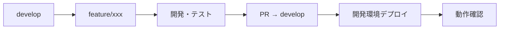

# 🚀 Shopify AIマーケティングスイート - クイックリファレンス

## 📅 最終更新: 2025年10月18日

---

### 🔗 重要ドキュメント（正本・統合済み）
| ドキュメント | パス | 説明 |
|---|---|---|
| **GDPR関連** | `docs/00-production-release/03-gdpr-compliance/` | GDPR対応の正本（統合済み） |
| **ドキュメント整理** | `docs/01-project-management/04-organization/doc-cleanup/` | ドキュメント整理のハブ |
| **ADR-002** | `docs/02-architecture/05-ADR/ADR-002-gdpr-canonical-and-report-naming.md` | ドキュメント統合の決定記録 |

## 📍 **主要URL - ワンクリックアクセス** 

| 環境 | サービス | URL | ステータス |
|---|---|---|---|
| **🌐 開発環境** | フロントエンド | `https://brave-sea-038f17a00.1.azurestaticapps.net` | ⭐ メイン |
| | バックエンドAPI | `https://shopifytestapi20250720173320-aed5bhc0cferg2hm.japanwest-01.azurewebsites.net` | ✅ 稼働中 |
| | API接続テスト | `https://brave-sea-038f17a00.1.azurestaticapps.net/api-test` | ✅ 利用可能 |
| | Database APIテスト | `https://brave-sea-038f17a00.1.azurestaticapps.net/database-test` | 🗄️ 新機能 |
| **🖥️ ローカル環境** | フロントエンド | `http://localhost:3000` | 開発用 |
| | バックエンドAPI | `https://localhost:7177` | 開発用 |
| | Swagger | `https://localhost:7177/swagger` | API仕様確認 |
| | Database APIテスト | `http://localhost:3000/database-test` | 開発用 |
| **🏭 本番環境** | 状況 | 未構築（Phase 2 で構築予定） | ⏳ 計画中 |

---

## ⚡ **クイックスタート**

### **🖥️ ローカル開発**
```powershell
# フロントエンド起動
cd frontend
npm install
npm run dev

# バックエンド起動（別ウィンドウで）
cd backend/ShopifyTestApi
dotnet restore
dotnet run
```

**詳細なセットアップ手順**: [開発環境セットアップガイド](./04-development/01-環境構築/開発環境セットアップガイド.md)

### **🌳 ブランチ戦略**
```bash
# 新機能開発
git checkout develop
git pull origin develop
git checkout -b feature/new-feature

# 開発後
git push origin feature/new-feature
# GitHub でdevelopへのPR作成
```

---

## 🔌 **主要APIエンドポイント**

| カテゴリ | エンドポイント | メソッド | 説明 | ステータス |
|---|---|---|---|---|
| **Database API** | `/api/database/test` | GET | 接続テスト | ✅ 実装済み |
| | `/api/database/customers` | GET | 顧客データ取得 | ✅ 実装済み |
| | `/api/database/orders` | GET | 注文データ取得 | ✅ 実装済み |
| | `/api/database/products` | GET | 商品データ取得 | ✅ 実装済み |
| | `/api/database/initialize` | POST | DB初期化 | ✅ 実装済み |
| **Shopify API** | `/api/health` | GET | ヘルスチェック | ✅ 実装済み |
| | `/api/customer/test` | GET | 顧客テスト | ✅ 実装済み |
| | `/api/customer/segments` | GET | 顧客セグメント | ✅ 実装済み |
| | `/api/customer/dashboard` | GET | ダッシュボードデータ | ✅ 実装済み |
| | `/api/shopify/products` | GET | Shopify商品取得 | ✅ 実装済み |
| | `/api/shopify/orders` | GET | Shopify注文取得 | ✅ 実装済み |
| | `/api/batch/*` | - | バッチ処理 | 🔄 開発予定 |
| | `/api/auth/*` | - | 認証システム | 🔄 開発予定 |

---

## 🗄️ **Database API クイックテスト**

### **開発環境でのテスト**
```bash
# 接続確認
curl https://shopifytestapi20250720173320-aed5bhc0cferg2hm.japanwest-01.azurewebsites.net/api/database/test

# 顧客データ取得
curl https://shopifytestapi20250720173320-aed5bhc0cferg2hm.japanwest-01.azurewebsites.net/api/database/customers

# フロントエンド統合テスト
https://brave-sea-038f17a00.1.azurestaticapps.net/database-test
```

---

## 🛠️ **管理・監視**

### **☁️ Azure管理**
- **Portal**: `https://portal.azure.com`
- **App Service**: バックエンドAPI管理
- **Static Web Apps**: フロントエンド管理
- **SQL Database**: Azure SQL管理

### **🔄 GitHub管理**
- **Repository**: `https://github.com/sideworks-fuk/shopify-ai-marketing-suite`
- **Actions**: CI/CDパイプライン監視
- **Branches**: ブランチ管理
- **develop**: 開発統合ブランチ ✅ **新規**

---

## 🎯 **開発フロー**

### **機能開発の標準手順**


### **コマンド例**
```bash
# 1. feature ブランチ作成
git checkout develop && git pull origin develop
git checkout -b feature/orders-products-frontend

# 2. 開発・コミット
# 開発作業...
git add . && git commit -m "feat: 注文・商品API統合"

# 3. プッシュ・PR作成
git push origin feature/orders-products-frontend
# GitHub でPR作成

# 4. マージ後、開発環境で確認
# https://brave-sea-038f17a00.1.azurestaticapps.net
```

---


## 🆘 **トラブルシューティング**

### **よくある問題**
- **フロントエンド起動エラー**: [開発環境セットアップガイド](./04-development/01-環境構築/開発環境セットアップガイド.md#トラブルシューティング)を参照
- **CORS エラー**: バックエンドのCORS設定確認
- **Database 接続エラー**: Azure SQL接続文字列・ファイアウォール設定確認

### **ログ確認先**
- **Azure App Service**: Portal > App Service > Log stream
- **GitHub Actions**: Repository > Actions > 該当ワークフロー
- **ブラウザ**: F12 > Console / Network タブ

---

## 📚 **詳細ドキュメント**

### **開発者向け**
- [📊 **ブックマーク集**](./BOOKMARKS.md) - 全URLワンクリック
- [🛠️ **環境構築ガイド**](./04-development/01-環境構築/開発環境セットアップガイド.md) - 詳細セットアップ手順
- [🌳 **ブランチ戦略**](./05-operations/branch-strategy-and-deployment-plan.md) - 開発フロー
- [🏗️ **システム設計**](./02-architecture/system-architecture.md) - アーキテクチャ

### **運用・管理**
- [🗄️ **Azure SQL統合ログ**](../docs/worklog/2025/07/2025-07-21-051500-azure-sql-database-integration-success.md) - 統合成功記録
- [📈 **プロジェクト状況**](./01-project-management/01-planning/project-status.md) - 進捗管理
- [💰 **コスト管理**](./06-infrastructure/02-cost-management/) - 運用コスト

---

## 🚀 **次のアクション**

### **今すぐできること**
1. **開発環境確認**: [Database APIテスト](https://brave-sea-038f17a00.1.azurestaticapps.net/database-test)
2. **API動作確認**: [Health Check](https://shopifytestapi20250720173320-aed5bhc0cferg2hm.japanwest-01.azurewebsites.net/api/health)
3. **ブランチ確認**: `git status` で現在のブランチ確認

### **次回開発予定**
- **feature/orders-products-frontend**: 注文・商品API統合画面
- **Shopify API連携**: リアルデータ取得機能
- **バッチ処理**: 自動データ更新機能

---

**💡 このリファレンスをブックマークして、効率的な開発を！** 🎯 