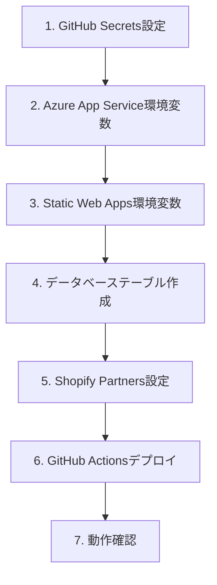

# 本番環境セットアップ最終チェックリスト

## 作成日: 2025-12-22

## 完了状況
- ✅ Azureリソース作成（App Service、SQL Database、Static Web Apps）
- ✅ GitHub Actionsワークフロー作成・修正
- ✅ appsettings.Production.json更新

## 残作業チェックリスト

### 1. 🔑 GitHub Secrets設定（必須）

#### Repository Settings → Secrets and variables → Actions → Secrets

| Secret名 | 取得方法 | 状態 |
|----------|----------|------|
| `AZURE_WEBAPP_PUBLISH_PROFILE_PRODUCTION` | Azure Portal → ec-ranger-backend-prod → 概要 → 発行プロファイルの取得 | ⬜ |
| `AZURE_STATIC_WEB_APPS_API_TOKEN_PRODUCTION` | 既存の`AZURE_STATIC_WEB_APPS_API_TOKEN_BRAVE_SEA_038F17A00`を使用（同じStatic Web Apps） | ⬜ |
| `SHOPIFY_API_KEY_PRODUCTION` | be1fc09e2135be7cee3b9186ef8bfe80 | ⬜ |
| `SHOPIFY_API_SECRET_PRODUCTION` | [メモから取得] | ⬜ |

### 2. 🌐 Azure App Service環境変数設定（必須）

#### Azure Portal → ec-ranger-backend-prod → 構成 → アプリケーション設定

| 変数名 | 値 | 状態 |
|--------|-----|------|
| `ASPNETCORE_ENVIRONMENT` | Production | ⬜ |
| `ConnectionStrings__DefaultConnection` | Server=ec-ranger-sql-prod.database.windows.net;Database=ec-ranger-db-prod;User Id=sqladmin;Password=[パスワード] | ⬜ |
| `Shopify__ApiSecret` | [メモから取得] | ⬜ |

### 3. 🎨 Azure Static Web Apps環境変数設定（必須）

#### Azure Portal → ec-ranger-frontend-prod → 構成 → アプリケーション設定

| 変数名 | 値 | 状態 |
|--------|-----|------|
| `NEXT_PUBLIC_API_URL` | https://ec-ranger-backend-prod-ghf3bbargbc4hfgh.japanwest-01.azurewebsites.net | ⬜ |
| `NEXT_PUBLIC_SHOPIFY_API_KEY` | be1fc09e2135be7cee3b9186ef8bfe80 | ⬜ |
| `NEXT_PUBLIC_SHOPIFY_APP_URL` | https://white-island-08e0a6300-2.azurestaticapps.net | ⬜ |
| `NEXT_PUBLIC_ENVIRONMENT` | production | ⬜ |
| `NEXT_PUBLIC_DISABLE_FEATURE_GATES` | false | ⬜ |

### 4. 🗄️ データベーステーブル作成（必須）

#### 方法1: EF Core Migrations実行（推奨）
```powershell
# ローカルから実行
cd backend/ShopifyAnalyticsApi
dotnet ef database update --connection "Server=ec-ranger-sql-prod.database.windows.net;Database=ec-ranger-db-prod;User Id=sqladmin;Password=[パスワード]"
```

#### 方法2: SQL Server Management Studio (SSMS) で手動実行
1. SSMSでec-ranger-sql-prod.database.windows.netに接続
2. 開発環境のスキーマをエクスポート
3. 本番環境で実行

#### 必要なテーブル
- Stores
- Orders
- Customers
- Products
- OrderItems
- StoreActivities
- DormantCustomers
- その他（Hangfire関連テーブルなど）

### 5. 🛍️ Shopify Partners設定（必須）

#### Shopify Partnersダッシュボード → アプリ設定

| 設定項目 | 値 | 状態 |
|---------|-----|------|
| App URL | https://white-island-08e0a6300-2.azurestaticapps.net/install | ⬜ |
| Allowed redirection URL(s) | https://white-island-08e0a6300-2.azurestaticapps.net/api/shopify/callback | ⬜ |
| | https://white-island-08e0a6300-2.azurestaticapps.net/auth/callback | ⬜ |
| | https://white-island-08e0a6300-2.azurestaticapps.net/auth/success | ⬜ |
| GDPR mandatory webhooks | 設定済みか確認 | ⬜ |

### 6. 🚀 GitHub Actionsからデプロイ（最終ステップ）

#### 実行順序
1. **データベーステーブル作成を先に完了**
2. **GitHub Actions実行**
   - Actions → "Production Full Deploy (Frontend + Backend)"
   - Run workflow → "YES - 本番環境に全体デプロイします"

### 7. ✅ 動作確認

#### インストールフロー確認
1. インストールURL: `https://white-island-08e0a6300-2.azurestaticapps.net/install`
2. ショップドメインを入力
3. Shopify OAuth認証
4. ダッシュボード表示

#### ヘルスチェック
- Backend: `https://ec-ranger-backend-prod-ghf3bbargbc4hfgh.japanwest-01.azurewebsites.net/api/health`
- Frontend: `https://white-island-08e0a6300-2.azurestaticapps.net`

## 推奨作業順序



## 重要な注意事項

### セキュリティ
- Shopify API Secretは絶対にコードにコミットしない
- データベースパスワードは強固なものを使用
- Azure Key Vaultの使用を検討（将来）

### デプロイ前確認
- データベースのバックアップ
- 開発環境での最終テスト
- ロールバック計画の準備

### トラブルシューティング
- App Serviceのログストリームを監視
- Application Insightsでエラーを確認
- CORS設定を確認

## 完了後のインストールURL

```
https://white-island-08e0a6300-2.azurestaticapps.net/install
```

このURLをお客様に提供してテストしてもらう。

---
作成者: 福田＋AI Assistant
最終更新: 2025-12-22
