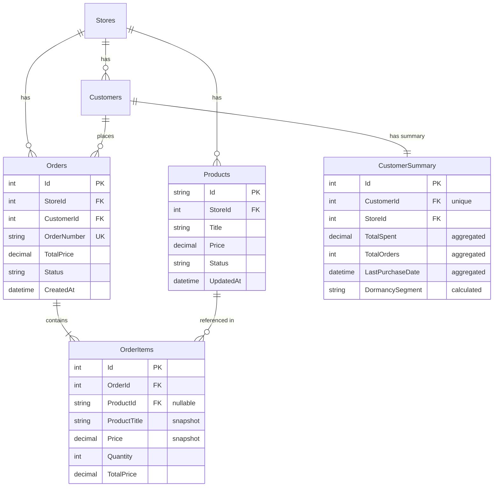

## データベース設計書作成指示（修正版）

### 作業概要
現在のDDLとモデル定義を基に、AIエージェントが正確に理解・参照できるデータベース設計書を作成してください。特に、テーブル間のリレーションシップと、データ保持方針（参照 vs スナップショット）を明確に文書化します。

### 1. 調査対象の収集

#### A. DDL（データ定義言語）の収集
以下のソースからDDLを抽出してください：

```markdown
## DDL収集元
1. **Migrationファイル**
   - `backend/ShopifyAnalyticsApi/Migrations/*.cs`
   - 各マイグレーションファイルから CREATE TABLE 文を抽出

2. **データベーススクリプト**
   - `backend/ShopifyAnalyticsApi/*.sql`
   - 初期化スクリプト、テーブル定義

3. **Entity Framework スキーマ**
   - DbContextから自動生成されるDDL
   - `dotnet ef dbcontext script` コマンドで出力
```

#### B. モデル定義の収集
```markdown
## モデル定義収集元
1. **Entityクラス**
   - `backend/ShopifyAnalyticsApi/Models/*.cs`
   - 各エンティティクラスの定義

2. **DbContext定義**
   - `backend/ShopifyAnalyticsApi/Data/ShopifyDbContext.cs`
   - リレーションシップ設定、制約定義

3. **DTO/ViewModel**
   - API応答で使用されるデータ構造
   - ビジネスロジックで使用される集計モデル
```

### 2. データベース設計書の構成

#### A. 作成するファイル構造
```
docs/03-design-specs/database/
├── DATABASE-DESIGN.md                    # メイン設計書
├── table-definitions/                    # 個別テーブル定義
│   ├── stores-table.md
│   ├── products-table.md
│   ├── customers-table.md
│   ├── orders-table.md
│   ├── order-items-table.md
│   ├── customer-summary-table.md
│   └── [その他テーブル].md
├── relationships/                        # リレーションシップ詳細
│   └── entity-relationships.md
├── design-decisions/                     # 設計判断
│   ├── snapshot-vs-reference.md
│   └── aggregation-strategy.md
└── diagrams/                            # ER図等
    ├── er-diagram-overview.mermaid
    └── er-diagram-detailed.mermaid
```

#### B. メイン設計書の構造
**ファイル**: `docs/03-design-specs/database/DATABASE-DESIGN.md`

```markdown
# データベース設計書

## 📋 概要
最終更新日: [日付]
データベース: SQL Server / PostgreSQL
ORM: Entity Framework Core [バージョン]

## 🏗️ アーキテクチャ概要

### データ保持方針
本システムでは以下の方針でデータを管理します：

1. **マスターデータ（参照型）**
   - Products: 商品マスター（Shopifyから同期）
   - Customers: 顧客マスター（Shopifyから同期）
   - Stores: 店舗マスター

2. **トランザクションデータ（スナップショット型）**
   - Orders: 注文時点の情報を保持
   - OrderItems: 注文時点の商品情報を含む（ProductTitle, Price等）

3. **集計データ（キャッシュ型）**
   - CustomerSummary: 顧客分析用の集計データ（日次更新）
   - ProductAnalytics: 商品分析用の集計データ

### 設計原則
- **正規化レベル**: 第3正規形を基本とし、パフォーマンスのため一部非正規化
- **命名規則**: PascalCase、複数形のテーブル名
- **主キー**: 基本的にId (int IDENTITY)を使用
- **タイムスタンプ**: CreatedAt, UpdatedAtを標準装備

## 📊 テーブル一覧

| テーブル名 | 種類 | 説明 | レコード数（想定） | 更新頻度 |
|-----------|------|------|------------------|----------|
| Stores | マスター | 店舗情報 | 10-100 | 低 |
| Products | マスター | 商品マスター | 1,000-10,000 | 日次同期 |
| Customers | マスター | 顧客マスター | 10,000-100,000 | 日次同期 |
| Orders | トランザクション | 注文データ | 100,000-1,000,000 | リアルタイム |
| OrderItems | トランザクション | 注文明細 | 500,000-5,000,000 | リアルタイム |
| CustomerSummary | 集計 | 顧客分析サマリー | 10,000-100,000 | 日次バッチ |

## 🔗 主要リレーションシップ

### 1. Orders - OrderItems (1:N)
- Orders.Id → OrderItems.OrderId
- カスケード削除: なし
- 設計意図: 注文と明細の親子関係

### 2. Orders - Customers (N:1)  
- Orders.CustomerId → Customers.Id
- 参照整合性: 必須
- 設計意図: 顧客の注文履歴管理

### 3. OrderItems - Products (N:1)
- OrderItems.ProductId → Products.Id
- 参照整合性: オプション（NULL許可）
- 設計意図: 商品マスターとの関連付け（分析用）

[詳細は relationships/entity-relationships.md 参照]

## 💾 データ保持ポリシー

### スナップショット型テーブルの設計
**OrderItemsテーブル**は商品情報のスナップショットを保持：
- ProductTitle: 注文時点の商品名（必須）
- Price: 注文時点の価格（必須）
- ProductId: 商品マスターへの参照（オプション）

**理由**: 
- 商品情報は変更される可能性があり、注文履歴は不変であるべき
- 商品が削除されても注文履歴は残る必要がある

[詳細は design-decisions/snapshot-vs-reference.md 参照]

## 🔍 クエリパターンとインデックス戦略

主要なクエリパターンに基づくインデックス設計：
1. 顧客別注文履歴: IX_Orders_CustomerId
2. 期間別売上集計: IX_Orders_CreatedAt
3. 商品別売上分析: IX_OrderItems_ProductId

[詳細は各テーブル定義書参照]
```

### 3. 個別テーブル定義書のフォーマット

**例**: `docs/03-design-specs/database/table-definitions/order-items-table.md`

```markdown
# OrderItems テーブル定義

## 概要
注文明細情報を管理するテーブル。商品情報はスナップショットとして保持し、注文時点の正確な情報を永続化する。

## テーブル定義

### DDL
```sql
CREATE TABLE [dbo].[OrderItems](
    [Id] [int] IDENTITY(1,1) NOT NULL,
    [OrderId] [int] NOT NULL,
    [ProductId] [nvarchar](50) NULL,
    [ProductTitle] [nvarchar](255) NOT NULL,
    [VariantTitle] [nvarchar](255) NULL,
    [Quantity] [int] NOT NULL,
    [Price] [decimal](18, 2) NOT NULL,
    [TotalPrice] [decimal](18, 2) NOT NULL,
    [CreatedAt] [datetime2](7) NOT NULL DEFAULT GETDATE(),
    [UpdatedAt] [datetime2](7) NULL,
    CONSTRAINT [PK_OrderItems] PRIMARY KEY CLUSTERED ([Id] ASC),
    CONSTRAINT [FK_OrderItems_Orders] FOREIGN KEY([OrderId]) REFERENCES [dbo].[Orders] ([Id]),
    CONSTRAINT [FK_OrderItems_Products] FOREIGN KEY([ProductId]) REFERENCES [dbo].[Products] ([Id])
);
```

### カラム詳細

| カラム名 | データ型 | NULL | デフォルト | 説明 |
|---------|----------|------|------------|------|
| Id | int | NO | IDENTITY | 主キー |
| OrderId | int | NO | - | 注文ID（FK） |
| ProductId | nvarchar(50) | YES | - | 商品ID（参照用） |
| ProductTitle | nvarchar(255) | NO | - | 商品名（スナップショット） |
| VariantTitle | nvarchar(255) | YES | - | バリアント名 |
| Price | decimal(18,2) | NO | - | 単価（スナップショット） |
| Quantity | int | NO | - | 数量 |
| TotalPrice | decimal(18,2) | NO | - | 小計 |
| CreatedAt | datetime2 | NO | GETDATE() | 作成日時 |
| UpdatedAt | datetime2 | YES | - | 更新日時 |

### インデックス
```sql
-- クラスタ化インデックス
PK_OrderItems ON [Id]

-- 非クラスタ化インデックス
CREATE INDEX IX_OrderItems_OrderId ON OrderItems(OrderId);
CREATE INDEX IX_OrderItems_ProductId ON OrderItems(ProductId) WHERE ProductId IS NOT NULL;
CREATE INDEX IX_OrderItems_CreatedAt ON OrderItems(CreatedAt);
```

### 設計上の重要事項

#### 🔍 スナップショット vs 参照の使い分け

**スナップショット保存項目**:
- ProductTitle: 注文時の商品名を永続保存
- Price: 注文時の価格を永続保存
- VariantTitle: 注文時のバリアント名を永続保存

**参照保存項目**:
- ProductId: 現在の商品マスターとの関連付け（NULL許可）

**設計理由**:
1. 注文履歴の不変性を保証
2. 商品マスターの変更や削除の影響を受けない
3. 分析時は ProductId で現在の商品情報と結合可能

### Entity Framework モデル定義
```csharp
public class OrderItem
{
    public int Id { get; set; }
    public int OrderId { get; set; }
    public string? ProductId { get; set; }
    public string ProductTitle { get; set; } = string.Empty;
    public string? VariantTitle { get; set; }
    public int Quantity { get; set; }
    public decimal Price { get; set; }
    public decimal TotalPrice { get; set; }
    public DateTime CreatedAt { get; set; }
    public DateTime? UpdatedAt { get; set; }
    
    // ナビゲーションプロパティ
    public virtual Order Order { get; set; } = null!;
    public virtual Product? Product { get; set; }
}
```

### 典型的なクエリパターン

```sql
-- 1. 注文明細と現在の商品情報を結合
SELECT 
    oi.ProductTitle as OrderedProductName,
    p.Title as CurrentProductName,
    oi.Price as OrderedPrice,
    p.Price as CurrentPrice,
    oi.Price - p.Price as PriceDifference
FROM OrderItems oi
LEFT JOIN Products p ON oi.ProductId = p.Id
WHERE oi.OrderId = @orderId;

-- 2. 商品別売上集計（スナップショットデータ使用）
SELECT 
    ProductTitle,
    COUNT(*) as OrderCount,
    SUM(Quantity) as TotalQuantity,
    SUM(TotalPrice) as TotalRevenue
FROM OrderItems
WHERE CreatedAt >= @startDate AND CreatedAt < @endDate
GROUP BY ProductTitle
ORDER BY TotalRevenue DESC;
```

### データ整合性チェック

```sql
-- ProductIdが設定されている場合の整合性確認
SELECT oi.*
FROM OrderItems oi
WHERE oi.ProductId IS NOT NULL
  AND NOT EXISTS (
    SELECT 1 FROM Products p WHERE p.Id = oi.ProductId
  );
```
```

### 4. ER図の作成

**ファイル**: `docs/03-design-specs/database/diagrams/er-diagram-overview.mermaid`



### 5. 設計判断文書

**ファイル**: `docs/03-design-specs/database/design-decisions/snapshot-vs-reference.md`

```markdown
# スナップショット vs 参照の設計判断

## 設計方針

### スナップショット採用箇所

#### OrderItems テーブル
- **ProductTitle**: 商品名のスナップショット
- **Price**: 価格のスナップショット  
- **VariantTitle**: バリアント名のスナップショット

**採用理由**:
1. 注文履歴の不変性保証
2. 商品情報変更の影響を受けない
3. 法的要件（取引記録の保存）

### 参照採用箇所

#### Orders テーブル
- **CustomerId**: 顧客マスターへの参照

**採用理由**:
1. 顧客情報の一元管理
2. 顧客分析の必要性
3. データ量の削減

### ハイブリッド採用箇所

#### OrderItems テーブル
- **ProductId**: 商品マスターへの参照（NULL許可）
- **ProductTitle**: 商品名のスナップショット（必須）

**採用理由**:
1. 履歴の保証とマスター連携の両立
2. 商品削除時の履歴保持
3. 分析時の柔軟性確保
```

### 6. 検証チェックリスト

設計書作成後、以下を確認：

- [ ] すべてのテーブルが文書化されている
- [ ] 外部キー関係がすべて記載されている
- [ ] スナップショット vs 参照の設計判断が明記されている
- [ ] インデックス設計が記載されている
- [ ] NULL許可の理由が説明されている
- [ ] DDLとモデル定義が一致している
- [ ] ER図が最新の状態を反映している
- [ ] 典型的なクエリパターンが示されている

### 7. AIエージェント向けルール設定

設計書完成後、プロジェクトのREADMEまたは開発ガイドラインに以下を追加：

```markdown
## 🗄️ データベース設計参照ルール

### 必須参照
AIエージェントおよび開発者は以下の場合、必ずDB設計書を参照すること：

1. **新規開発時**
   - テーブル・カラムの追加提案
   - クエリやLINQの作成
   - APIレスポンス設計

2. **データ操作時**
   - OrderItemsのProductTitle, Priceは**スナップショット**として扱う
   - CustomerSummaryは**集計データ**（リアルタイムではない）
   - 外部キー制約に従った操作

3. **分析機能実装時**
   - 適切なインデックスの利用
   - スナップショットデータと現在データの使い分け

### 設計書の場所
`docs/03-design-specs/database/DATABASE-DESIGN.md`
```

### 完了条件
- [ ] メイン設計書の作成
- [ ] 全テーブル定義書の作成（最低6テーブル）
- [ ] ER図の作成（overview版とdetailed版）
- [ ] 設計判断文書の作成
- [ ] クエリパターンの記載
- [ ] レビューと検証完了

期限：3日以内