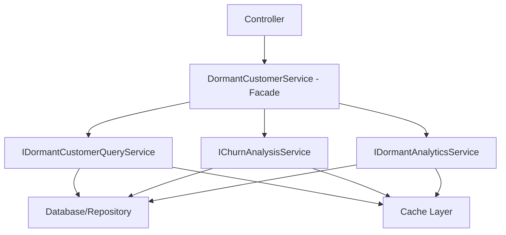

# DormantCustomerService 分割・移行計画

## 📋 概要

DormantCustomerService (686行) を4つの専門サービスに分割し、段階的に移行する計画

## 🎯 分割後のアーキテクチャ



## 🔄 段階的移行戦略

### Phase 1: 基盤構築 (Week 1)
- ✅ インターフェース定義完了
- [ ] 実装クラスのスケルトン作成
- [ ] 依存性注入設定
- [ ] ユニットテスト基盤構築

### Phase 2: 実装 (Week 2-3)
- [ ] DormantCustomerQueryService 実装
- [ ] ChurnAnalysisService 実装  
- [ ] DormantAnalyticsService 実装
- [ ] 統合テスト作成

### Phase 3: 並行運用 (Week 4)
- [ ] フィーチャートグル実装
- [ ] A/Bテスト環境構築
- [ ] パフォーマンス比較
- [ ] バグフィックス

### Phase 4: 完全移行 (Week 5)
- [ ] 新サービスに完全切替
- [ ] 既存DormantCustomerService削除
- [ ] ドキュメント更新

## 🧪 テスト戦略

### ユニットテスト
```csharp
[TestClass]
public class DormantCustomerQueryServiceTests
{
    private Mock<ShopifyDbContext> _mockContext;
    private Mock<IMemoryCache> _mockCache;
    private Mock<ILogger<DormantCustomerQueryService>> _mockLogger;
    private DormantCustomerQueryService _service;

    [TestInitialize]
    public void Setup()
    {
        _mockContext = new Mock<ShopifyDbContext>();
        _mockCache = new Mock<IMemoryCache>();
        _mockLogger = new Mock<ILogger<DormantCustomerQueryService>>();
        _service = new DormantCustomerQueryService(_mockContext.Object, _mockCache.Object, _mockLogger.Object);
    }

    [TestMethod]
    public async Task GetDormantCustomersAsync_ValidQuery_ReturnsPagedResult()
    {
        // Arrange
        var query = new DormantCustomerQuery 
        { 
            StoreId = 1, 
            PageSize = 10, 
            PageNumber = 1 
        };

        // Act
        var result = await _service.GetDormantCustomersAsync(query);

        // Assert
        Assert.IsNotNull(result);
        Assert.IsTrue(result.Items.Count <= 10);
    }
}
```

### 統合テスト
```csharp
[TestClass]
public class DormantCustomerServiceIntegrationTests
{
    private TestServer _server;
    private HttpClient _client;

    [TestInitialize]
    public void Setup()
    {
        var builder = new WebHostBuilder()
            .UseStartup<TestStartup>();
        _server = new TestServer(builder);
        _client = _server.CreateClient();
    }

    [TestMethod]
    public async Task GetDormantCustomers_NewVsLegacy_SameResults()
    {
        // Legacy API call
        var legacyResponse = await _client.GetAsync("/api/dormant/customers?legacy=true");
        var legacyData = await legacyResponse.Content.ReadAsStringAsync();

        // New API call
        var newResponse = await _client.GetAsync("/api/dormant/customers?legacy=false");
        var newData = await newResponse.Content.ReadAsStringAsync();

        // Compare results
        Assert.AreEqual(legacyData, newData);
    }
}
```

## ⚠️ リスク管理

### 高リスク
1. **データ不整合**: 新旧サービス間での結果差異
   - **対策**: 並行実行時の結果比較テスト

2. **パフォーマンス劣化**: 新実装での性能低下
   - **対策**: 詳細なベンチマークテスト

### 中リスク
1. **フロントエンド連携**: APIレスポンス形式変更
   - **対策**: レスポンス形式の互換性維持

2. **依存関係**: 他サービスへの影響
   - **対策**: インターフェース経由での疎結合

## 📊 成功指標

### 技術指標
- [ ] 単体テストカバレッジ 90%以上
- [ ] APIレスポンス時間 既存比 110%以内
- [ ] メモリ使用量 既存比 120%以内
- [ ] エラー率 0.1%未満

### ビジネス指標
- [ ] 機能の100%互換性
- [ ] ダウンタイム 0時間
- [ ] データ精度 100%

## 🔧 実装ガイドライン

### コーディング標準
- 非同期パターンの統一使用
- 例外処理の標準化
- ログ出力の統一化
- キャッシュ戦略の一貫性

### パフォーマンス要件
- データベースクエリの最適化
- N+1問題の回避
- 適切なインデックス使用
- キャッシュの効果的活用

## 📚 参考資料

- [Strangler Fig Pattern](https://docs.microsoft.com/en-us/azure/architecture/patterns/strangler-fig)
- [Facade Pattern Implementation](https://refactoring.guru/design-patterns/facade)
- [.NET Testing Best Practices](https://docs.microsoft.com/en-us/dotnet/core/testing/)

---

**作成日**: 2025年1月26日  
**更新日**: 2025年1月26日  
**責任者**: 開発チーム