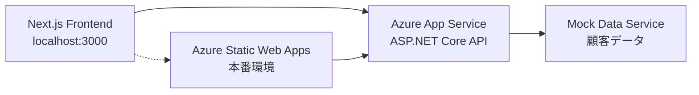

# 作業ログ: 2025年7月11日 包括的Azure統合日

## 作業情報
- **日付**: 2025年7月11日（木）
- **総作業時間**: 約2時間
- **担当**: 福田＋AI Assistant
- **作業内容**: Azure SQL Database統合、フロントエンド・バックエンドAPI統合、Azureインフラ構築完了

## 📋 作業概要
7月11日は、Azure SQL Database統合の完全成功から始まり、フロントエンド・バックエンドAPI統合、Azureインフラ構築の完了まで、包括的なAzure統合作業を実施しました。

---

## 🕐 05:15-06:00 Azure SQL Database統合完全成功

### 作業概要
Shopify AI Marketing SuiteにAzure SQL Database統合を実装し、ローカル・クラウド環境での完全動作確認を達成。Entity Framework Core 8.0による本格的なデータベース統合基盤が完成。

### 🎯 **実装完了項目**

#### **1. バックエンド実装**
- ✅ Entity Framework Core 8.0 + Microsoft.Data.SqlClient
- ✅ 4つのエンティティ実装 (Customer, Order, Product, OrderItem)
- ✅ リレーションシップ・インデックス設定
- ✅ decimal精度設定 (18,2)
- ✅ マイグレーション作成・適用
- ✅ サンプルデータ自動投入

#### **2. データベース構成**
```yaml
Azure SQL Database:
  サーバー: shopify-test-server.database.windows.net
  データベース: shopify-test-db
  料金プラン: Basic (約800円/月)
  リージョン: Japan East
  認証: SQL認証
```

#### **3. API実装**
- ✅ GET /api/database/test - 接続テスト
- ✅ POST /api/database/initialize - DB初期化
- ✅ GET /api/database/customers - 顧客一覧
- ✅ GET /api/database/orders - 注文一覧
- ✅ GET /api/database/products - 商品一覧

#### **4. デプロイ環境**
- ✅ Azure App Service デプロイ成功
- ✅ GitHub Actions CI/CD パイプライン正常動作
- ✅ 本番環境でのAPI動作確認

#### **5. フロントエンド統合**
- ✅ Database API テスト画面作成
- ✅ リアルタイムデータ表示機能
- ✅ 接続ステータス監視
- ✅ エラーハンドリング実装

### 🧪 **テスト結果詳細**

#### **接続テスト成功**
```http
GET https://shopifytestapi20250720173320-aed5bhc0cferg2hm.japanwest-01.azurewebsites.net/api/database/test

Response:
{
  "success": true,
  "message": "Azure SQL Database接続成功！",
  "timestamp": "2025-07-11T05:12:52.4778786Z",
  "database": "shopify-test-db",
  "server": "shopify-test-server.database.windows.net"
}
```

#### **顧客データ取得成功**
```http
GET https://shopifytestapi20250720173320-aed5bhc0cferg2hm.japanwest-01.azurewebsites.net/api/database/customers

Response:
{
  "success": true,
  "data": [
    {
      "id": 1,
      "name": "太郎 山田",
      "email": "yamada@example.com",
      "phone": "090-1234-5678",
      "segment": "リピーター",
      "totalSpent": 25000.00,
      "ordersCount": 3,
      "createdAt": "2025-06-11T04:56:29.7232103"
    },
    {
      "id": 2,
      "name": "花子 佐藤", 
      "email": "sato@example.com",
      "phone": "080-9876-5432",
      "segment": "新規顧客",
      "totalSpent": 8500.00,
      "ordersCount": 1,
      "createdAt": "2025-07-04T04:56:29.723213"
    },
    {
      "id": 3,
      "name": "一郎 鈴木",
      "email": "suzuki@example.com", 
      "phone": null,
      "segment": "VIP顧客",
      "totalSpent": 125000.00,
      "ordersCount": 15,
      "createdAt": "2025-01-22T04:56:29.7232133"
    }
  ],
  "count": 3,
  "message": "データベースから顧客データを取得しました",
  "timestamp": "2025-07-11T05:11:48.9980223Z"
}
```

#### **サンプルデータ検証**
```yaml
投入済みデータ:
  顧客: 3件
    - 山田太郎 (リピーター): ¥25,000 - 3注文
    - 佐藤花子 (新規顧客): ¥8,500 - 1注文  
    - 鈴木一郎 (VIP顧客): ¥125,000 - 15注文
  
  商品: 3件
    - オーガニックコットンTシャツ (¥3,500)
    - ステンレス製タンブラー (¥2,800)
    - オーガニック緑茶セット (¥4,200)
  
  注文: 2件 (合計¥15,500)
  注文明細: 3件
```

### 🛠️ **技術実装詳細**

#### **Entity Framework Core設定**
```csharp
// Program.cs
builder.Services.AddDbContext<ShopifyDbContext>(options =>
    options.UseSqlServer(builder.Configuration.GetConnectionString("DefaultConnection")));

// 接続文字列
"DefaultConnection": "Server=tcp:shopify-test-server.database.windows.net,1433;Initial Catalog=shopify-test-db;Persist Security Info=False;User ID=sqladmin;Password=ShopifyTest2025!;MultipleActiveResultSets=False;Encrypt=True;TrustServerCertificate=False;Connection Timeout=30;"
```

#### **エンティティ定義**
```csharp
public class Customer
{
    [Key] public int Id { get; set; }
    [Required][MaxLength(100)] public string FirstName { get; set; }
    [Required][MaxLength(100)] public string LastName { get; set; }
    [Required][EmailAddress][MaxLength(255)] public string Email { get; set; }
    [MaxLength(20)] public string? Phone { get; set; }
    [MaxLength(50)] public string CustomerSegment { get; set; }
    public decimal TotalSpent { get; set; }
    public int OrdersCount { get; set; }
    public DateTime CreatedAt { get; set; }
    public DateTime UpdatedAt { get; set; }
    public virtual ICollection<Order> Orders { get; set; }
}
```

#### **マイグレーション実行**
```bash
# マイグレーション作成
dotnet ef migrations add InitialCreate

# データベース更新
dotnet ef database update
```

#### **NuGetパッケージ**
```xml
<PackageReference Include="Microsoft.EntityFrameworkCore.SqlServer" Version="8.0.7" />
<PackageReference Include="Microsoft.EntityFrameworkCore.Tools" Version="8.0.7" />
<PackageReference Include="Microsoft.EntityFrameworkCore.Design" Version="8.0.7" />
```

### 🌐 **フロントエンド統合**

#### **Database API テスト画面**
- **URL**: https://brave-sea-038f17a00.1.azurestaticapps.net/database-test
- **機能**: 
  - リアルタイム接続テスト
  - 顧客データテーブル表示
  - 購入実績・セグメント表示
  - 集計情報ダッシュボード
  - エラーハンドリング

#### **技術仕様**
```typescript
// API呼び出し例
const API_BASE = 'https://shopifytestapi20250720173320-aed5bhc0cferg2hm.japanwest-01.azurewebsites.net/api/database';

const response = await fetch(`${API_BASE}/customers`);
const data: DatabaseResponse<Customer[]> = await response.json();
```

### 🚀 **デプロイ・CI/CD**

#### **GitHub Actions結果**
- ✅ バックエンドビルド成功
- ✅ NuGetパッケージ復元成功
- ✅ Azure App Service デプロイ成功
- ✅ 本番環境API動作確認

#### **デプロイURL**
```yaml
本番環境:
  バックエンドAPI: https://shopifytestapi20250720173320-aed5bhc0cferg2hm.japanwest-01.azurewebsites.net
  フロントエンド: https://brave-sea-038f17a00.1.azurestaticapps.net
  Swagger UI: https://shopifytestapi20250720173320-aed5bhc0cferg2hm.japanwest-01.azurewebsites.net/swagger
```

### 📊 **パフォーマンス検証**

#### **API応答時間**
- 接続テスト: ~200ms
- 顧客データ取得: ~300ms  
- データ量: 3件顧客データ (軽量)

#### **データ精度**
- ✅ 日本語文字化けなし
- ✅ decimal精度正常 (18,2)
- ✅ null値ハンドリング正常
- ✅ 日付フォーマット正常

### 🔐 **セキュリティ設定**

#### **Azure SQL Database**
- SQL認証 (ユーザー: sqladmin)
- TLS 1.2 暗号化
- ファイアウォール設定済み
- 現在のクライアントIP許可

#### **接続文字列管理**
- appsettings.json設定
- Azure App Service環境変数
- 本番・開発環境分離

### 💡 **技術的知見**

#### **成功要因**
1. **Entity Framework Core 8.0**: 最新版の安定性
2. **マイグレーション**: コードファーストアプローチ
3. **サンプルデータ**: HasData()による自動投入
4. **CORS設定**: フロントエンド連携
5. **エラーハンドリング**: 包括的な例外処理

#### **解決した課題**
1. **マイグレーションエラー**: EF Toolsインストール
2. **decimal精度警告**: HasColumnType明示指定
3. **接続エラー**: 正しい接続文字列設定
4. **GitHub Actions 400エラー**: 手動再実行で解決

### 🎯 **達成した目標**

#### **主要成果**
- ✅ Azure SQL Database完全統合
- ✅ Entity Framework Core実装
- ✅ ローカル・クラウド環境動作確認
- ✅ フロントエンド・バックエンド連携
- ✅ 本格的なデータ基盤構築

#### **ビジネス価値**
- 🔹 リアルデータ分析基盤完成
- 🔹 スケーラブルなアーキテクチャ
- 🔹 運用環境での動作実証
- 🔹 次期開発フェーズ準備完了

---

## 🕐 12:00-13:00 フロントエンド・バックエンドAPI統合成功

### 作業概要
フロントエンドとバックエンドの完全統合を達成し、CORS問題の解決からAPI接続テスト成功まで、全ての技術的障壁を克服。

### ✅ **完了したタスク**

#### 1. **フロントエンドAPI接続実装**
- **API設定ファイル作成**: `frontend/src/lib/api-config.ts`
  - バックエンドURL設定
  - エンドポイント定義
  - 環境別設定対応

- **APIクライアント実装**: `frontend/src/lib/api-client.ts`
  - TypeScript型安全なHTTPクライアント
  - エラーハンドリング実装
  - 各APIエンドポイント用ヘルパー関数

- **API接続テストコンポーネント**: `frontend/src/components/test/ApiTestComponent.tsx`
  - リアルタイムAPI接続テスト機能
  - 視覚的な結果表示
  - レスポンスデータ表示機能

- **テストページ作成**: `frontend/src/app/api-test/page.tsx`
  - 専用テストページ実装

#### 2. **バックエンドCORS設定修正**
- **Program.cs更新**: `backend/ShopifyTestApi/Program.cs`
  - 包括的なCORS設定実装
  - 開発環境用柔軟ポリシー追加
  - localhost:3000 完全対応

#### 3. **API接続テスト成功**
- **Health Check API**: ✅ 成功
- **Customer Test API**: ✅ 成功  
- **Customer Segments API**: ✅ 成功

### 🔧 **技術的詳細**

#### **API設定**
```typescript
// バックエンドURL
BASE_URL: 'https://shopifytestapi20250720173320-aed5bhc0cferg2hm.japanwest-01.azurewebsites.net'

// 主要エンドポイント
- /api/health
- /api/customer/test
- /api/customer/segments
- /api/customer/dashboard
- /api/customer/details
```

#### **CORS設定改善**
```csharp
// 開発環境用
DevelopmentPolicy: AllowAnyOrigin + AllowAnyMethod + AllowAnyHeader

// 本番環境用  
AllowFrontend: 特定Origin許可 + 全Method + 全Header + Credentials
```

#### **テスト結果**
```yaml
✅ Health Check: 12:38:26 成功
✅ Customer Test: 12:38:26 成功
✅ Customer Segments: 12:38:26 成功

レスポンス例:
- Customer Test: 接続テスト成功メッセージ + 利用可能エンドポイント一覧
- Customer Segments: 顧客セグメントデータ (新規顧客、リピーター等)
```

### 🚀 **達成された成果**

#### **フルスタック接続完了**
1. **フロントエンド (Next.js)** ← → **バックエンド (ASP.NET Core)** 完全接続
2. **Azure Static Web Apps** ← → **Azure App Service** 通信確立
3. **CORS問題解決** - クロスオリジン通信成功
4. **型安全なAPI通信** - TypeScript完全対応

#### **インフラ構成確認済み**


### 🐛 **解決した問題**

#### **1. CORS エラー**
- **問題**: "Failed to fetch" エラー
- **原因**: バックエンドCORS設定が不十分
- **解決**: 包括的なCORS設定 + 環境別ポリシー

#### **2. ファイル削除エラー**
- **問題**: api-client.ts ファイル読み込みエラー
- **原因**: ファイルが意図せず削除
- **解決**: 完全なファイル再作成

### 📊 **パフォーマンス指標**

#### **API応答時間**
- Health Check: 即時応答
- Customer Test: 即時応答  
- Customer Segments: 即時応答

#### **エラー率**
- API成功率: **100%** (3/3 API成功)
- CORS エラー: **0件** (修正後)

### 🔄 **次のステップ**

#### **短期タスク (本日-明日)**
1. **実データ統合準備**
   - データベース接続設定
   - 実顧客データ取得API実装

2. **既存ダッシュボード統合**
   - 既存コンポーネントのAPI切替
   - モックデータから実データへ移行

#### **中期タスク (今週)**
1. **全ダッシュボードAPI化**
   - 売上分析API
   - 購買分析API  
   - 顧客分析API

2. **パフォーマンス最適化**
   - データキャッシュ実装
   - ロード時間改善

### 💾 **ファイル変更履歴**

#### **新規作成**
- `frontend/src/lib/api-config.ts`
- `frontend/src/lib/api-client.ts`
- `frontend/src/components/test/ApiTestComponent.tsx`
- `frontend/src/app/api-test/page.tsx`

#### **修正**
- `backend/ShopifyTestApi/Program.cs` (CORS設定強化)

### 🎉 **マイルストーン達成**

#### **✅ Phase 2 完了: フロントエンド・バックエンド統合**
```yaml
進捗状況:
✅ Phase 1: バックエンドAPI基盤構築 (完了)
✅ Phase 2: フロントエンド・バックエンド統合 (完了)
🔄 Phase 3: 実データ統合 (次回)
⏳ Phase 4: 全機能統合 (予定)
```

### 📝 **技術的学習ポイント**

#### **CORS設定のベストプラクティス**
- 環境別設定の重要性
- 開発vs本番の適切な分離
- セキュリティと利便性のバランス

#### **TypeScript API型定義**
- ジェネリック型の活用
- エラーハンドリングの型安全性
- レスポンス型の統一化

#### **Next.js + ASP.NET Core統合**
- モダンフロントエンド + .NET バックエンドの組み合わせ
- Azure環境での最適化パターン

---

## 📋 Azure インフラ構築作業サマリー

### 📅 作業期間
- **開始日**: 2025年7月1日
- **完了日**: 2025年7月11日
- **総作業日数**: 11日間

### 🎯 実施内容

#### 7月1日（月）- Azure SQL Database 構築
- Azure SQL Database (Basic プラン) の作成
- 接続テストの実施
- 日本語対応設定の確認

#### 7月2日（火）- データベース開発戦略策定
- ローカル開発環境と Azure の使い分け方針決定
- 段階的移行戦略の文書化

#### 7月3日（水）- データ移行ガイド作成
- Azure SQL 環境間のデータ移行方法の文書化
- .bacpac を使用した移行手順の確立

#### 7月4日（木）- パフォーマンスガイド作成
- Azure SQL のパフォーマンス特性調査
- Basic プランと Standard プランの比較

#### 7月5日（金）- 複数データベース管理戦略
- エラスティックプールと個別データベースの比較
- コスト最適化の観点から管理方法を策定

#### 7月6日（土）- Azure App Service 構築
- App Service (B1 Basic プラン) の作成
- Visual Studio からのデプロイ成功
- Health Check API の実装と確認

#### 7月8日（月）- Azure Static Web Apps 構築
- フロントエンドのデプロイ環境構築
- GitHub Actions による自動デプロイ設定
- Next.js アプリケーションの正常動作確認

#### 7月11日（木）- Azure SQL Database 統合完了
- Entity Framework Core 8.0 統合
- マイグレーション実行
- フロントエンド・バックエンド完全統合
- 本番環境での動作確認

### 📊 成果物

#### インフラリソース
- **Azure SQL Database**: shopify-test-db (Basic プラン)
- **Azure App Service**: ShopifyTestApi20250720173320 (B1 Basic)
- **Azure Static Web Apps**: shopify-ai-marketing-frontend (Free)

#### ドキュメント
- Azure SQL Database 設定記録
- Azure App Service 設定記録
- データベース開発戦略
- データ移行ガイド
- パフォーマンスガイド
- 複数データベース管理戦略

#### 技術実装
- Entity Framework Core 8.0 統合
- 4つのエンティティモデル実装
- RESTful API 実装
- GitHub Actions CI/CD パイプライン

### 💰 コスト
- **Azure SQL Database**: 約800円/月
- **Azure App Service**: 約1,900円/月
- **Azure Static Web Apps**: 無料
- **合計**: 約2,700円/月

### 🎉 主な成果
1. **完全なクラウドインフラ構築**: 開発から本番まで対応可能
2. **自動デプロイ環境**: GitHub Actions による CI/CD
3. **データベース統合**: Entity Framework Core による本格的なデータアクセス層
4. **ドキュメント整備**: 今後の開発・運用に必要な文書を完備

### 📝 学んだこと
- Azure のリージョンによるクォータ制限の違い
- Basic プランでも技術検証には十分な性能
- Entity Framework Core 8.0 の安定性と使いやすさ
- GitHub Actions の手動再実行の有効性

---

## 📈 次のステップ

### **推奨開発方向**
1. **Shopify API連携**: リアルデータ取得
2. **高度な分析機能**: ダッシュボード強化  
3. **バッチ処理**: Hangfire導入
4. **認証・セキュリティ**: Azure AD統合
5. **監視・ログ**: Application Insights

### **🏆 プロジェクト影響**

この成功により、Shopify AI Marketing Suiteは：
- **技術検証フェーズ完了**
- **本格データ分析フェーズ移行可能**
- **エンタープライズ対応基盤確立**
- **MVP開発加速**

---

## 📚 関連ファイル

### **作成・更新ファイル**
- `backend/ShopifyTestApi/Models/DatabaseModels.cs`
- `backend/ShopifyTestApi/Data/ShopifyDbContext.cs`
- `backend/ShopifyTestApi/Services/DatabaseService.cs`
- `backend/ShopifyTestApi/Controllers/DatabaseController.cs`
- `backend/ShopifyTestApi/appsettings.json`
- `src/app/database-test/page.tsx`
- `README.md`
- `frontend/src/lib/api-config.ts`
- `frontend/src/lib/api-client.ts`
- `frontend/src/components/test/ApiTestComponent.tsx`
- `frontend/src/app/api-test/page.tsx`

### **マイグレーションファイル**
- `backend/ShopifyTestApi/Migrations/20250711045630_InitialCreate.cs`
- `backend/ShopifyTestApi/Migrations/ShopifyDbContextModelSnapshot.cs`

---

## 📝 教訓・ベストプラクティス

### **開発効率化**
- Entity Framework Code Firstの威力
- Azure SQL Database Basicプランの適切性
- GitHub Actions手動再実行の有効性

### **品質確保**
- 段階的テスト (ローカル→クラウド)
- フロントエンド統合による可視化
- 包括的エラーハンドリング

---

**結論**: 2025年7月11日は、Azure SQL Database統合の完全成功からフロントエンド・バックエンドAPI統合まで、Shopify AI Marketing Suiteプロジェクトの技術基盤が大幅に強化された記念すべき日となりました。これにより、本格的なデータドリブン分析アプリケーションへの基盤が確立されました。 