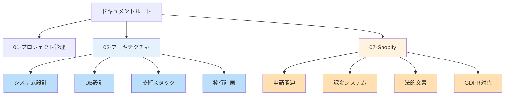

# 📚 ドキュメント構成ガイド

## Shopify AI Marketing Suite - ドキュメント体系

最終更新：2025年8月12日

---

## 📁 フォルダ構成（整理済み）

```
docs/
├── 01-project-management/    # プロジェクト管理
├── 02-architecture/          # ✨ アーキテクチャ設計（整理済み）
│   ├── 01-システム設計/
│   ├── 02-データベース設計/
│   ├── 03-技術スタック/
│   └── 04-移行計画/
├── 03-design-specs/          # 設計仕様書
├── 04-development/           # 開発ドキュメント
├── 05-operations/            # 運用ドキュメント
├── 06-infrastructure/        # インフラ構成
├── 07-shopify/              # ✨ Shopify関連（整理済み）
│   ├── 01-申請関連/
│   ├── 02-課金システム/
│   ├── 03-法的文書/
│   └── 04-GDPR対応/
└── 08-operations-manual/    # 運用マニュアル
```

---

## 🎯 目的別ドキュメントガイド

### 👨‍💼 経営層・ビジネス向け
| カテゴリ | ドキュメント | 場所 |
|---------|------------|------|
| 収益モデル | 課金システムビジネスレポート | `07-shopify/02-課金システム/` |
| 申請状況 | Shopifyアプリ申請準備レポート | `07-shopify/01-申請関連/` |
| プロジェクト進捗 | 進捗トラッカー | `ai-team/progress-tracker-*.md` |

### 👨‍💻 開発者向け（新規参加）
| 順番 | ドキュメント | 場所 |
|------|------------|------|
| 1 | 技術スタック概要 | `02-architecture/03-技術スタック/` |
| 2 | システムアーキテクチャ | `02-architecture/01-システム設計/` |
| 3 | データベースモデル | `02-architecture/02-データベース設計/` |
| 4 | 開発環境構築 | `04-development/` |

### 🚀 実装担当者向け
| タスク | ドキュメント | 場所 |
|--------|------------|------|
| 課金実装 | 課金システム設計・フロー図 | `07-shopify/02-課金システム/billing/` |
| GDPR対応 | GDPR Webhook仕様 | `07-shopify/04-GDPR対応/` |
| バッチ処理 | バッチ処理アーキテクチャ | `02-architecture/01-システム設計/` |

### 📝 申請担当者向け
| タスク | ドキュメント | 場所 |
|--------|------------|------|
| 申請準備 | 申請チェックリスト | `07-shopify/01-申請関連/` |
| 法的文書 | プライバシーポリシー・利用規約 | `07-shopify/03-法的文書/` |
| マーケティング | 申請準備状況レポート | `07-shopify/01-申請関連/` |

---

## 🔄 最近の更新（2025年8月12日）

### 大規模再構成を実施
1. **02-architecture** フォルダ
   - 日本語サブフォルダに整理
   - ファイル名を日本語化
   - READMEファイル追加

2. **07-shopify** フォルダ（旧：07-shopify-bussiness）
   - フォルダ名修正
   - 4つのカテゴリに分類
   - 課金システムドキュメント統合

3. **新規作成ドキュメント**
   - 課金システムMermaid図解（10種類）
   - 実装チェックリスト
   - ビジネス向けレポート3種

---

## 📊 ドキュメント統計

| カテゴリ | ファイル数 | 状態 |
|---------|-----------|------|
| アーキテクチャ | 8 | ✅ 整理済み |
| Shopify関連 | 12 | ✅ 整理済み |
| プロジェクト管理 | 15+ | 🔄 更新中 |
| 開発ドキュメント | 20+ | 📝 作成中 |

---

## 🗺️ ドキュメントマップ



---

## 📌 重要なドキュメント（クイックアクセス）

### 🔥 最優先
- [課金システム設計](./07-shopify/02-課金システム/billing/billing-system-design.md)
- [申請チェックリスト](./07-shopify/01-申請関連/申請チェックリスト.md)
- [実装スケジュール](./01-project-management/01-planning/2025-08-13-onwards-schedule.md)

### 📊 進捗管理
- [進捗トラッカー](../ai-team/progress-tracker-20250812.md)
- [作業継続ガイド](../ai-team/work_continuation_guide_20250812_PM.md)

### 🛠️ 技術資料
- [システムアーキテクチャ](./02-architecture/01-システム設計/システムアーキテクチャ.md)
- [データベースモデル](./02-architecture/02-データベース設計/データベースモデル一覧.md)

---

## 🎨 ドキュメント作成ガイドライン

### ファイル命名規則
- 日本語ファイル名OK
- スペースの代わりにアンダースコア使用
- 日付は`YYYY-MM-DD`形式

### フォルダ構成
- 番号プレフィックス（01-, 02-）で順序管理
- 最大3階層まで
- 各フォルダにREADME.md配置

### 更新ルール
- 重要な変更は履歴を記録
- 担当者と日付を明記
- 古い情報はアーカイブ（削除しない）

---

## 👥 ドキュメント管理者

| 領域 | 担当者 | 連絡先 |
|------|--------|--------|
| 全体管理 | Kenji（PM） | Slack: #documentation |
| 技術文書 | Takashi | Slack: #tech-docs |
| UI/UX文書 | Yuki | Slack: #design-docs |
| ビジネス文書 | 福田様 | メール |

---

## 📝 次回更新予定

- [ ] 04-development フォルダの整理
- [ ] 運用マニュアルの統合
- [ ] 英語版ドキュメントの作成
- [ ] API仕様書の最新化

---

**このガイドは定期的に更新されます**
**最終更新**: 2025年8月12日 18:30