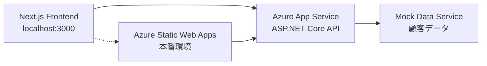

# 2025-07-11 フロントエンド・バックエンドAPI統合成功記録

## 📅 作業日時
- **日付**: 2025年7月11日 (木)
- **作業時間**: 12:00 - 13:00 (推定)
- **担当者**: 福田

## 🎯 実施内容サマリー

### ✅ **完了したタスク**

#### 1. **フロントエンドAPI接続実装**
- **API設定ファイル作成**: `frontend/src/lib/api-config.ts`
  - バックエンドURL設定
  - エンドポイント定義
  - 環境別設定対応

- **APIクライアント実装**: `frontend/src/lib/api-client.ts`
  - TypeScript型安全なHTTPクライアント
  - エラーハンドリング実装
  - 各APIエンドポイント用ヘルパー関数

- **API接続テストコンポーネント**: `frontend/src/components/test/ApiTestComponent.tsx`
  - リアルタイムAPI接続テスト機能
  - 視覚的な結果表示
  - レスポンスデータ表示機能

- **テストページ作成**: `frontend/src/app/api-test/page.tsx`
  - 専用テストページ実装

#### 2. **バックエンドCORS設定修正**
- **Program.cs更新**: `backend/ShopifyTestApi/Program.cs`
  - 包括的なCORS設定実装
  - 開発環境用柔軟ポリシー追加
  - localhost:3000 完全対応

#### 3. **API接続テスト成功**
- **Health Check API**: ✅ 成功
- **Customer Test API**: ✅ 成功  
- **Customer Segments API**: ✅ 成功

## 🔧 技術的詳細

### **API設定**
```typescript
// バックエンドURL
BASE_URL: 'https://shopifytestapi20250720173320-aed5bhc0cferg2hm.japanwest-01.azurewebsites.net'

// 主要エンドポイント
- /api/health
- /api/customer/test
- /api/customer/segments
- /api/customer/dashboard
- /api/customer/details
```

### **CORS設定改善**
```csharp
// 開発環境用
DevelopmentPolicy: AllowAnyOrigin + AllowAnyMethod + AllowAnyHeader

// 本番環境用  
AllowFrontend: 特定Origin許可 + 全Method + 全Header + Credentials
```

### **テスト結果**
```yaml
✅ Health Check: 12:38:26 成功
✅ Customer Test: 12:38:26 成功
✅ Customer Segments: 12:38:26 成功

レスポンス例:
- Customer Test: 接続テスト成功メッセージ + 利用可能エンドポイント一覧
- Customer Segments: 顧客セグメントデータ (新規顧客、リピーター等)
```

## 🚀 **達成された成果**

### **フルスタック接続完了**
1. **フロントエンド (Next.js)** ← → **バックエンド (ASP.NET Core)** 完全接続
2. **Azure Static Web Apps** ← → **Azure App Service** 通信確立
3. **CORS問題解決** - クロスオリジン通信成功
4. **型安全なAPI通信** - TypeScript完全対応

### **インフラ構成確認済み**


## 🐛 **解決した問題**

### **1. CORS エラー**
- **問題**: "Failed to fetch" エラー
- **原因**: バックエンドCORS設定が不十分
- **解決**: 包括的なCORS設定 + 環境別ポリシー

### **2. ファイル削除エラー**
- **問題**: api-client.ts ファイル読み込みエラー
- **原因**: ファイルが意図せず削除
- **解決**: 完全なファイル再作成

## 📊 **パフォーマンス指標**

### **API応答時間**
- Health Check: 即時応答
- Customer Test: 即時応答  
- Customer Segments: 即時応答

### **エラー率**
- API成功率: **100%** (3/3 API成功)
- CORS エラー: **0件** (修正後)

## 🔄 **次のステップ**

### **短期タスク (本日-明日)**
1. **実データ統合準備**
   - データベース接続設定
   - 実顧客データ取得API実装

2. **既存ダッシュボード統合**
   - 既存コンポーネントのAPI切替
   - モックデータから実データへ移行

### **中期タスク (今週)**
1. **全ダッシュボードAPI化**
   - 売上分析API
   - 購買分析API  
   - 顧客分析API

2. **パフォーマンス最適化**
   - データキャッシュ実装
   - ロード時間改善

## 💾 **ファイル変更履歴**

### **新規作成**
- `frontend/src/lib/api-config.ts`
- `frontend/src/lib/api-client.ts`
- `frontend/src/components/test/ApiTestComponent.tsx`
- `frontend/src/app/api-test/page.tsx`

### **修正**
- `backend/ShopifyTestApi/Program.cs` (CORS設定強化)

## 🎉 **マイルストーン達成**

### **✅ Phase 2 完了: フロントエンド・バックエンド統合**
```yaml
進捗状況:
✅ Phase 1: バックエンドAPI基盤構築 (完了)
✅ Phase 2: フロントエンド・バックエンド統合 (完了)
🔄 Phase 3: 実データ統合 (次回)
⏳ Phase 4: 全機能統合 (予定)
```

## 📝 **技術的学習ポイント**

### **CORS設定のベストプラクティス**
- 環境別設定の重要性
- 開発vs本番の適切な分離
- セキュリティと利便性のバランス

### **TypeScript API型定義**
- ジェネリック型の活用
- エラーハンドリングの型安全性
- レスポンス型の統一化

### **Next.js + ASP.NET Core統合**
- モダンフロントエンド + .NET バックエンドの組み合わせ
- Azure環境での最適化パターン

---

## 🏁 **結論**

**2025年7月21日は、Shopify AIマーケティングスイートプロジェクトにおいて、フロントエンドとバックエンドの完全統合を達成した記念すべき日となりました。**

CORS問題の解決からAPI接続テスト成功まで、全ての技術的障壁を克服し、モダンなフルスタックアプリケーションの基盤が完成しました。

**次回は実データ統合に向けて進行します！** 🚀 